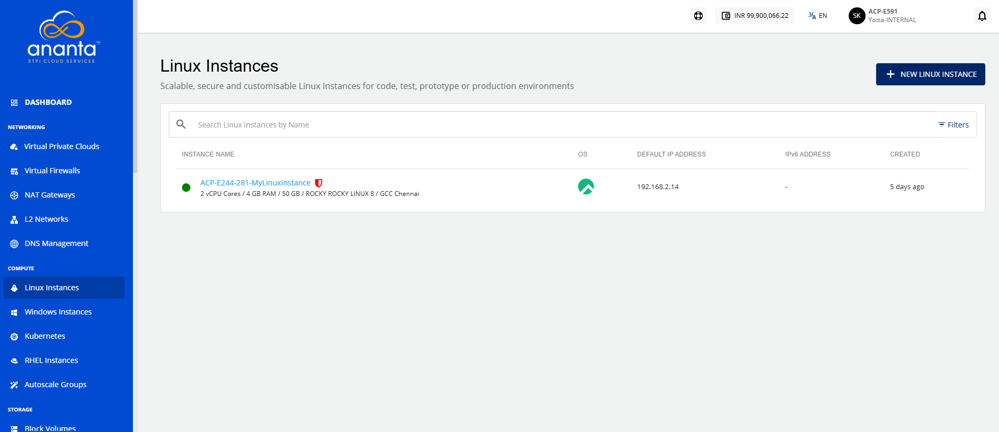
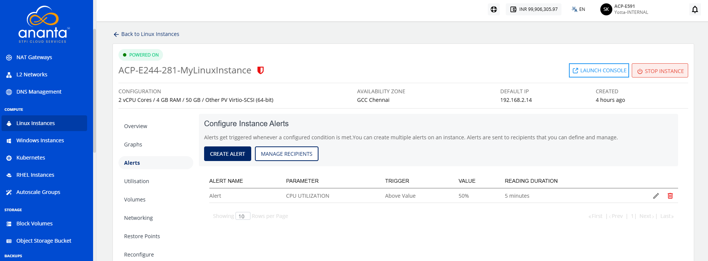
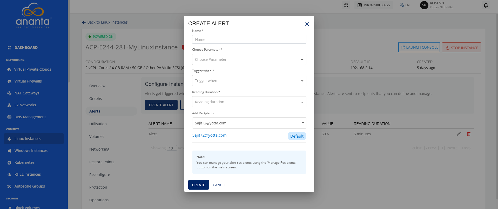
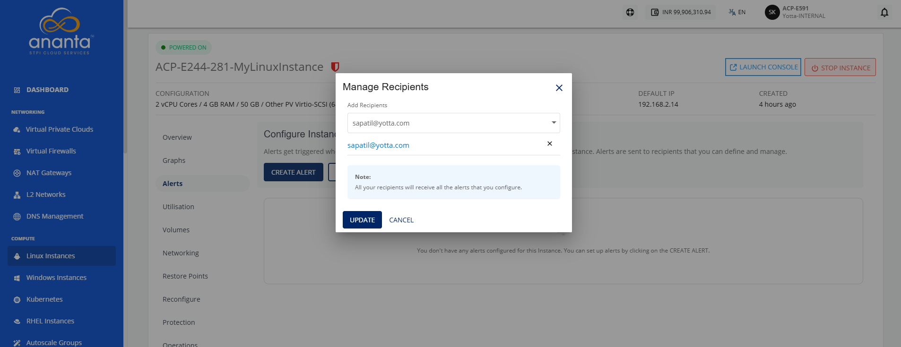

# Managing Alerts

Alerts help you monitor the health and performance of your Linux instance by notifying you when predefined conditions are met. You can create, view, modify, or delete alerts and manage email recipients to ensure the appropriate users receive notifications. Managing alerts enables you to proactively monitor your Linux instance and respond promptly to important events.

This section comprises of the following sub-sections:
- [Configuring Alert](#configuring-alert)
- [Managing Recipients](#managing-recipients)

## Configuring Alert

Create an alert to monitor a specific Linux instance metric and receive an email notification when the configured threshold is reached. While creating an alert, specify a name, select the parameter to monitor, define the trigger condition and reading duration, and add the email recipients for notifications.

To configure alerts, follow these steps:
1. Navigate to **Compute > Linux Instances**. The following screen appears:
2. Click on your created Linux instance name from the list. 
3. Navigate to **Alerts**. The following screen appears:
4. Click the **Create Alert** button. The following screen appears:
5. Provide the following details:
	- **Name**: You can define the name for your alert.
	- **Choose Parameter**: This option allows you to define what parameter needs to be monitored to trigger the alert email. The NGC supports CPU, RAM, Disk, 1-min Load Average, 5-min Load Average, and 15-min Load Average parameters.
	- **Trigger when**: This set of options lets you define whether to trigger above or below a custom value.
	- **Reading duration**: This option lets you define the breach window, that is, the duration for which the breach must be consistent to trigger the alert email.
	- **Add Recipients**: This option lets you add recipients from the dropdown.

## Managing Recipients
The manage recipients feature lets you control who receives Linux instance alerts. It displays all configured or added email IDs and provides options to remove outdated addresses or add new ones.

To configure recipients, follow these steps:

1. Navigate to **Compute > Linux Instances**. The following screen appears:
2. Click on your created Linux instance name from the list. 
3. Navigate to **Alerts**. The following screen appears:
4. Click the **Manage Recipients** button. The following screen appears:
5. Click the dropdown icon in the **Add Recipients** field to view the recipients list.
6. Select the recipients from the dropdown.
7. Click the **Update** button.
 

:::note
All configured recipients will receive the setup alerts. If no email ID is added, no emails will be sent for the configured alerts.
:::
