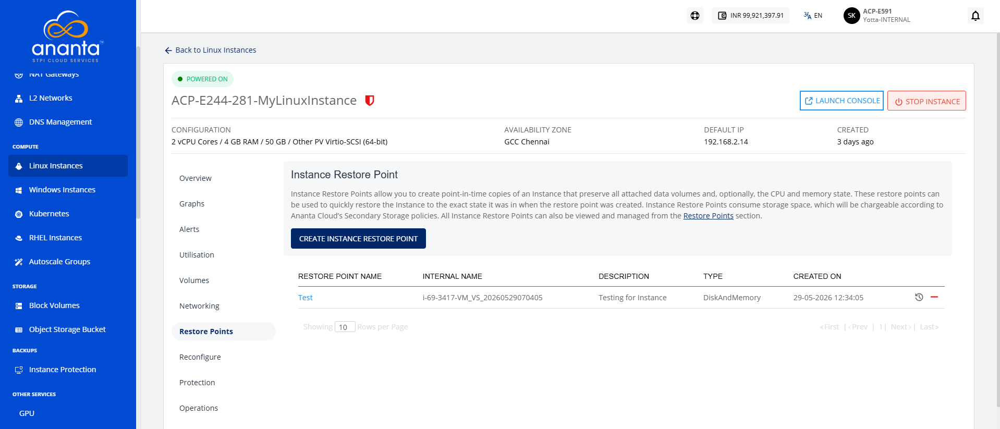
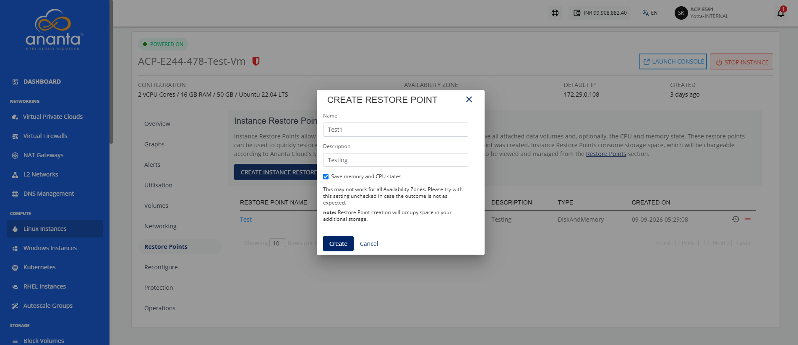
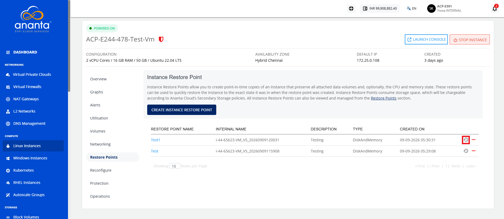
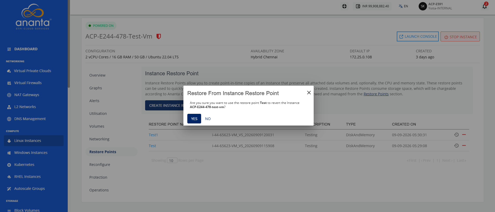
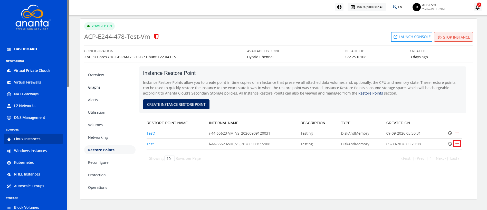
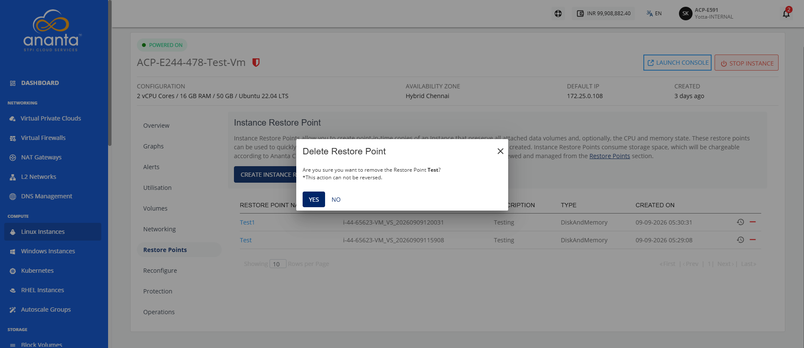

# Managing Instance Linux Restore Points

Instance restore points help protect your Linux instances by creating point-in-time recovery snapshots. You can create restore points before performing maintenance, configuration changes, or updates, and restore the instance to a previous state if required. You can also delete restore points that are no longer needed to optimize resource usage. This section explains how to create, restore, and delete instance restore points for a Linux instance.

This section comprises of the following sub-sections:
- [Creating an Instance Restore Point](#creating-an-iinstance-restore-point)
- [Restoring an Instance Restore Point](#restoring-an-instance-restore-point)
- [Deleting an Instance Restore Point](#deleting-an-instance-restore-point)
## Creating an Instance Restore Point
Create an instance restore point to capture the current state of your Linux instance. You can use the restore point to recover the instance to a previous state when needed, helping protect data and simplify recovery during maintenance or unexpected issues.

To create an instance restore point, follow these steps:

1. Navigate to **Compute > Linux Instances**. The following screen appears:
2. Click on your created Linux instance name from the list.
3. Click **Restore Points**. The following screen appears:
4. Click the **Create Instance Restore Point** button. The following screen appears, where you can provide the required details:
5. Click the **Create** button.
## Restoring an Instance Restore Point

Restoring an instance from a restore point reverts the Linux instance to a previously saved state. This operation restores the instance configuration and data captured at the selected restore point, allowing you to recover from configuration errors, failed updates, or other unexpected issues. Restoring a restore point helps minimize service disruption, ensures business continuity, and provides a reliable method to recover the Linux instance to a known working state.

To restore an instance restore point, follow these steps:

1. Navigate to **Compute > Linux Instances**. The following screen appears:
2. Click on your created Linux instance name from the list.
3. Click **Restore Points**. The following screen appears:
4. Click the **Restore from Instance Restore Point** icon (highlighted in red). The following screen appears: 
5. Click the **Yes** button.

## Deleting an Instance Restore Point

Deleting a restore point permanently removes a saved recovery point from the Linux instance. You can delete restore points that are no longer required to free up storage and keep your restore point list organized.

:::warning
	This action can not be reversed.
:::

To delete an instance restore point, follow these steps:

1. Navigate to **Compute > Linux Instances**. The following screen appears:
2. Click on your created Linux instance name from the list.
3. Click **Restore Points**. The following screen appears:
4. Click the **Delete Restore Point** icon (highlighted in red). The following screen appears: 
5. Click the **Yes** button. The instance restore point is deleted.