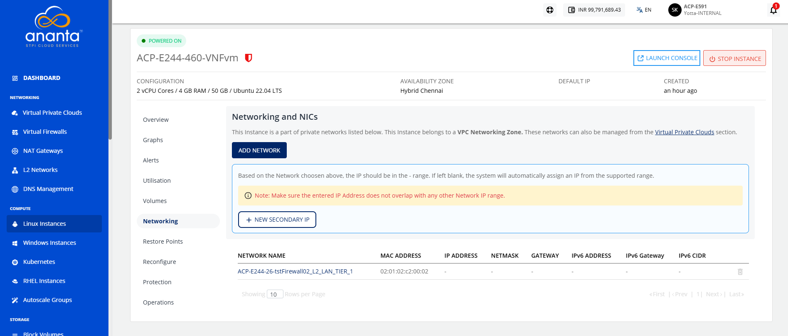
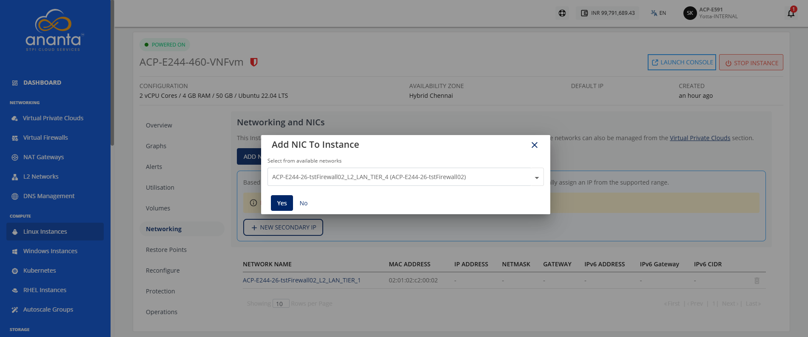
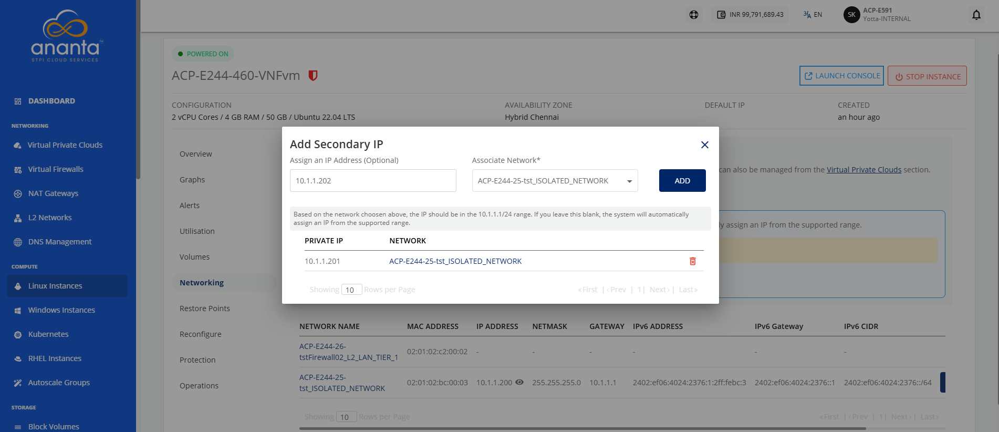
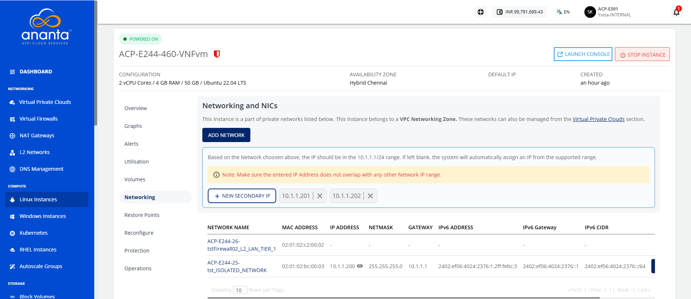

# Managing Networks
This section explains how to manage the network settings of your Linux instances. You can add a network to connect an instance to a virtual network and assign secondary IP addresses to enable multiple network connections on the same instance. This helps you configure and manage your networking requirements more efficiently. 

The following are the major topics covered in this section:

- [Adding a Network](#adding-a-network)
- [Adding a Secondary IP](#adding-a-secondary-ip)

To view the Networks associated with a Linux Instance, navigate to **Compute > Linux Instances** and access the **Networking** tab. The **Networking** tab lists all the networks that a Linux Instance is attached to, with the following details:

- Network Name
- MAC Address
- IP Address
- Netmask
- IPv6 Address
- IPv6 Gateway
- IPv6 CIDR  

## Adding a Network

If the Instance is inside a VPC, you can associate the Instance with multiple tiers within the VPC or share the Instance with other VPC networks in the same availability zone by using the **Add Network** option.

To add a network, follow these steps:

1. Navigate to **Compute > Linux Instances**. The following screen appears:
2. Click on your created Linux instance name from the list.
3. Navigate to **Networking**. The following screen appears:
4. Click the **Add Network** button. The following screen appears: 
5. Select the **tier** from the available networks.
	:::note
	The dropdown displays all tiers available in the instance's availability zone.
	:::
6. Click **Yes**.  

The Unlink action removes the network/tier association.

:::note  
The [Virtual Private Clouds](https://coda.grammarly.com/docs/Guides/Networking/VirtualPrivateClouds/AboutVirtualPrivateCloud) service is used for advanced networking configurations.
:::

## Adding a Secondary IP

A Secondary IP Address is an additional IP address assigned to the same network interface as the primary IP address. It allows a single server or virtual machine to use multiple IP addresses without adding extra network interfaces.

### Use cases

- Hosting multiple applications or websites on the same server.
- Running different services (such as web, API, FTP, or mail) using separate IP addresses.
- Supporting load balancing, firewall/NAT configurations, and network segmentation.
- Enabling high availability, failover, and application migration with minimal downtime.
- Providing unique IP addresses for containers, databases, and cloud workloads.

It is used in the following networking services in the NGC portal:
  - **Static NAT**: You can map a public IP to a secondary IP for external access.
  - **Port Forwarding**: You can direct traffic on specific ports to a secondary IP address assigned to the instance.
  - **Load Balancing**: You can use secondary IPs as backend or virtual service IPs to distribute traffic.

To add a secondary IP, follow these steps:

1. Navigate to **Compute > Linux Instances**. 
2. Click on your created Linux instance name from the list.
3. Navigate to **Networking**. The following screen appears:
4. Click the **New Secondary IP** button. The following screen appears:
5. Enter a **new secondary IP address** and select the associated network from the **select tier** dropdown.
6. Click the **Add** button.

The Secondary IP is successfully added.
