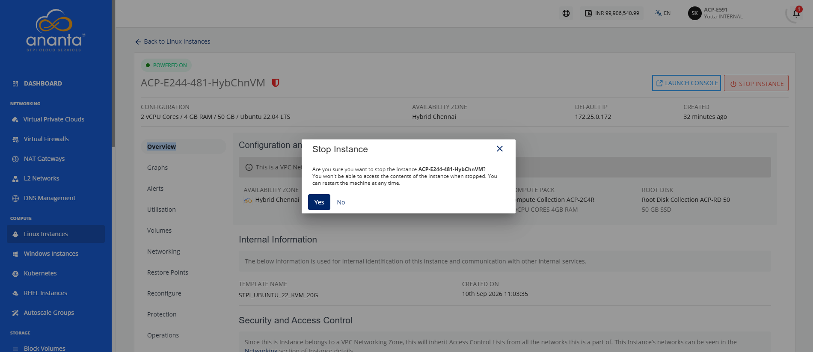
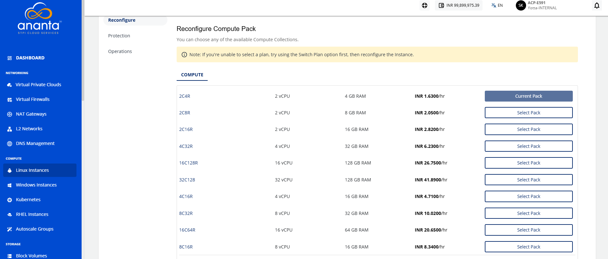
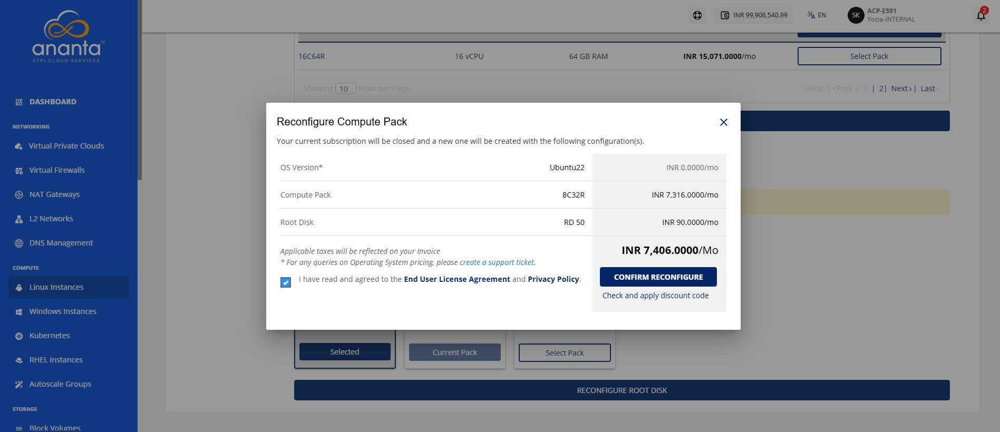
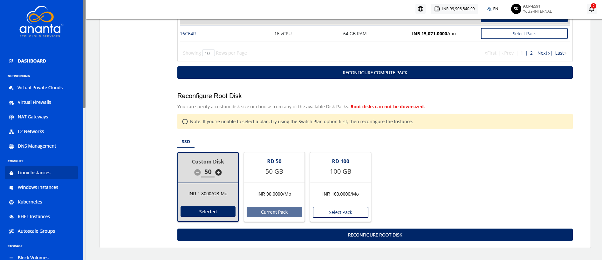

# Reconfiguring Linux Instances

Reconfigure a Linux instance to change its compute and root disk configuration when your workload requirements change. Updating the compute pack and root disk allows you to allocate resources that better match your application's performance and capacity needs.

:::note
You can only reconfigure the Instance with the same billing interval. To change the billing interval, use the **Switch Plan** button. It is recommended to switch the plan before reconfiguring the Instance if you intend to use both the Reconfigure and Switch Plan options. Charges will be applied based on the reconfigured pack, not the previous pack.
:::

To reconfigure the Linux instances, follow these steps:

1. Navigate to **Compute > Linux Instances**. The following screen appears:
2. Click on your created Linux instance name from the list.
3. Click the **Stop Instance** button. The following screen appears:
4. Click the **Yes** button. The following screen appears:   
5. Navigate to **Reconfigure**. The following screen appears:
6. Select a **compute pack** from the list.
7. Click the **Reconfigure Compute Pack** button. The following screen appears:
8. Select the **I have read and agreed to the End User License Agreement** and **Privacy Policy** option, and click the **Confirm Reconfigure** button. 
9. Select **Root Disk**.
10. Click the **Reconfigure Root Disk** button. The following screen appears:
    
 11. Select the **I have read and agreed to the End User License Agreement** and **Privacy Policy** option, and click the **Confirm Reconfigure** button. 

