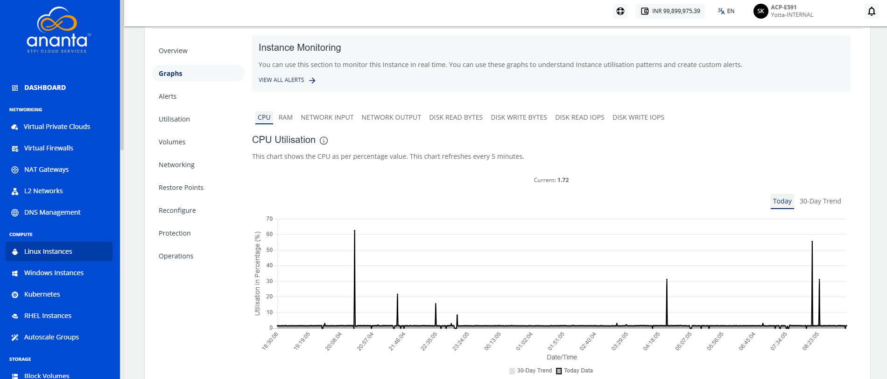
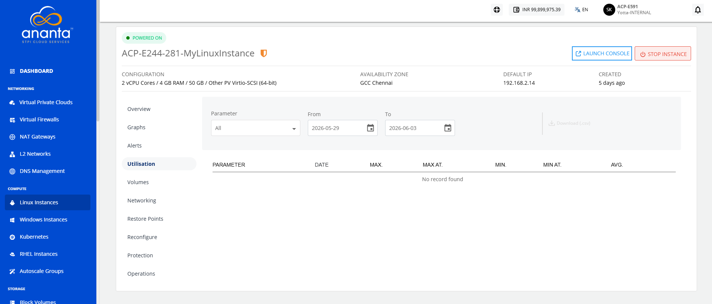

# Viewing Graphs and Utilization of Linux Instances

Graphs and Utilisation for Linux instances helps monitor real-time performance and analyse resource usage. It provides insights into key metrics like CPU, memory, network, and disk activity, enabling better monitoring and troubleshooting.
## Graphs (Real-time)

To view the available graphs and monitor the instance in real time, navigate to **Compute > Linux instance**, select Linux Instance, and access the **Graphs** tab.

You can use these graphs to understand Instance utilisation patterns and create custom alerts.

The graphs are available on a 24-hour time-scale with a 30-day trend line for the following parameters:

- CPU
- RAM
- Network Input
- Network Output
- Disk Read Bytes
- Disk Write Bytes
- Disk Read IOPS
- Disk Write IOPS

## Utilisation (Historical)

To view historical usage across supported parameters, perform these steps:

1. Navigate to **Compute > Linux Instances.**
2. Select a Linux Instance and access the **Utilisation** tab. The following screen appears:

The Utilisation table shows historical date-wise details of daily maximum, minimum, and average readings for all parameters. The Utilisation report is downloadable as a **.csv** file. 

:::note
	The logs are available for a maximum period of two years.
:::