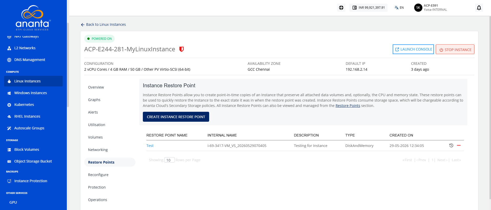
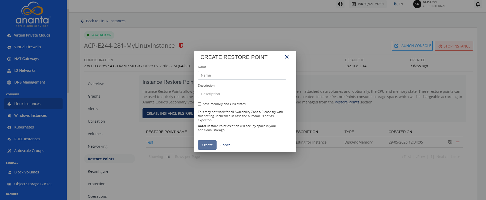

# Working with Linux Restore Points

Instance Restore Points allow you to create point-in-time copies of an Instance that preserve all attached data volumes and, optionally, the CPU and memory state. These restore points can be used to quickly restore the Instance to the exact state it was in when the recovery point was created.

Navigate to **Compute > Linux Instance**, click the particular Linux **Instance Name**, and access the **Restore Point** tab.

A Restore Point lists the following details:

- Restore Point Name
- Internal Name
- Description
- Type
- Created On

The following quick options are available:

- Restore from Instance Recovery Point
- Delete Recovery Point
## Creating a Restore Point

To create an Instance Restore Point, follow these steps:

1. Click the **Create Instance Restore Point** button. The following window appears: 
2. Enter the **name** and **description** of the restore point.
3. Select the **save memory and CPU states** option.
4. Click the **Create** button.

The restore point will be created.