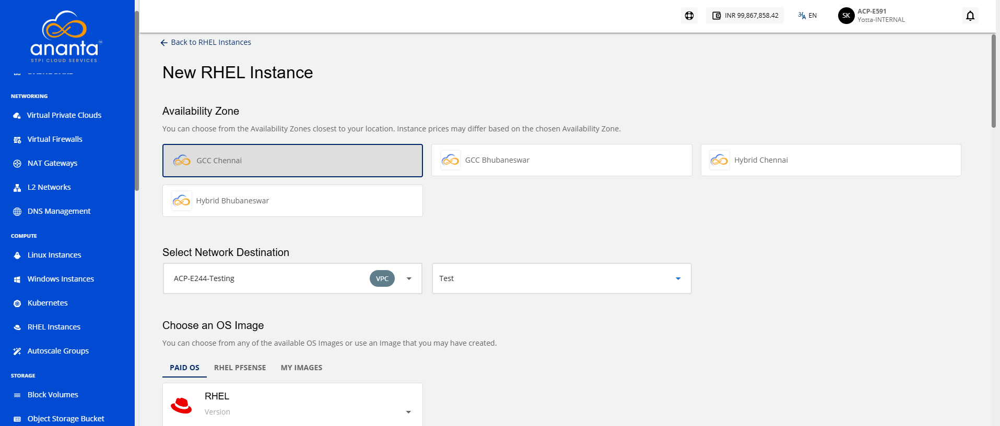
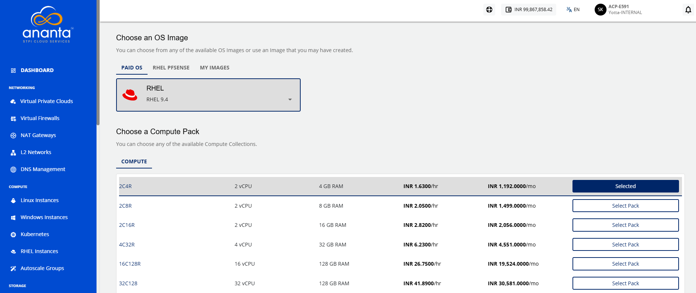
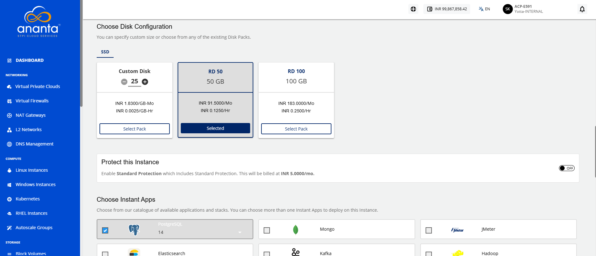
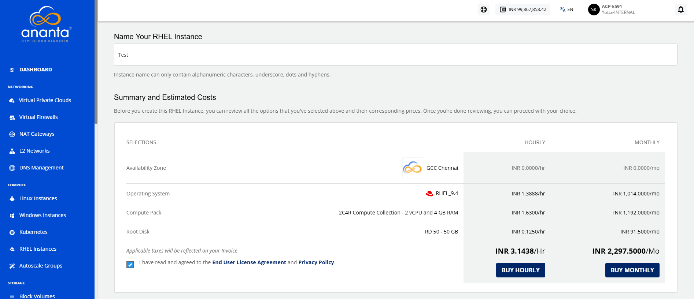
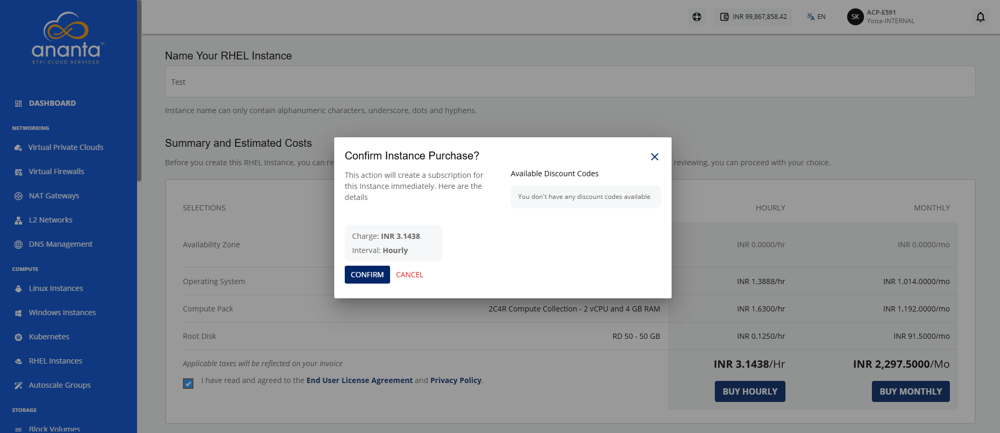

# Creating RHEL Instances
Create a RHEL instance to deploy a virtual machine for running RHEL-based applications and workloads in the cloud. During creation, you configure the required compute, storage, networking, and other settings to provision an instance that meets your workload requirements. 

To create a RHEL instance, follow these steps:

1. Navigate to **Compute > RHEL Instances**. The following screen appears
2. Click the **New RHEL Instance** button. The following screen appears:
3. Choose an **Availability Zone**, which is the geographical region where your Instance will be deployed. 
4. Select the **Destination** and then the **Network** from the drop-downs.
5. **Choose an OS Image** to run on your Instance. You can also select the image from the **My Images** tab. 
   :::note
	  To learn how to upload a custom instance image, refer to the [Uploading Custom Image](/docs/Guide/ToolsandUtilities/ManagingCustomTemplatesandImages#uploading-custom-image) page.
	:::
6. **Choose a Compute Pack** from the available compute collections. 
7. **Choose Disk Configuration** from the available **SSD**/**HDD** disk packs, or you can use the free size option to specify the root disk.
   :::note
    The NGC offers both encrypted and non-encrypted offerings. To learn more about it, refer [Disk Offerings](/docs/Knowledgebase/WhatareDiskOfferings).
	:::
8. Select the option to **Protect this Instance**.
9. **Choose an Authentication Method**: 
    - **Use SSH key pair**: Clicking on the Use SSH key pair option, all the SSH key pairs present in your account will be listed; if your account doesn’t have any SSH key pair, then you can click the **Generate a new key pair** option or upload the key pair by clicking the **Upload a key pair** option. 
    - **Use root user password**: On selecting Use root user password, **Also email me the password** option is displayed. If you select this option, the password, along with the details, for instance, will be emailed to your registered email ID.
10. Enter the instance name in **Name Your RHEL Instance**.
11. Select the **I have read and agreed to the End User License Agreement and Privacy Policy** option, and then click **Buy Hourly** or **Buy Monthly** button. The following screen appears.
    
12. Click the **Confirm** button.

:::note
It might take up to 5-8 minutes for the instance to create. You may use the Cloud Console during this time, but it is advised that you do not refresh the browser window.
:::

