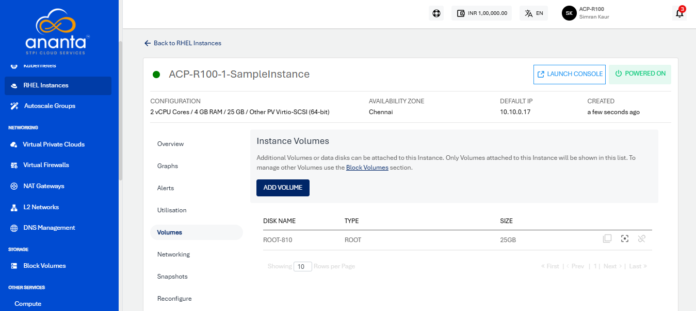

# Volume Management with RHEL Instances

To view the disk attached to particular instance, navigate to [RHEL Instances Screen](AboutRHELInstances.md) and access the **Volumes** tab.

RHEL Instances on Ananta work with the [Block Volumes Service](/docs/Guide/Storage/BlockVolumes/AboutBlockVolumes) and let you carry out basic disk operations.

The following are the quick actions:

- **Create Template** - To enter the image name and description, click the icon
- **Create Snapshot** - To create a Volume snapshot, click the icon.
- **Detach/attach** - This option attach/detach the volume to/from the instance.

:::note
Volume-level operations are available as part of the Block Volumes service.
:::

