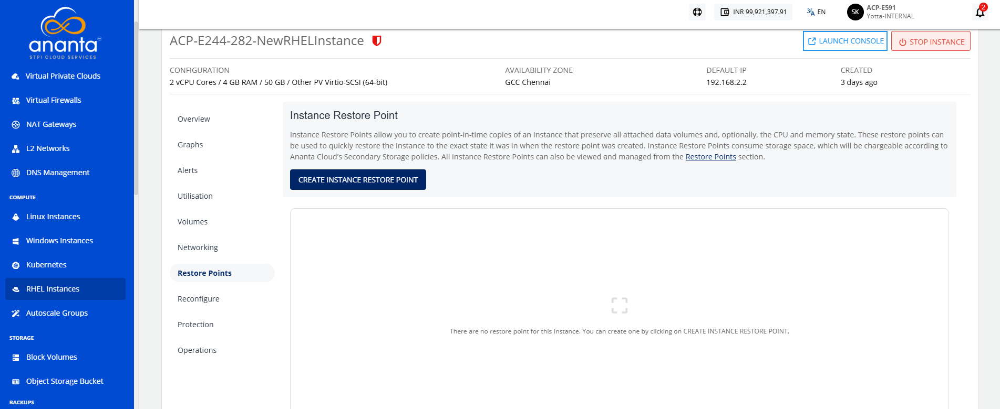
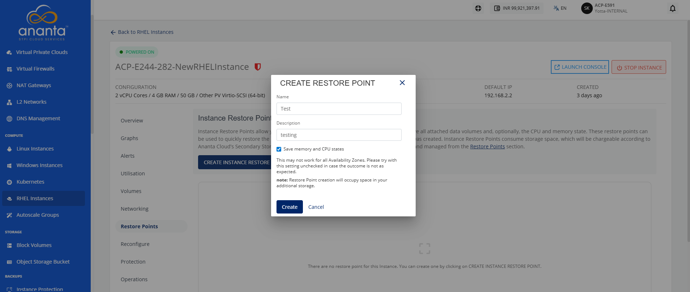
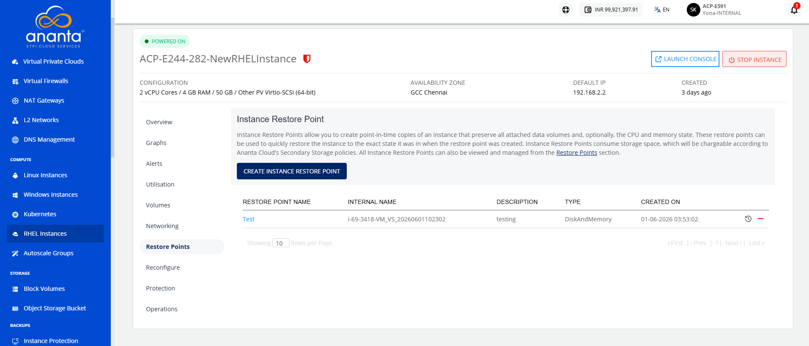

# Working with RHEL Restore Points

Instance Restore points allow you to create point-in-time images of instances that preserve all their data volume as well as (optionally) their CPU/memory states. You can use Restore points to quickly restore Instances.

The Restore points section shows all RHEL Instance Restore points, which can be used to revert the RHEL Instances to an earlier state.

To view all the Restore points taken for the Instance, navigate to **Compute > RHEL Instances**, and access the **Restore points** tab.

Restore points list down the following details:

- Restore points name
- Internal Name
- Description
- Type
- Created On

Two quick options are available, one is to revert the Instance from the restore point, and the other is to delete the particular restore point.

To create a restore point, follow these steps:

1. Click the **Create Instance Restore Point** button. The following screen appears:
2. Enter the **Name** and the **Description** of the restore point.
3. Click the **Create** button. The following screen appears: 

