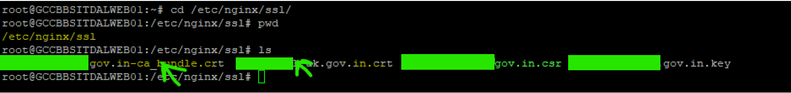
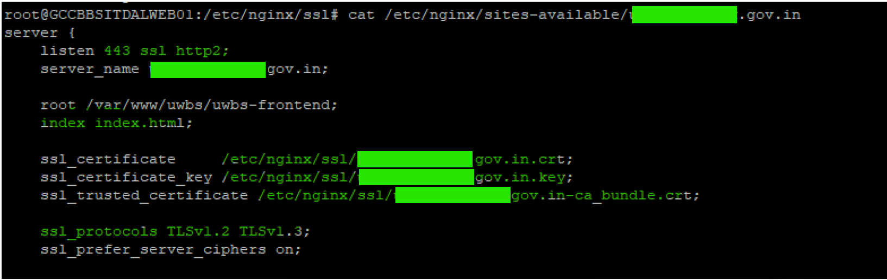
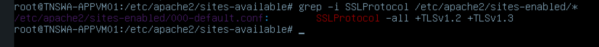
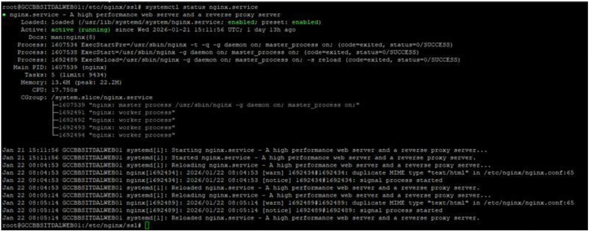

# SSL Certificate Configuration
SSL certificate configuration involves generating private keys and CSRs on Linux-based Nginx servers to obtain vendor-issued certificates. This process secures domains, such as public or government-facing websites, by embedding accurate organizational details.

It enables HTTPS on Nginx web servers through the installation of trusted SSL certificates, ensuring encrypted communication for external users. The workflow includes generating organization-specific CSRs, procuring certificates from approved vendors, updating Nginx SSL configurations, restarting services, and validating domain security.

The scope is limited to standard 2048-bit RSA keys and assumes certificate assets are managed within the `/etc/nginx/ssl` directory.

To generate the CSR for all Linux servers:
Get the details from customer site:
For example:
- CN = `organization`.in (Domain name)
- O = Organization Name
- L = Locality Name
- ST = State NAme

## 1. Generate Private Key
Run the following commands:

```bash
#cd /etc/nginx/ssl
#openssl genrsa -out /etc/nginx/ssl/organization.in.key 2048
```


## 2. Generate CSR
Run the following commands:
```bash
#cd /etc/nginx/ssl
#openssl req -new -key /etc/nginx/ssl/organization.in.key -out /etc/nginx/ssl/organization.in.csr
#chmod 777 organization.in.csr
```

## 3. Obtain the SSL certificate
After generating the CSR, share it with the vendor to obtain the SSL certificate. After receiving the
certificate, copy the certificate files to the server’s SSL configuration directory.


## 4. Modify the Nginx SSL Configuration File


## 5. Validate TLS
Enable TLS 1.2 and above. TLS 1.0 and below is not recommended due to security issues.

## 6. Restart the Nginx Service
