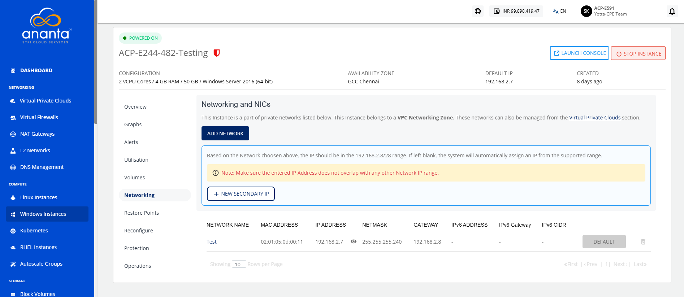
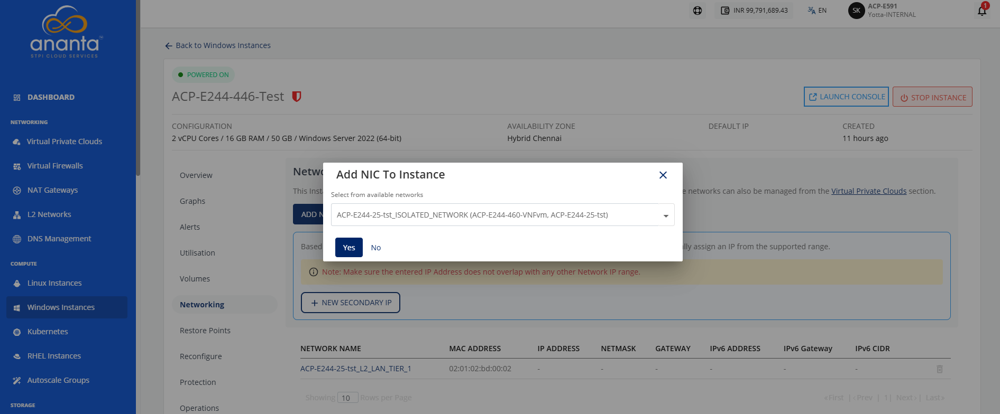
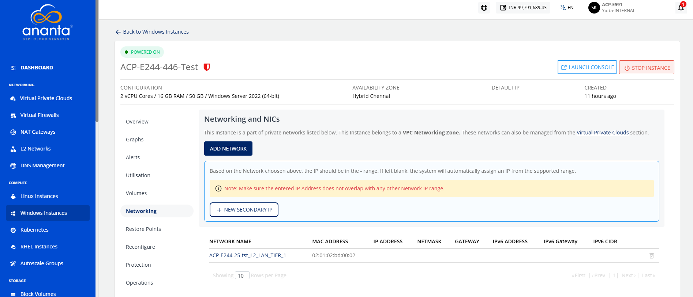
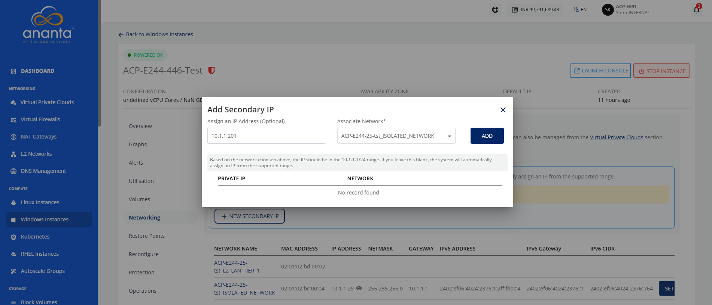

# Managing Networks

This section explains how to manage the network settings of your Windows instances. You can add a network to connect an instance to a virtual network and assign secondary IP addresses to enable multiple network connections on the same instance. This helps you configure and manage your networking requirements more efficiently. 

The following are the major topics covered in this section:

- [Adding a Network](#adding-a-network)
- [Adding a Secondary IP](#adding-a-secondary-ip)
## Adding a Network

If the Instance is inside a VPC, you can associate the Instance with multiple tiers within the VPC or share the Instance with other VPC networks in the same availability zone by using the **Add Network** option.

To add a network, follow these steps:

1. Navigate to **Compute > Windows Instance**. The following screen appears:
2. Click on your created Windows instance name from the list.
3. Navigate to **Networking**. The following screen appears: 
4. Click the **Add Network** button. The following screen appears: 
5. Select the **tier** from the available networks.
	:::note
		The dropdown displays all tiers available in the instance's availability zone.
	:::
6. Click **Yes**.  

:::note
	The Unlink action removes the network/tier association.
:::

:::note  
Advanced networking configurations can be done using the [Virtual Private Clouds](https://coda.grammarly.com/docs/Guides/Networking/VirtualPrivateClouds/AboutVirtualPrivateCloud) service.  
:::

## Adding a Secondary IP

A Secondary IP Address is an additional IP address assigned to the same network interface as the primary IP address. It allows a single server or virtual machine to use multiple IP addresses without adding extra network interfaces.

A Secondary IP is helpful in the following cases:
- Hosting multiple applications or websites on the same server.
- Running different services (such as web, API, FTP, or mail) using separate IP addresses.
- Supporting load balancing, firewall/NAT configurations, and network segmentation.
- Enabling high availability, failover, and application migration with minimal downtime.
- Providing unique IP addresses for containers, databases, and cloud workloads.

It is used in the following networking services in the NGC portal:
  - **Static NAT**: You can map a public IP to a secondary IP for external access.
  - **Port Forwarding**: You can direct traffic on specific ports to a secondary IP address assigned to the instance.
  - **Load Balancing** You can use secondary IPs as backend or virtual service IPs to distribute traffic.

To add a secondary IP, follow these steps:

1. Navigate to **Compute > Windows Instances**. 
2. Click the **VPC name** and select the **Networking** tab. The following screen appears: 
3. Click the **New Secondary IP** button. The following screen appears:  
4. Enter a **new secondary IP address** and select the associated network from the **select tier** dropdown.
5. Click the **Add** button.
