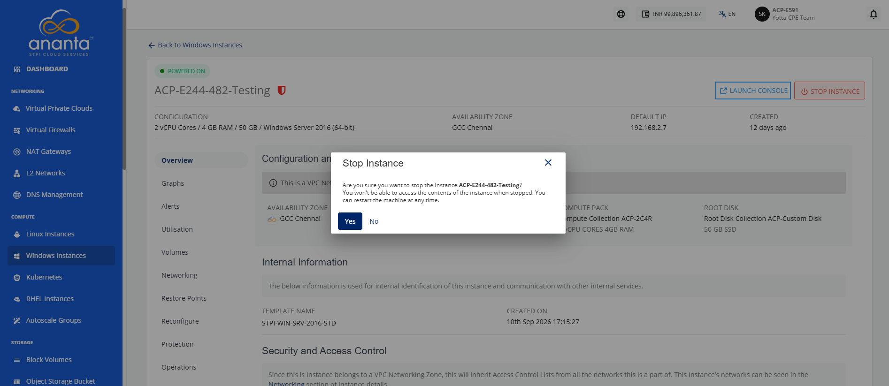
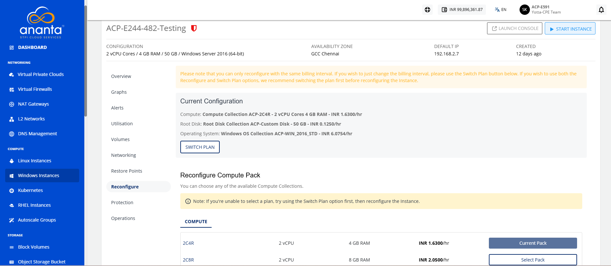
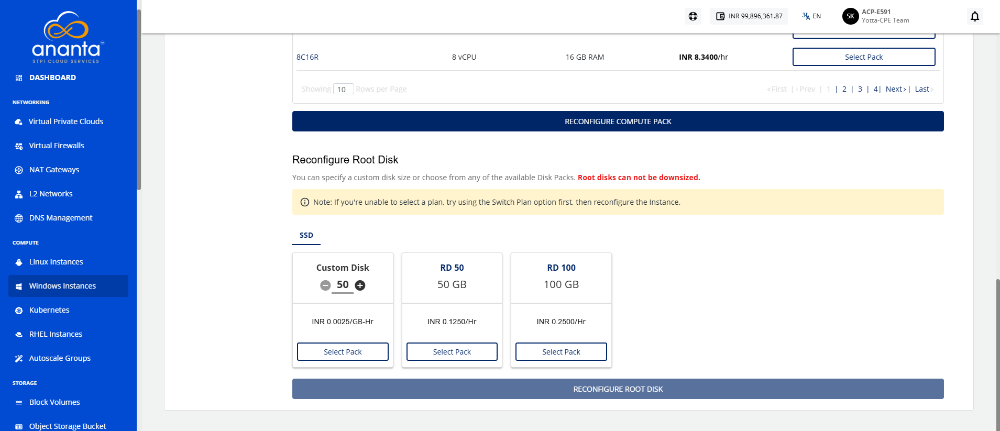
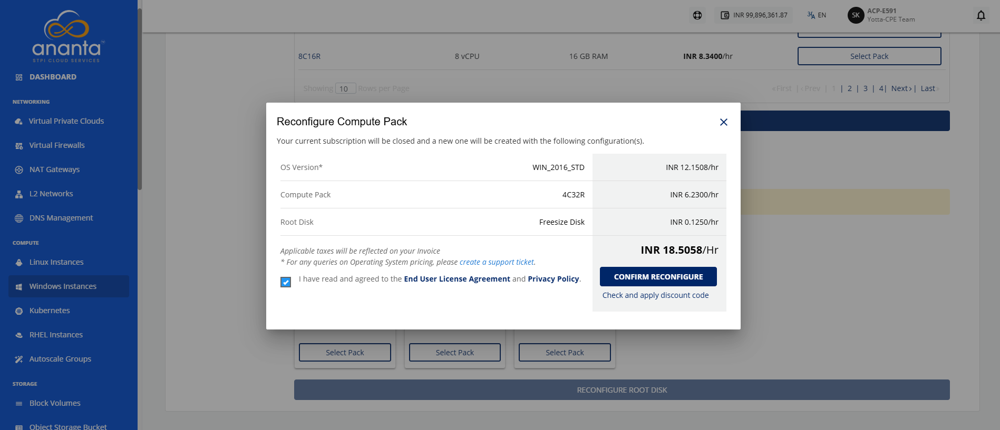
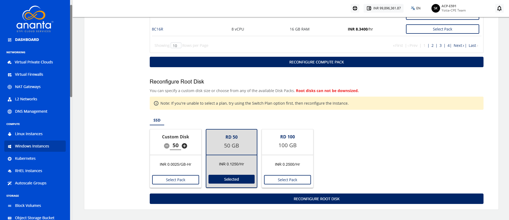
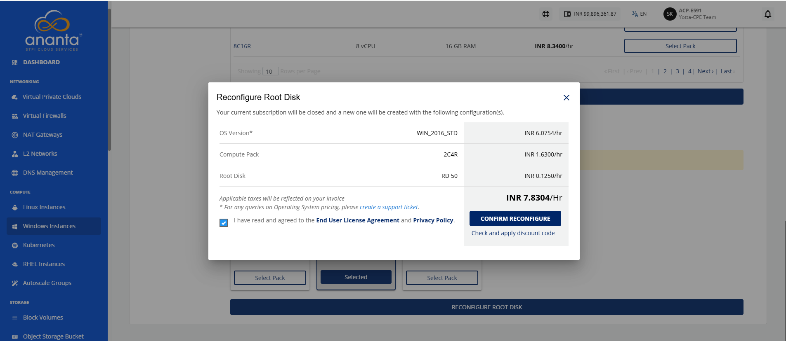

# Reconfiguring Windows Instances

Reconfigure a Window instance to change its compute and root disk configuration when your workload requirements change.  Updating the compute pack and root disk allows you to allocate resources that better match your application's performance and capacity needs.

:::note
You can only reconfigure the Instance with the same billing interval. To change the billing interval, use the **Switch Plan** button. It is recommended to switch the plan before reconfiguring the Instance if you intend to use both the Reconfigure and Switch Plan options. Charges will be applied based on the reconfigured pack, not the previous pack.
:::

To reconfigure the Window instances, follow these steps:

1. Navigate to **Compute > Windows Instances**. The following screen appears:
2. Click on your created Window instance name from the list. The **Overview** tab opens automatically. The following screen appears: 
3. Click the **Stop Instance** button. The following screen appears:
4. Click the **Yes** button, and navigate to **Reconfigure**. The following screen appears: 
5. Select a compute pack from the list, and click the **Reconfigure Compute Pack** button. The following screen appears:
6. Select the **I have read and agreed the End User License Agreement** and **Privacy Policy**.
7. Click the **Confirm Reconfigure** button. 
8. Select **Root Disk**, and click the **Reconfigure Root Disk** button. The following screen appears:
9. Select the **I have read and agreed the End User License Agreement** and **Privacy Policy**.
10. Click the **Confirm Reconfigure** button.

