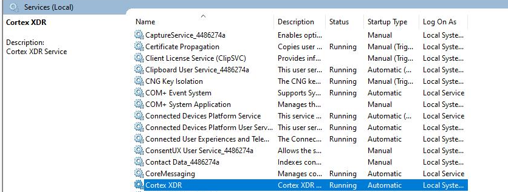

# Validating Cortex Anti-Malware/Anti-Virus Installation Status on the Server
Refer to the following screenshot to verify that the service is active and running.  
Ensure the service status shows as **Running** and protection is enabled.

