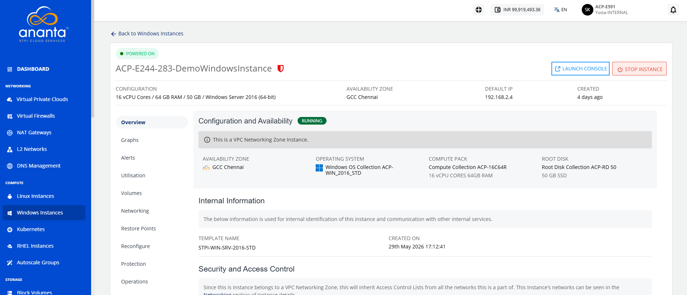

# Viewing Details of Windows Instances

View detailed information about a Windows instance, including its configuration, status, networking, storage, and resource allocation. Reviewing these details helps you monitor the instance and verify its settings for effective management.

This section comprises of the following sub-sections:
- [Launching Windows Instance Web based Console](#launching-windows-instance-web-based-console)
- [Stopping and Starting a Window Instance](#stopping-and-starting-a-windows-instance)

To view the details of Windows instances, follow these steps:

1. Navigate to **Compute > Windows Instances**. The following screen appears:
2. Click on your created Window instance name from the list. The **Overview** tab opens automatically. The following screen appears with the details:
	- **Configuration and Availability:** This displays the following Window instance configuration details to help verify its current configuration and operational state:
	    - The instance's status **Running** or **Stopped**
	    - Availability Zone
	    - Operating System
	    - Compute Pack
	    - Root Disk
	- **Internal Information:** This displays the following information that is used for internal identification of the Window instances and communication with other internal services:
	    - Template Name
	    - Created On
	- **Security and Access Control:** This displays the available security settings and access control options for the Windows instance based on its networking zone. The available information and operations may vary depending on the configured network environment:
	    - Network Name
	    - VPC Name
	    - Access Control

## Launching Window Instance Web Based Console

Launch the Windows instance web-based console to access and manage your Windows virtual machine through a web browser. The console provides a convenient way to perform administrative and management tasks on the instance.

To launch Window instance web based console, follow these steps:

1. Navigate to **Compute > Windows Instances**. The following screen appears:
2. Click on your created Window instance name from the list. The Overview tab opens automatically. The following screen appears:
3. Click the **Launch Console** button, and then provide the Windows credentials to login and access the Windows instance web-based console.

## Stopping and Starting a Window Instance

Stop a Windows instance to temporarily shut it down when it is not in use, helping optimize resource usage. Start the instance whenever you need to restore access and resume running your Windows-based applications and workloads.

To stop and start the Window instance, follow these steps:

1. Navigate to **Compute > Windows Instances**. The following screen appears:
2. Click on your created Window instance name from the list. The **Overview** tab opens automatically. The following screen appears:
3. Click the Stop Instance button. The following screen appears:
4. Click the **Yes** button. The following screen appears:
5. Click the Start Instance button. The following screen appears:
6. Click the **Yes** button. The following screen appears:

