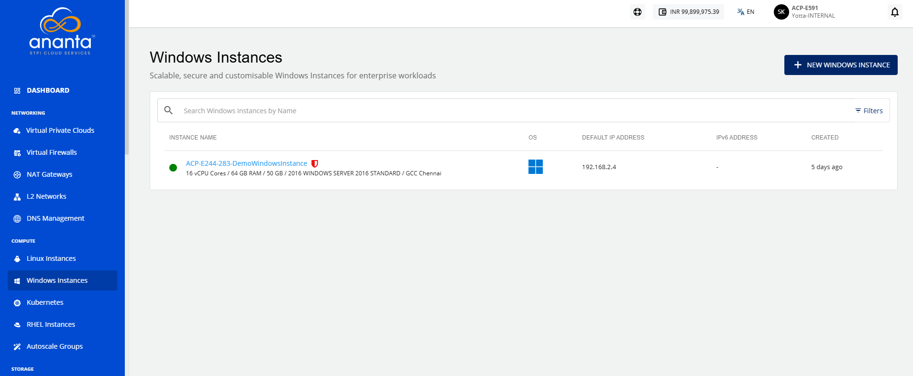
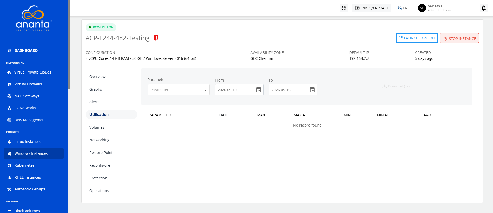

# Viewing Utilisation

Utilisation reports provide historical usage details for your Window instance. You can view daily maximum, minimum, and average readings across all supported parameters. The utilisation table presents this information in a clear date‑wise format, and you can download the report as a .csv file for further analysis.

To view historical usage across supported parameters, follow these steps:

1. Navigate to **Compute > Windows Instances**. The following screen appears:
2. Click on your created Window instance name from the list. The following screen appears:
3. Click **Utilisation**. The following screen appears: 