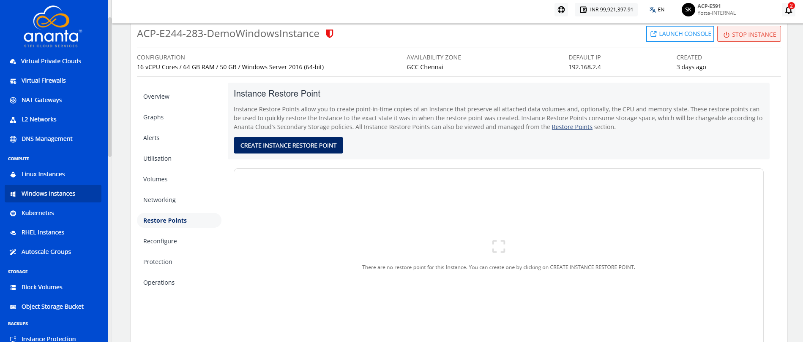
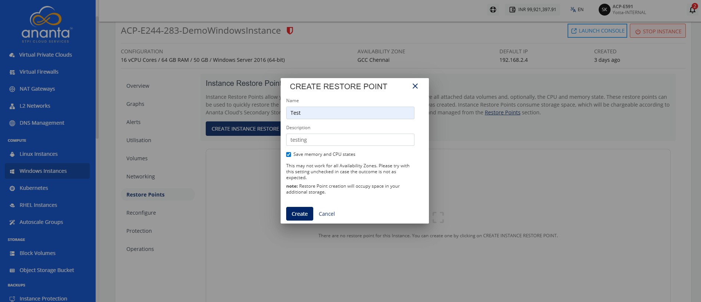
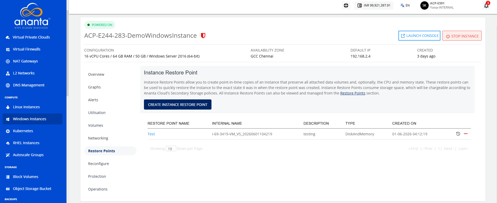

# Working with Windows Restore Points

Instance Restore Points allow you to create point-in-time images of Instances that preserve all their data volume and (optionally) CPU/memory states. You can use Restore Points to restore Instances quickly.

The Restore Points section shows all Windows Instances Restore Points, which can be used to revert the Windows Instances to an earlier state.

Navigate to **Compute > Windows Instances**, click the **Windows Instance Name,** and access the **Restore Points** tab.

Restore point shows the following details:

- Restore Point Name
- Internal Name
- Description
- Type
- Created On

To create an instance restore point, follow these steps:

1. Click the **Create Instance Restore Point** button. The following screen appears:
   
2. Specify the name and the description of the restore point.
3. To create a Restore Point, click **Create** button.
   