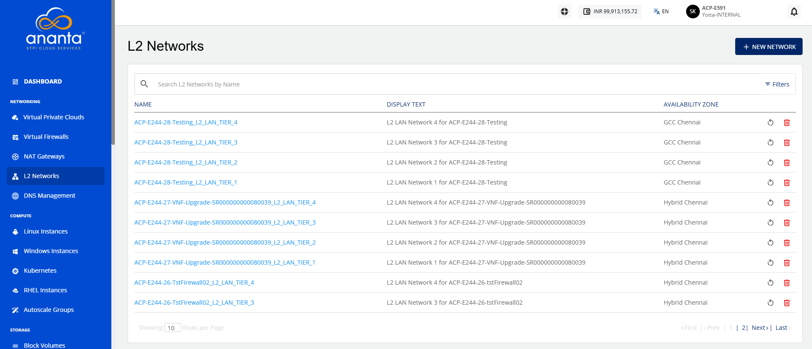
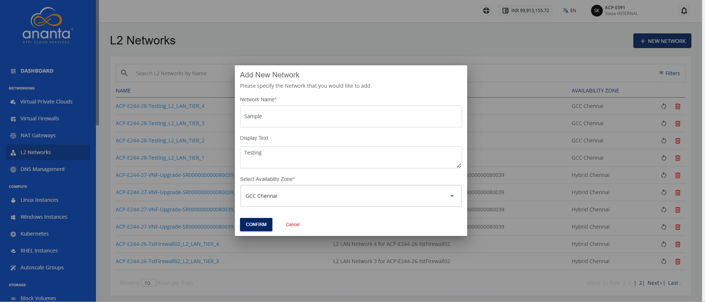

# Adding an L2 Network

Adding an L2 network allows you to create a network layer that enables connectivity within the same broadcast domain. It is useful for setting up isolated or internal networks, supporting seamless communication between resources within a defined environment.

To add an L2 network, follow these steps:

1. Navigate to **Networking > L2 Networks**. The following screen appears:
2. Click the **New Network** button. The following screen appears where you provide the required details:
3. Click the **Confirm** button.