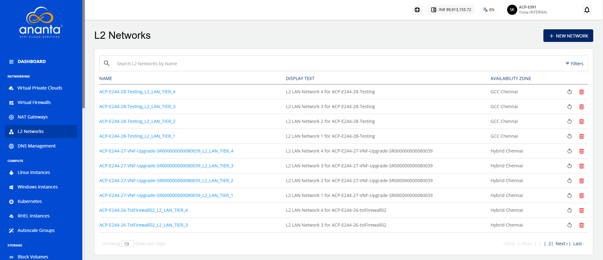
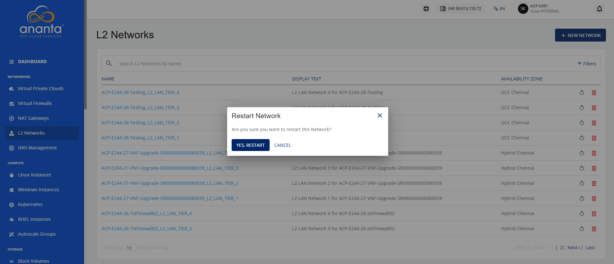
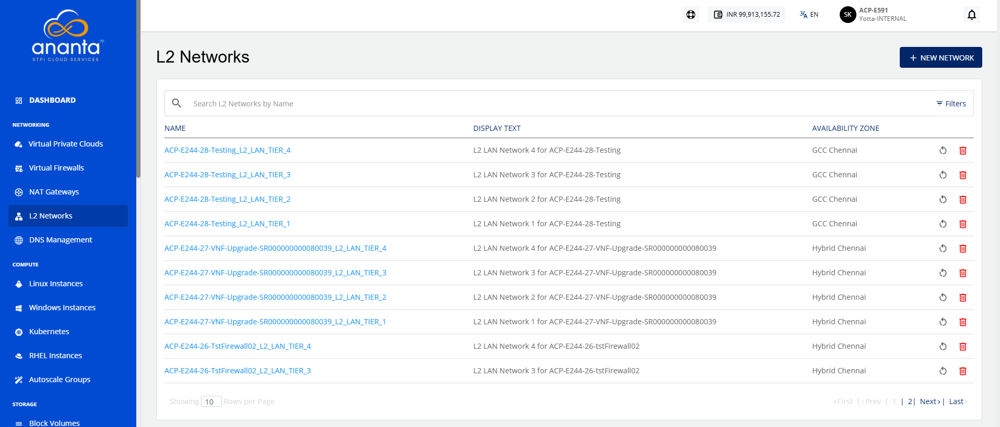
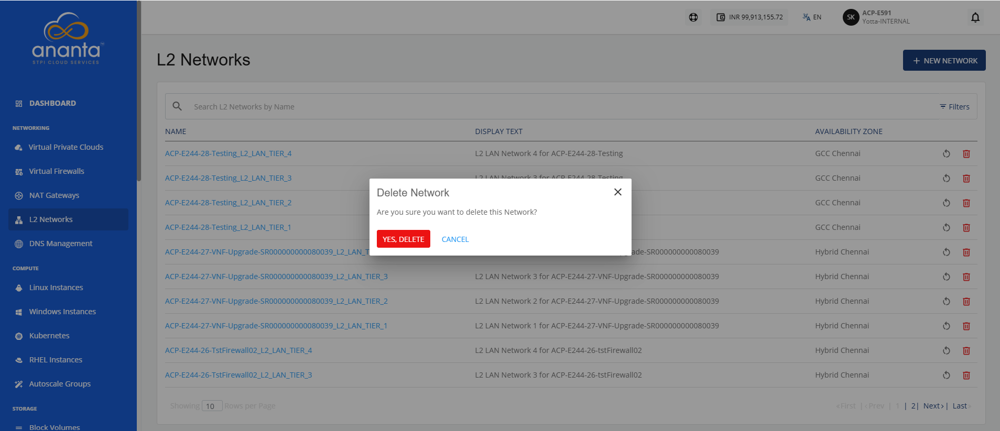

# Managing L2 Operations

Managing an L2 network allows you to maintain its availability and lifecycle. Manage an L2 network to perform actions such as restarting the network to restore connectivity and deleting unused networks to free resources and keep your network environment organised.

This section comprises of the following sub-sections:
- Restarting the L2 Network
- Deleting the L2 Network

## Restarting the L2 Network

Restarting an L2 network refreshes the L2 network to restore its operational state and apply pending changes, if required. Restart an L2 network to resolve temporary connectivity issues and ensure reliable communication between connected resources.

To restart an L2 network, follow these steps:

1. Navigate to **Networking > L2 Networks**. The following screen appears:  
2. Click the **Restart Network** icon (highlighted in red) for the required L2 network. The following screen appears:
3. Click the **Yes, Restart** button.

## Deleting the L2 Network

Deleting an L2 network permanently removes an unused Layer 2 network from your environment. Delete an L2 network to free resources, simplify network management, and remove networks that are no longer required.

:::warning
	This action is irreversible and permanently deletes the L2 network. You will not be able to recover the L2 network or its associated configuration after deletion.
:::

To delete an L2 network, follow these steps:

1. Navigate to **Networking > L2 Networks**. The following screen appears:  
2. Click the **Delete Network** icon (highlighted in red) for the required L2 network. The following screen appears: 
3. Click the **Yes, Delete** button.
