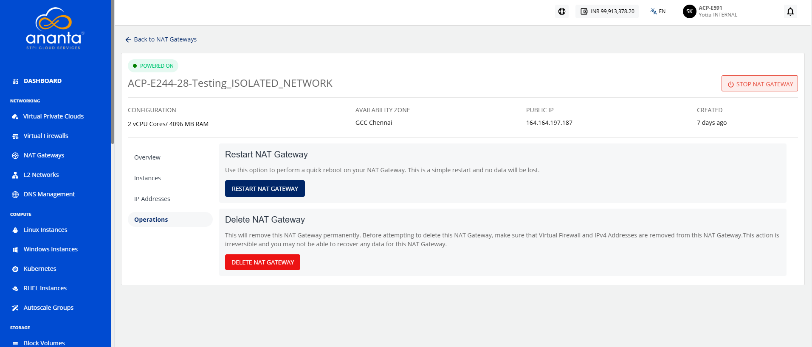
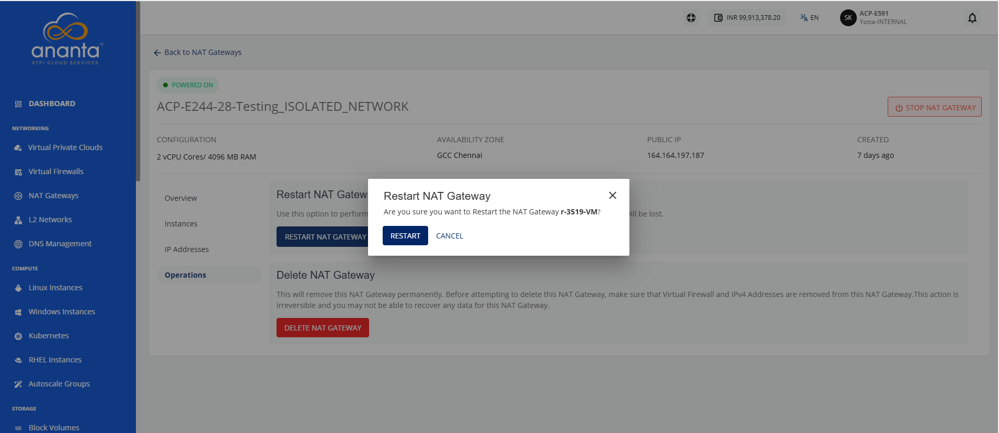

# Managing NAT Gateway Operations

NAT Gateway operations allow you to manage the lifecycle and availability of a NAT Gateway within a Virtual Private Cloud (VPC). These operations include restarting the NAT Gateway to restore or refresh its service availability and deleting the NAT Gateway when it is no longer required. Before deletion, ensure that all associated configurations, such as firewall associations and IP address assignments, are removed.

This section comprises of the following sub-sections:
- [Restarting a NAT Gateway](#restarting-a-nat-gateway)
- [Deleting a NAT Gateway](#deleting-a-nat-gateway)
## Restarting a NAT Gateway

Restarting a NAT Gateway performs a quick reboot of the gateway to refresh its operation and restore service availability when required. This operation does not remove any configurations or data associated with the NAT Gateway.

To restart a NAT gateway, follow these steps:

1. Navigate to **Networking > NAT Gateways**. The following screen appears:
2. Click a NAT Gateway name from the list. The Overview tabs opens automatically. The following screen appears:
3. Click **Operations**. The following screen appears:
4. Click the **Restart NAT Gateway** button. The following screen appears:
5. Click the **Restart** button.

## Deleting a NAT Gateway

This permanently removes the NAT gateway. This action is irreversible and you will not be able to recover any data for this NAT Gateway. Before attempting to delete this NAT Gateway, make sure that Virtual Firewall and IPv4 Addresses are removed from this NAT Gateway.

:::warning
	Deleting this NAT Gateway will permanently remove it. Before you delete the NAT Gateway, remove the associated Virtual Firewall and IPv4 Addresses. This action is irreversible, and you may not recover any data associated with this NAT Gateway after deletion.
:::

To delete a NAT gateway, follow these steps:

1. Navigate to **Networking > NAT Gateways**. The following screen appears:
2. Click a NAT Gateway name from the list. The Overview tabs opens automatically. The following screen appears:
3. Click **Operations**. The following screen appears:
4. Click the **Delete NAT Gateway** button. 
5. Enter **DELETE** and click the **Delete Now** button.