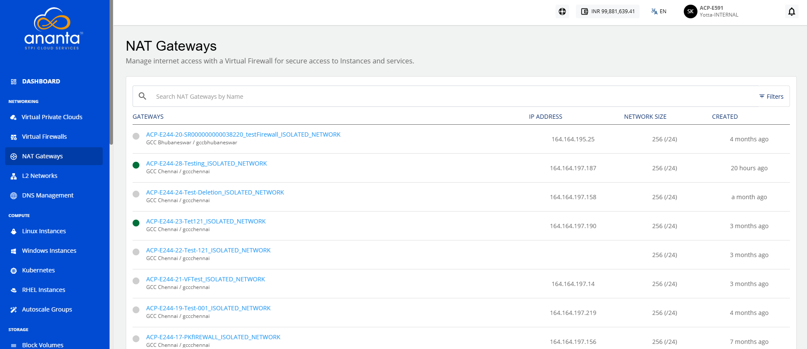
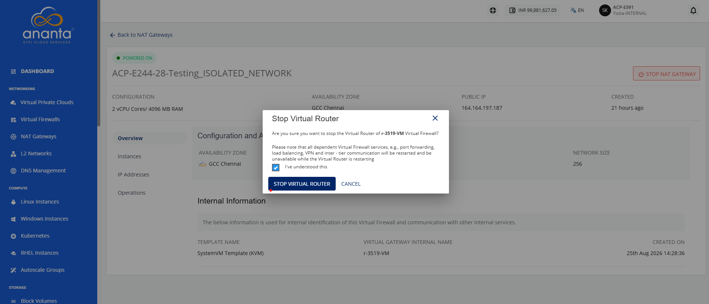
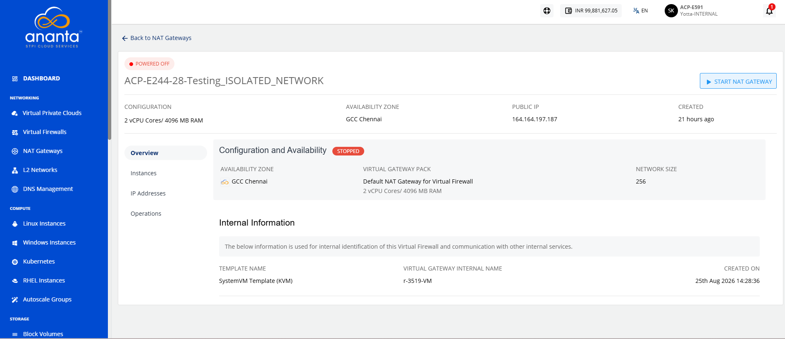
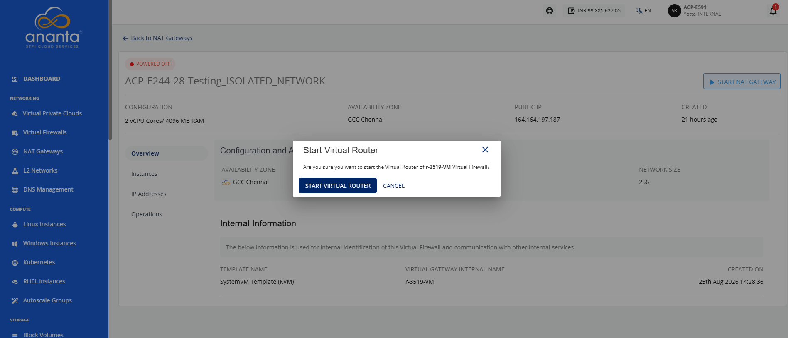
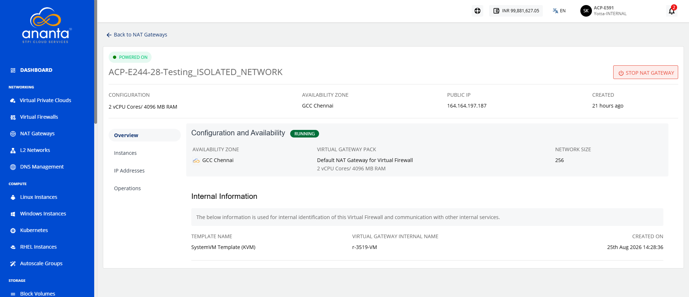

# Starting and Stopping a NAT Gateway

You can control a NAT gateway’s operational state by starting or stopping the virtual router that provides NAT services. Start the virtual router to enable network address translation, route traffic between connected networks, and restore network connectivity. Stop the virtual router when you perform maintenance, apply configuration changes, or temporarily disable NAT services to conserve resources and troubleshoot network issues.

To start and stop a NAT Gateway, follow these steps:

1. Navigate to **Networking > NAT Gateways**. The following screen appears:
2. Click a NAT Gateway name from the list. The Overview tab opens automatically. The following screen appears:
3. Click the **Stop NAT Gateway** button. The following screen appears:
   
4. Select the **I have understood this** option, and click the **Stop Virtual Router** button. The following screen appears:
5. Click the **Start NAT Gateway** button. The following screen appears:
	
6. Click the **Start Virtual Router** button. The following screen appears:
   