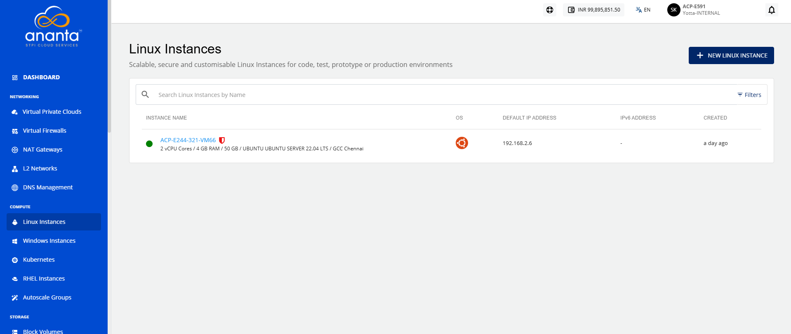
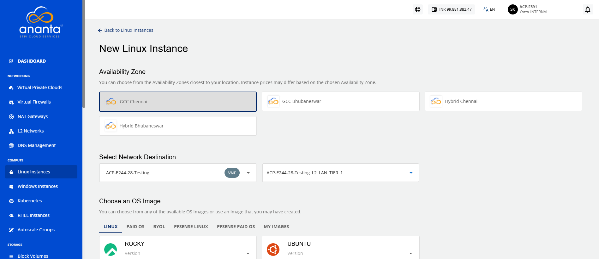
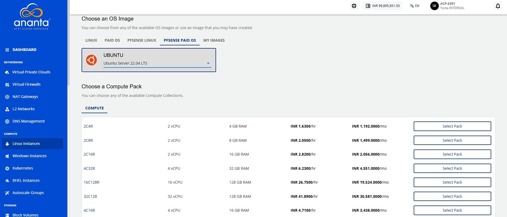
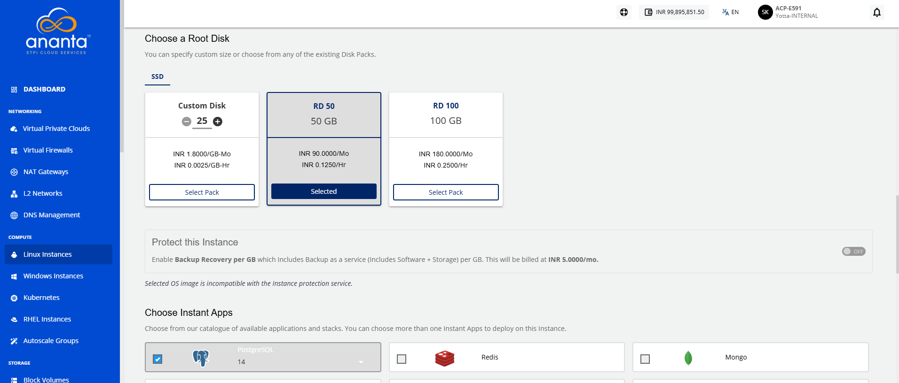
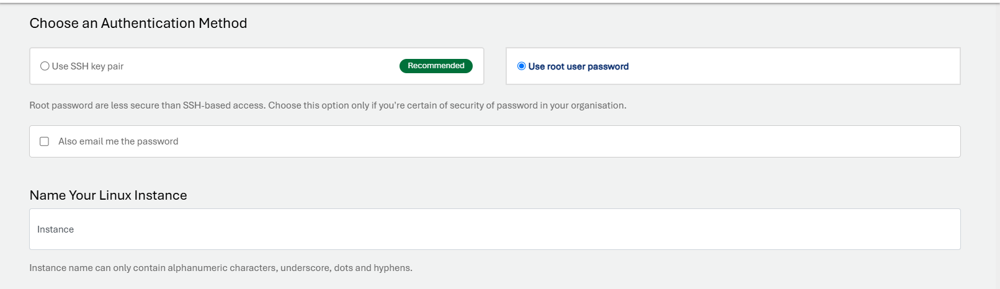
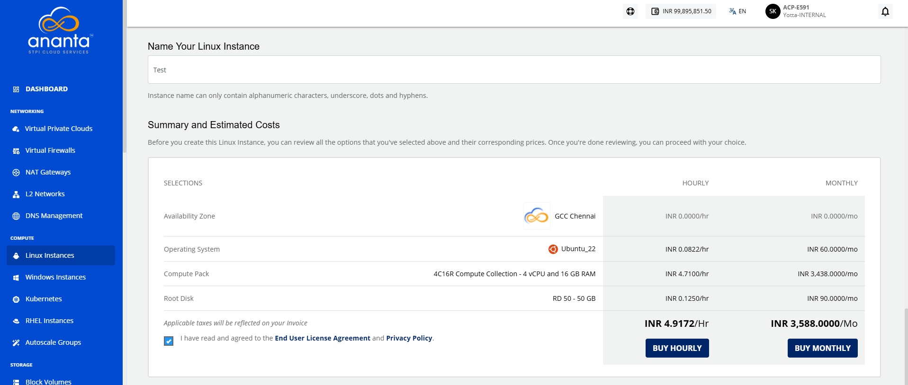
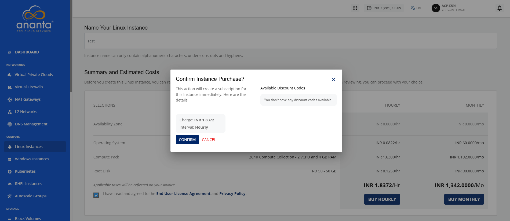

# Adding Linux Instance

To create a Linux instance, follow these steps:

1. Navigate to **Compute > Linux Instances**. The following screen appears:
2.  Click the **New Linux Instance** button. The following screen appears:
3. Choose an **Availability Zone**, which is the geographical region where your Instance will be deployed. 
4. Select a VNF network from the **Select Network** dropdown and select the appropriate tier listed in **Select a Network Tier**. 
5. Choose an OS image from the **pfSense Paid OS** tab.
6. **Choose a Compute Pack** from the available compute collections.  
7. **Choose a Root Disk** from the available options.
8. In **Choose Instant Apps**, select the available applications. To Verify/Login into your selected database, refer to [App Overlays](/docs/Guide/Compute/LinuxInstances/AppOverlays). 
    
9. **Choose an Authentication Method**:
    - **Use SSH key pair**: Click on the Use SSH key pair option; all the SSH key pairs present in your account will be listed. If your account does not have any SSH key pair, then you can click the **Generate a new key pair** option or upload the key pair by clicking the **Upload a key pair** option. 
    - **Use root user password**: On selecting Use root user password, the **Also email me the password** option is displayed. If you select this option, the password, along with the details, for instance, will be emailed to your registered email ID.
10. In the **Name Your Linux Instance** field, enter the desired name for your Linux Instance.
    
    
11. Select the **I have read and agreed to the End User License Agreement and Privacy Policy** option, and click **Buy Hourly** or **Buy Monthly** button. The following screen appears:
	
12. Click the **Confirm** button.

:::note
It might take up to 5-8 minutes for the Linux instance to get created. You may use the Cloud Console during this time, but it is advised that you do not refresh the browser window.
:::

Once ready, you receive a notification of this purchase at your email address. To access the newly created Linux instance, navigate to **Compute > Linux Instances** on the main navigation panel.