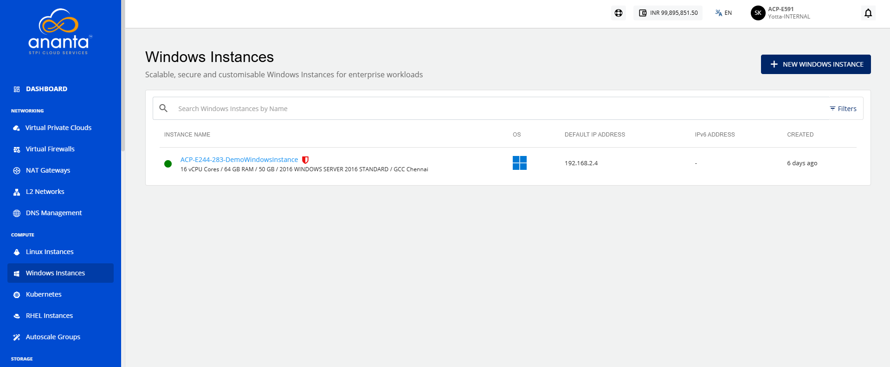
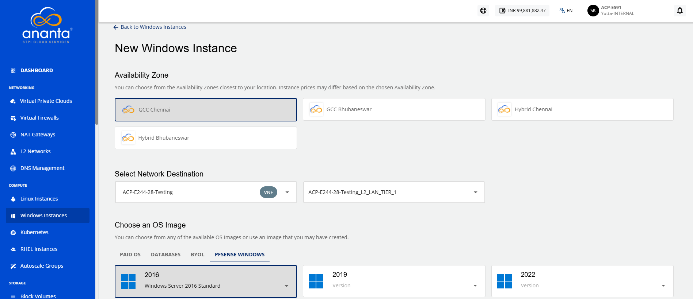
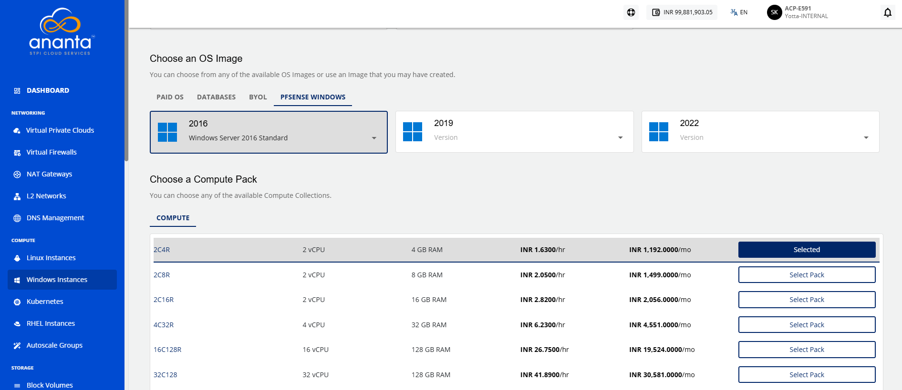
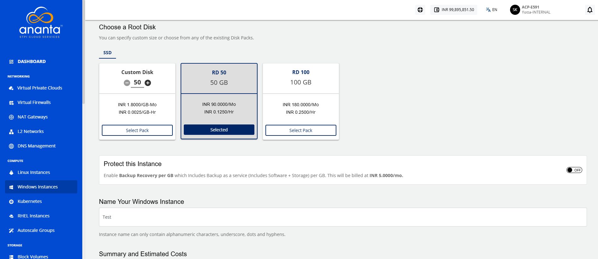
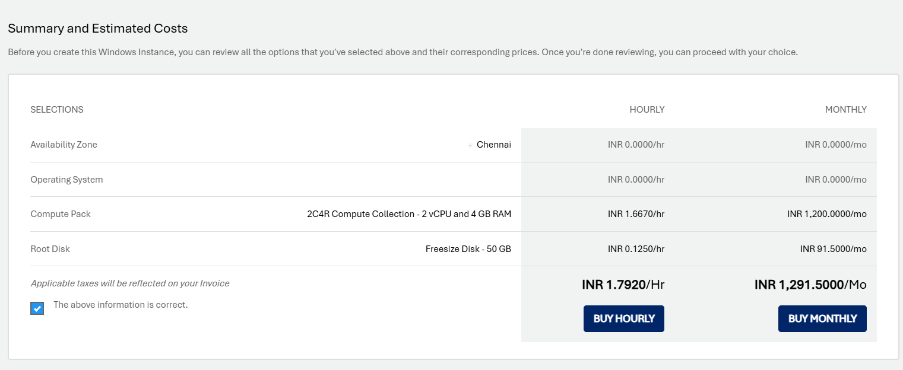
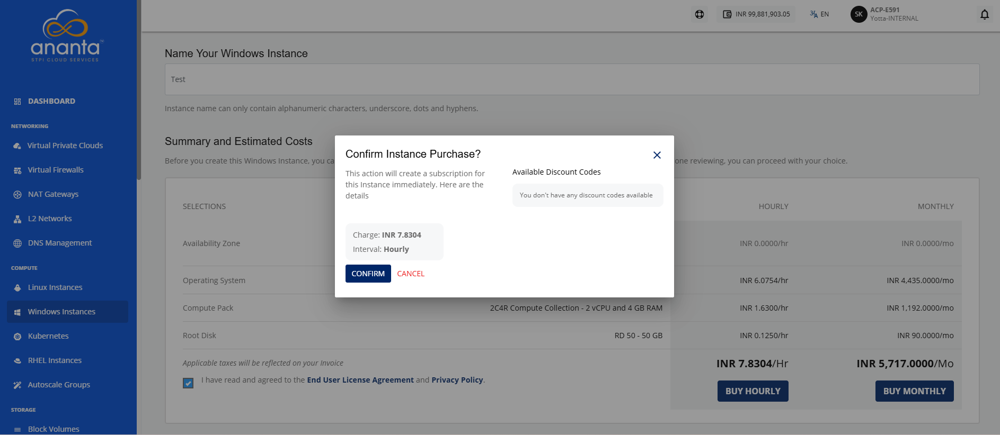

# Adding Windows Instance

To create a Windows instance, follow these steps:

1. Navigate to **Compute > Windows** Instances. The following screen appears: 
2. Click the **New Windows Instance** button. The following screen appears:
	
3.  Choose an **Availability Zone**, which is the geographical region where your Instance will be deployed. The chosen option should be the **advanced VPC** from all available AZs.
4.  Select a VNF network from the **Select Network** dropdown and select the appropriate tier listed in **Select a Network Tier**.
5.  Choose an OS image from the **pfSense Windows** tab. 
6. **Choose a compute pack** from the available compute collections.
7. **Choose a Root disk** from the available Disk packs, or you can use the free size option to specify the Root Disk.
8.  In the **Name Your Windows Instance** field, enter the desired name for your Windows Instance.
	
	
9.  Select the **I have read and agreed to the End User License Agreement and Privacy Policy** option, and click **Buy Hourly** or **Buy Monthly** button. The following screen appears:
	
10. Click the **Confirm** button.

:::note 
This might take up to 5-8 minutes. You may use the Cloud Console during this time, but it is advised that you do not refresh the browser window.
:::

Once ready, you receive a notification of this purchase at your email address. To access the newly created Windows instance, navigate to **Compute > Windows Instances** on the main navigation panel.