# Application Load Balancer
The Application Load Balancer feature prevents the overloading of a single server. It efficiently distributes incoming requests to multiple available backend servers. This process involves real-time mediation of client requests, where the load balancer directs the traffic to the most suitable backend servers for optimal processing.

This section covers the following topics:
-  [Prerequisites](#prerequisites) 
- [Configuring pfSense Firewall and Application Load Balancer](#configuring-pfsense-firewall-and-application-load-balancer)
## Prerequisites 
Before proceeding with the configuration, it is recommended to review the foundational concepts, supported features, and operational considerations of the platform. A clear understanding of these aspects helps ensure consistency, security, and alignment with organizational network standards.

The pfSense documentation provides detailed guidance on core functionalities, advanced configurations, and established best practices required for building a secure, scalable, and production-ready environment.

[Click here](https://docs.netgate.com/pfsense/en/latest/index.html "https://docs.netgate.com/pfsense/en/latest/index.html") to refer to the comprehensive pfSense documentation for the deployment and administration details. 

## Configuring pfSense Firewall and Application Load Balancer

To configure pfSense Firewall and Application Load Balancer, follow these steps:

1. Set up the Virtual Firewall on Ananta Cloud, for detailed steps refer to the [Creating a Virtual Firewall](CreatingaVirtualFirewall.md) page.
2. Navigate to **Networking > Virtual Firewall**. The following screen appears:
	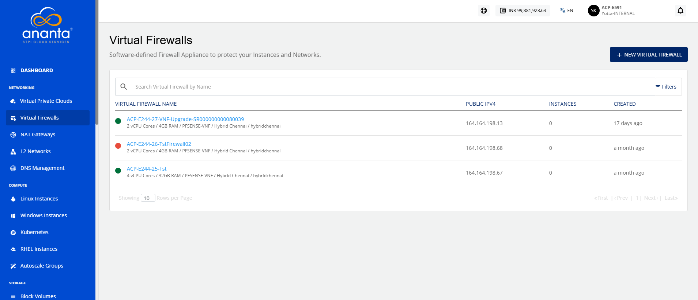
3. To view the details of the pfSense Firewall, click **Virtual Firewall Name**. The following screen appears: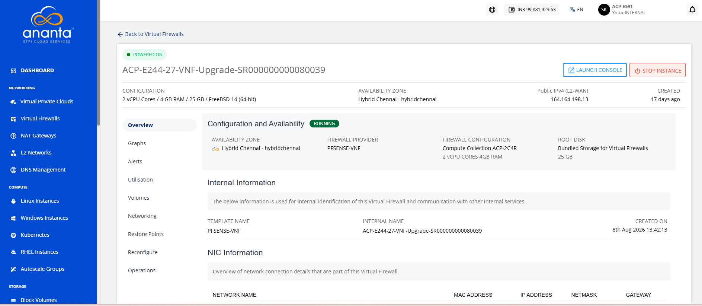
4. To launch your pfSense account, click the **Launch Console** button.
5. You will get the mail on your registered mail id with login credentials.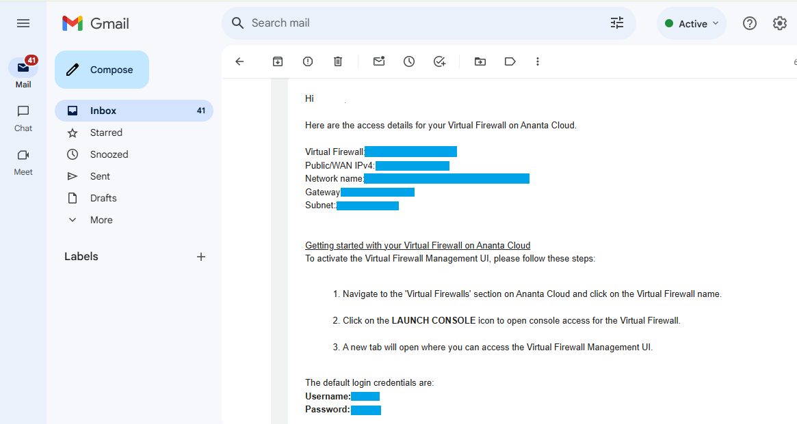
6. Enter the Username and Password to log in to the pfSense firewall GUI.
7. The pfSense dashboard screen appears: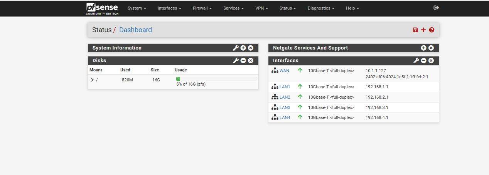
8. **Deploy Application Instance**
	- Navigate to the **Create Linux Instance** tab.
	- Deploy the application instance in the desired tier.
	- Perform the required application installation on the application instances.
9. Navigate to **System** > **Certificates** > **Certificates**, click the **Add/Sign** button. 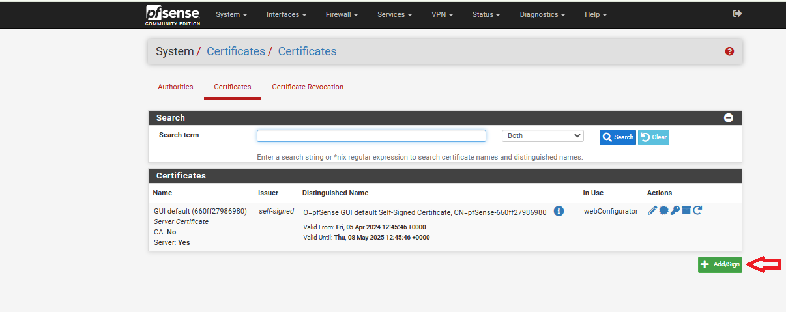
10. Specify the following:
    - **Method**: Select Import an existing certificate option from the dropdown.
    - **Descriptive Name**: Enter a valid name without using any special characters.
    - **Certificate Type**: Select **X.509 PEM** as your certificate type.
    - **Certificate Data**: Paste your certificate data.
    - **Private Key Data**: Paste your private key data.
    - Leave other options at their default values.
11. Click **Save** and **Apply Changes**.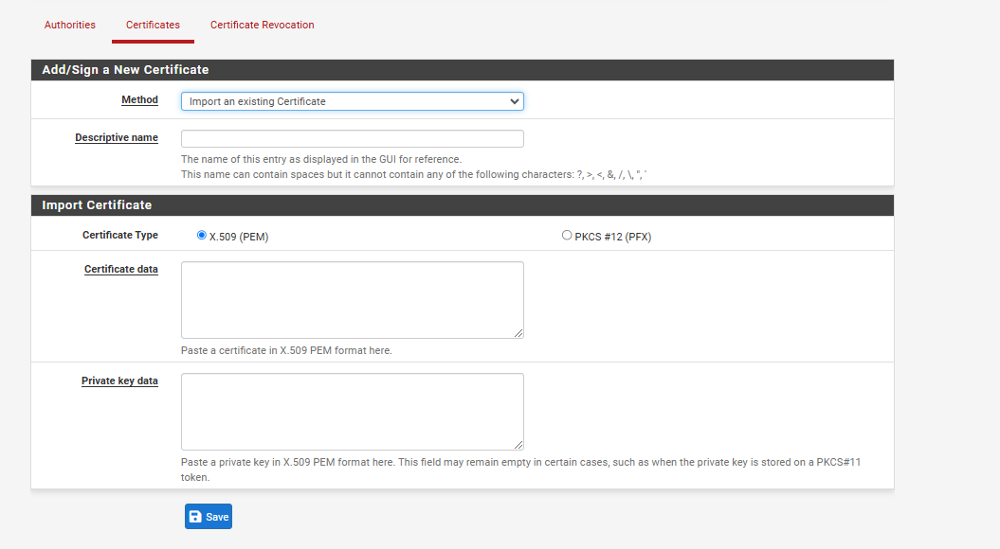

Now your certificates are ready and your can start configuring **HAProxy**.
	:::note
		If you wish to use an unsecured connection (e.g. port 80), you can skip this step.
	:::

To configure the backend and frontend in HAProxy, follow these steps:

1. Navigate to the **Services > HAProxy > Backend** tab. The following screen appears: 
	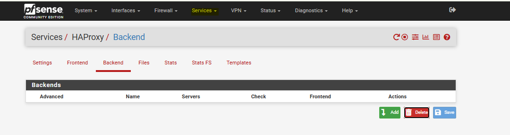
2. Click the **Add** button. The following screen appears: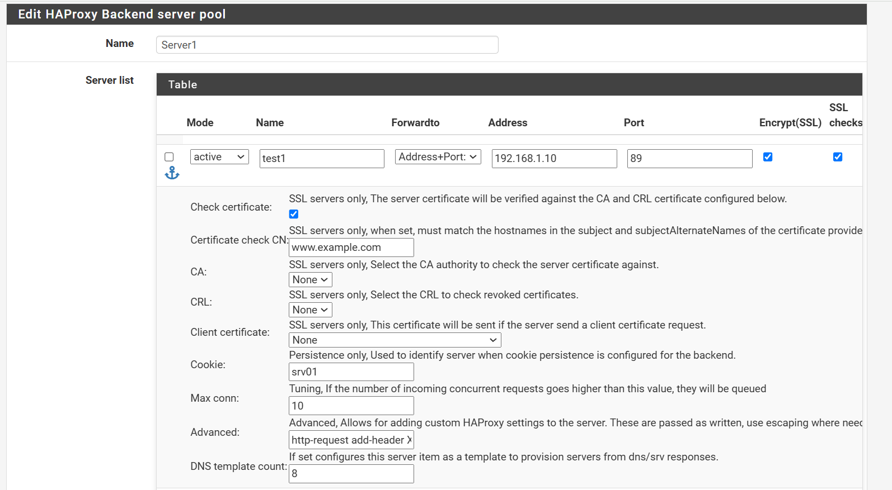
   
3. Specify the following:
    - **Name**: Provide a name for the backend.
    - **Server List**: Add the IP addresses of backend servers.
    - Leave other options at their default values.
4. Click **Save** and **Apply Changes**.
5. Navigate to the **Frontend** tab in HAProxy, click **Add** to create a new frontend.
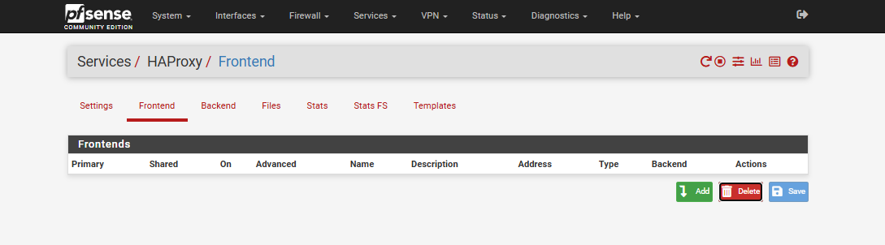
5. Specify the following:
    - **Name**: Provide a name for the frontend.
    - **Description**: Add a brief description.
    - **External Address**: Define the external address.
    - **Type**: Choose the appropriate type.
    - **Access Control Lists**: Specify any ACL rules.
    - **Actions**: Define the required actions.
    - **Default Backend**: Link to the corresponding backend.
    - **Use "forwardfor" Option** - Select this option to generate an HTTP **"X-Forwarded-For"** header that includes the client's IP address.
    - **Certificate** - Link the imported SSL certificate.
    - Leave other options at their default values.
6. Click **Save** and **Apply Changes**.
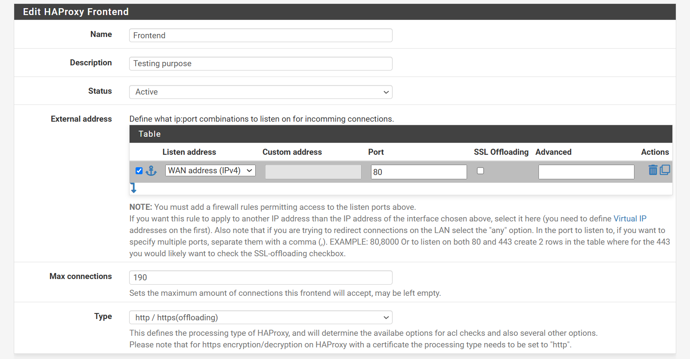

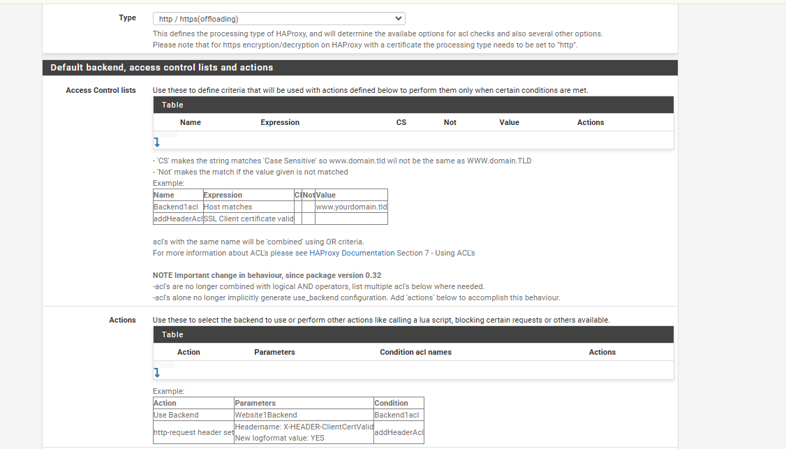

After completing the steps, test your application by entering its domain name in the browser's address bar.
