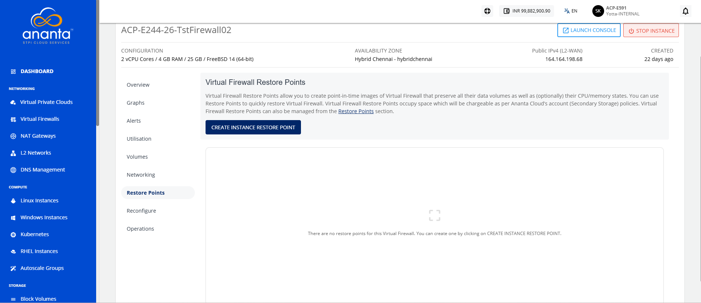
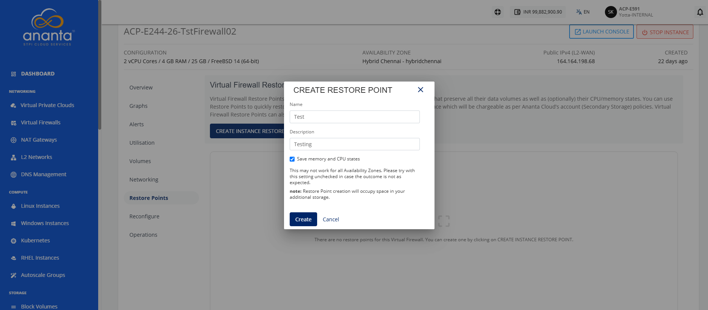
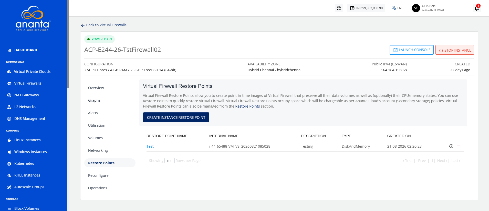
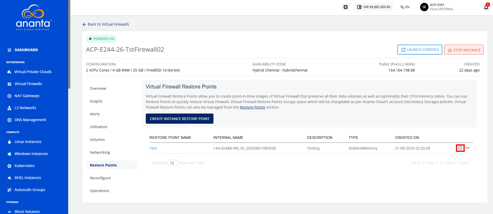
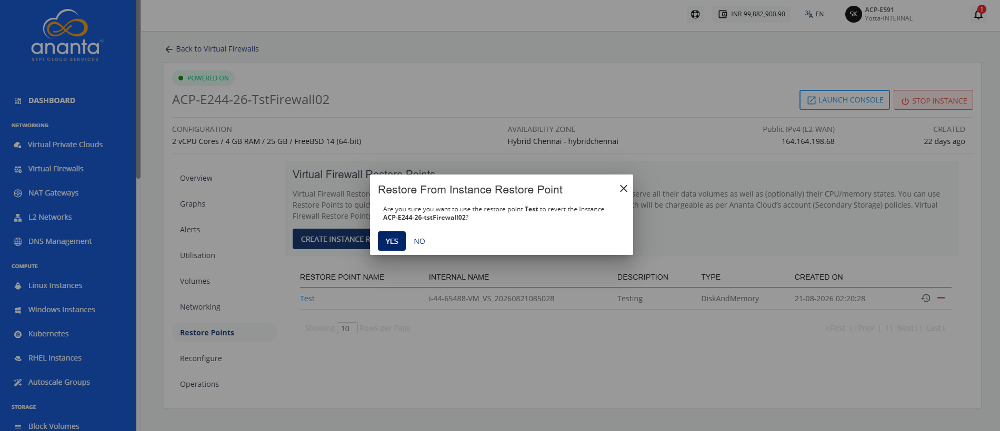
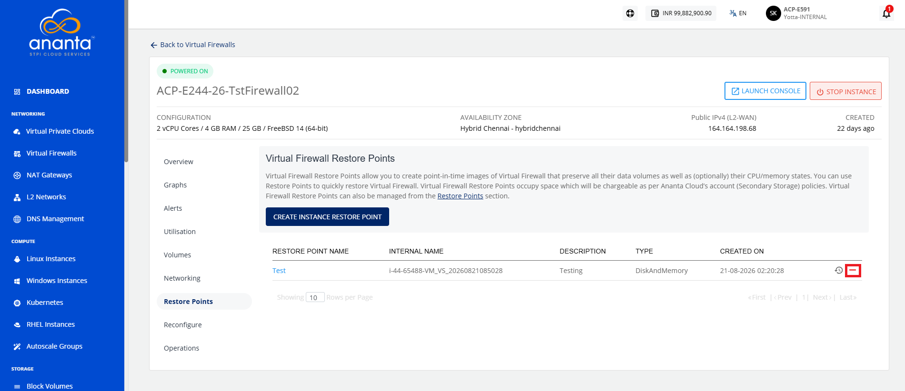
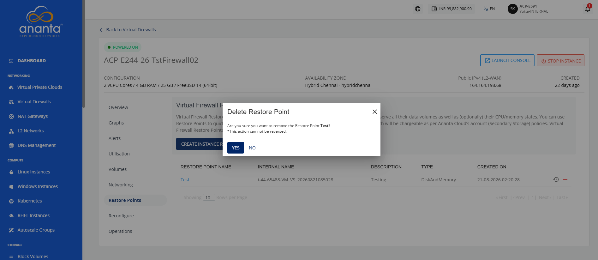

# Managing Instance Restore Point

Instance Restore Points help protect your instances by creating recovery points that can be used to restore them to a previous state when needed. Managing restore points allows you to create new recovery points, restore an instance from an existing restore point, and delete restore points that are no longer required. This helps ensure reliable data protection, simplifies recovery, and enables efficient management of instance backups.

This section covers the following topics:
- [Creating an Instance Restore Point](#creating-an-instance-restore-point)
- [Restoring an Instance Restore Point](#restoring-an-instance-restore-point)
- [Deleting an Instance Restore Point](#deleting-an-instance-restore-point)

## Creating an Instance Restore Point

Create a restore point to capture the current state of an instance before making configuration changes, updates, or other modifications. A restore point helps you recover the instance to a previous state if needed, improving data protection and minimizing the impact of unexpected changes.

To create an instance restore point, follow these steps:

1. Navigate to **Networking > Virtual Firewalls**. The following screen appears:
2. Click on your created virtual firewall name from the list. The following screen appears:
3. Click **Restore Points**. The following screen appears:
   
4. Click the **Create Instance Restore Point** button. The following screen appears:
5. Provide the required details, and click the **Create** button. 

The instance restore point is created successfully.

## Restoring an Instance Restore Point

Restore an instance from a restore point to recover it to a previously captured state. This helps you reverse unwanted changes, recover from configuration issues, and quickly return the instance to a known working state.

To restore an instance restore point, follow these steps:
1. Navigate to **Networking > Virtual Firewalls**. The following screen appears:
2. Click on your created virtual firewall name from the list and navigate to **Restore Points**. The following screen appears: 
3. Click the **Restore from Instance Restore Point** icon (highlighted in red). The following screen appears: 
4. Click the **Yes** button.
   

## Deleting an Instance Restore Point

Delete an instance restore point to remove recovery points that are no longer required. This helps you keep restore point records organized and manage storage resources efficiently while retaining only the recovery points you need.

To delete an instance restore point, follow these steps:

1. Navigate to **Networking > Virtual Firewalls**. The following screen appears:
2. Click on your created virtual firewall name from the list and navigate to **Restore Points**. The following screen appears: 
3. Click the **Restore from Instance Restore Point** icon(highlighted in red). The following screen appears: 
4. Click the **Yes** button.
   