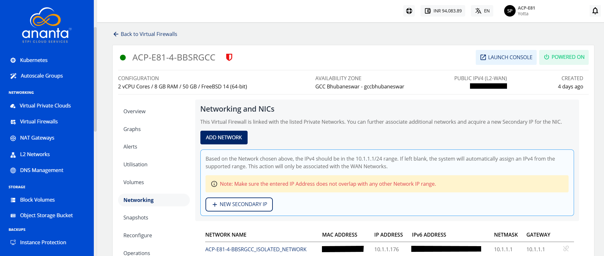
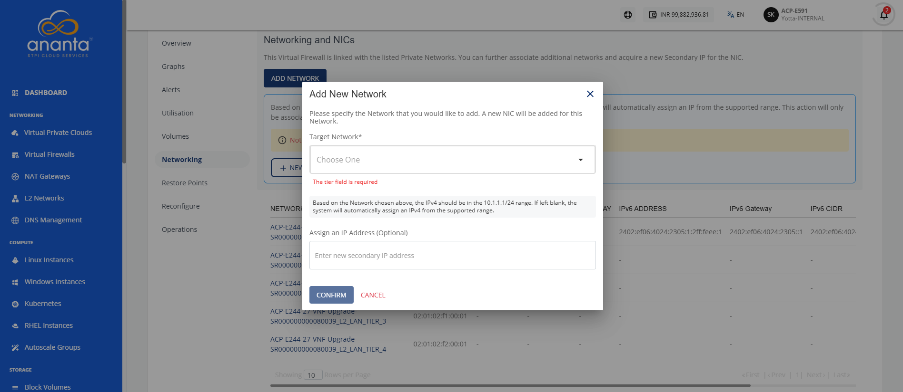
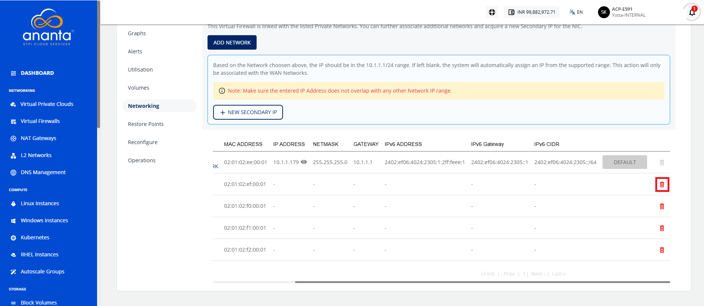
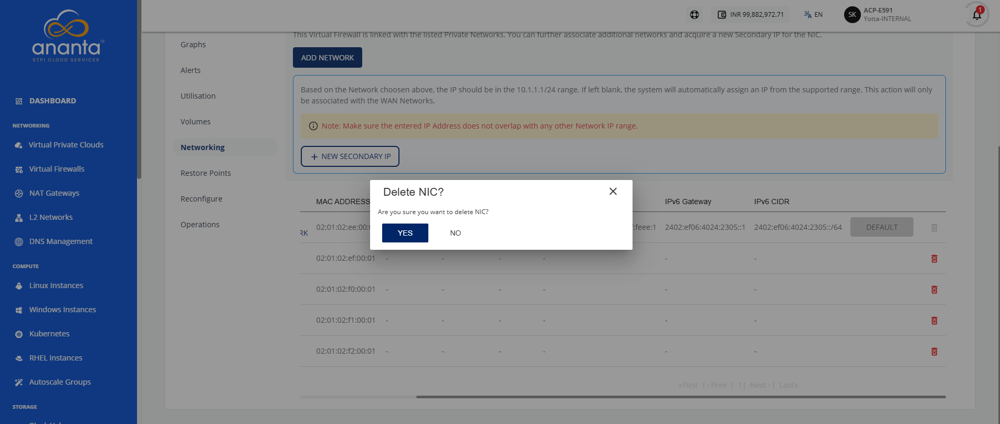
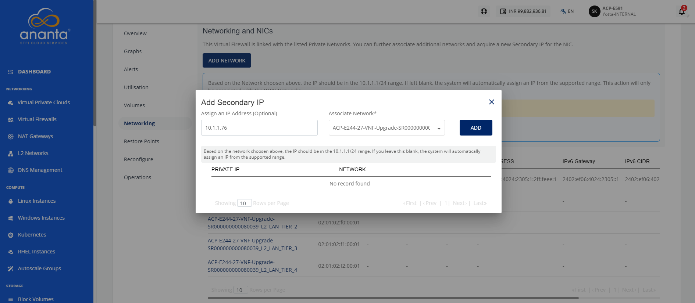
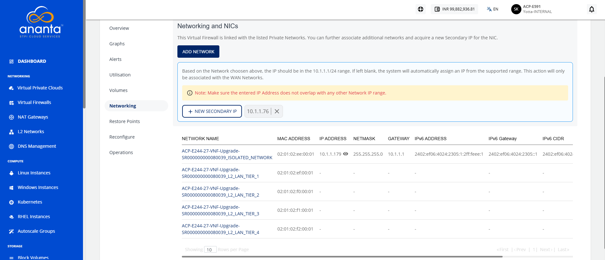

# Networking Management

Networking management keeps your virtual firewall instance connected securely and ensures smooth traffic flow. It involves expanding connectivity when needed, assigning extra addresses for flexibility, and removing unused interfaces to keep configurations clean.

This section covers the following topics:
- [Adding a Network](#adding-a-network)
- [Adding a Secondary IP](#adding-a-secondary-ip)

## Adding a Network

A network connects your virtual firewall to other resources and defines secure traffic flow through IP addressing and subnet configuration. Add a network to extend connectivity or assign secondary IPs, and detach unused networks to simplify management and maintain a secure configuration.

To add and detach a network, follow these steps:

1. Navigate to **Networking > Virtual Firewalls**. The following screen appears:
2. Click on your created virtual firewall name from the list and click **Networking**. The following screen appears:
3. Click the **Add Network** button. The following screen appears where you can provide the required details:
4. Click the **Confirm** button. 

### Deleting a NIC

To detach NIC, follow these steps:
1. Navigate to **Networking > Virtual Firewalls**. The following screen appears:
2. Click on your created virtual firewall name from the list and click **Networking**. The following screen appears:
3. Click the **Delete icon** (highlighted in red).
4. Click the **Yes** button. The following screen appears:
	
## Adding a Secondary IP

A secondary IP is an additional address assigned to your virtual firewall instance, allowing it to handle multiple connections or services on the same network interface. Adding a secondary IP is important because it helps you isolate workloads, support different applications, and improve flexibility in managing traffic.

To add a secondary IP, follow these steps:

1. Navigate to **Networking > Virtual Firewalls**. The following screen appears:
2. Click on your created virtual firewall name from the list and click **Networking**. The following screen appears:
3. Click the **New Secondary IP** button. The following screen appears where you can provide the required details:
4. Click the **Add** button. 

The secondary IP is added.

