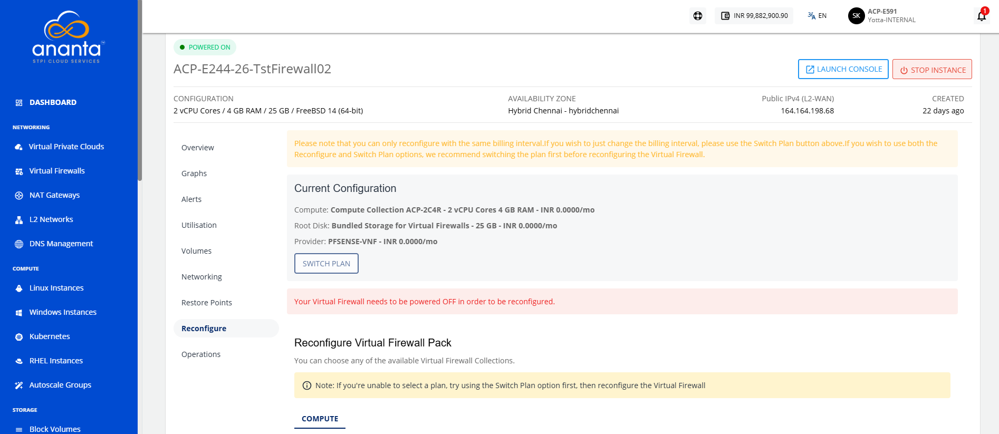
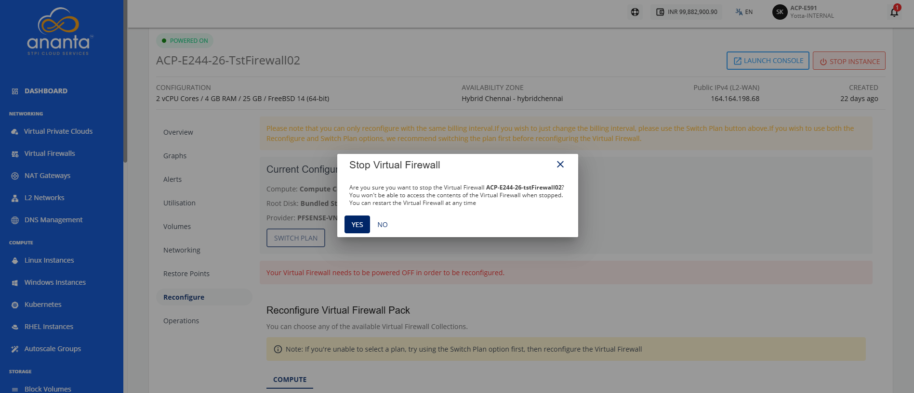
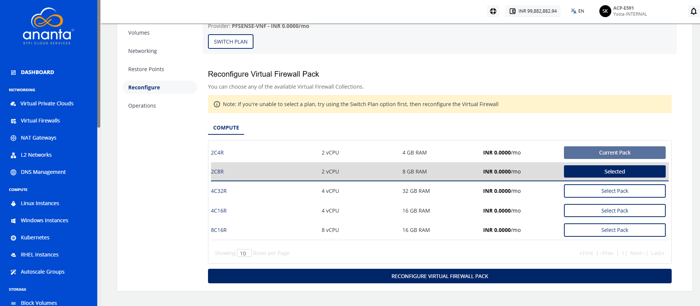
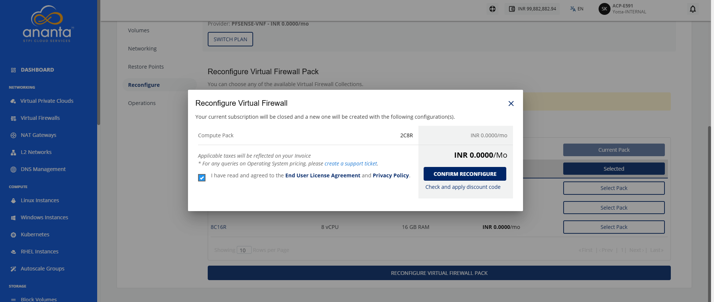

# Reconfiguring Virtual Firewall

Reconfigure a virtual firewall to replace its current firewall appliance with a different one that better meets your operational and security requirements. This operation updates the firewall configuration by applying the selected appliance.

To reconfigure the existing virtual firewall, follow these steps:

1. Navigate to **Networking > Virtual Firewalls**. The following screen appears:
2. Click on your created virtual firewall name from the list. The following screen appears:
3. Click **Reconfigure**. The following screen appears:
4. Click the **Stop Instance** button. The following screen appears:
5. Click the **Yes** button. The following screen appears:
6. Select a **Compute** from the list, and click the **Reconfigure Virtual Firewall Pack** button. The following screen appears:
7. Select **I have read and agreed to the End User License Agreement and Privacy Policy** option.
8. Click the **Confirm Reconfigure** button.