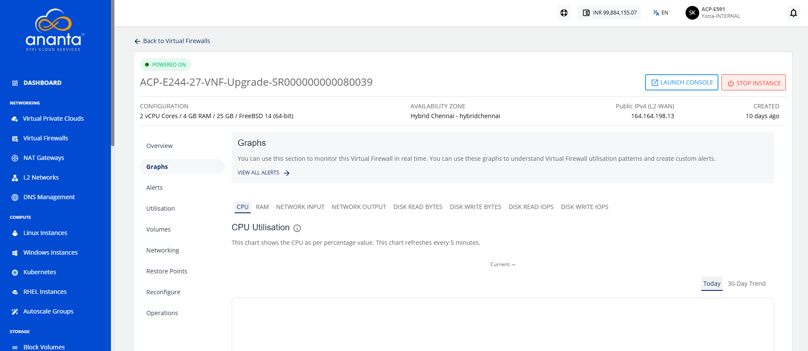

# Viewing Graphs

Graphs display key performance metrics of your Virtual Firewall instance. You can view CPU, RAM, network traffic, and disk activity on a 24‑hour time scale with a 30‑day trend line. Graphs help you track utilization patterns and configure custom alerts to manage performance effectively.

To view the available graphs and monitor the instance in real-time, follow these steps:

1. Navigate to **Network and Security > Virtual Firewalls**. The following screen appears:
2. Click on your created virtual firewall name from the list, and navigate to **Graphs**. The following screen appears:
	