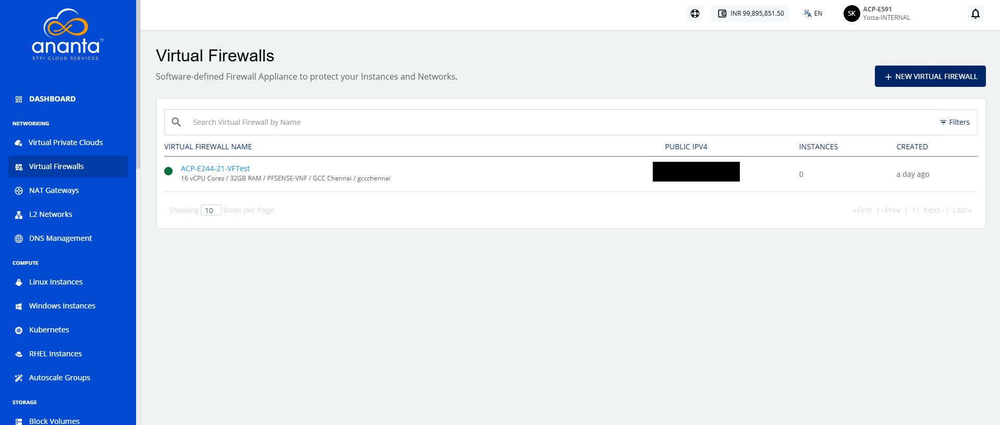

# Viewing Virtual Firewall Details

The virtual firewalls list provides you a centralized view of all configured virtual firewall appliances within the cloud environment. Virtual Firewalls are software-defined firewall appliances that help protect cloud instances and networks by controlling and securing network traffic.

This page allows you to view firewall details, monitor their availability status, search for specific firewalls, and manage firewall resources.

To view the virtual firewalls, navigate to **Network > Virtual Firewalls**. The following screen appears where you can view these details:
- Names of the Virtual Firewalls
- Public IPV4
- Number of instances associated with each Virtual Firewall
- Creation Date

