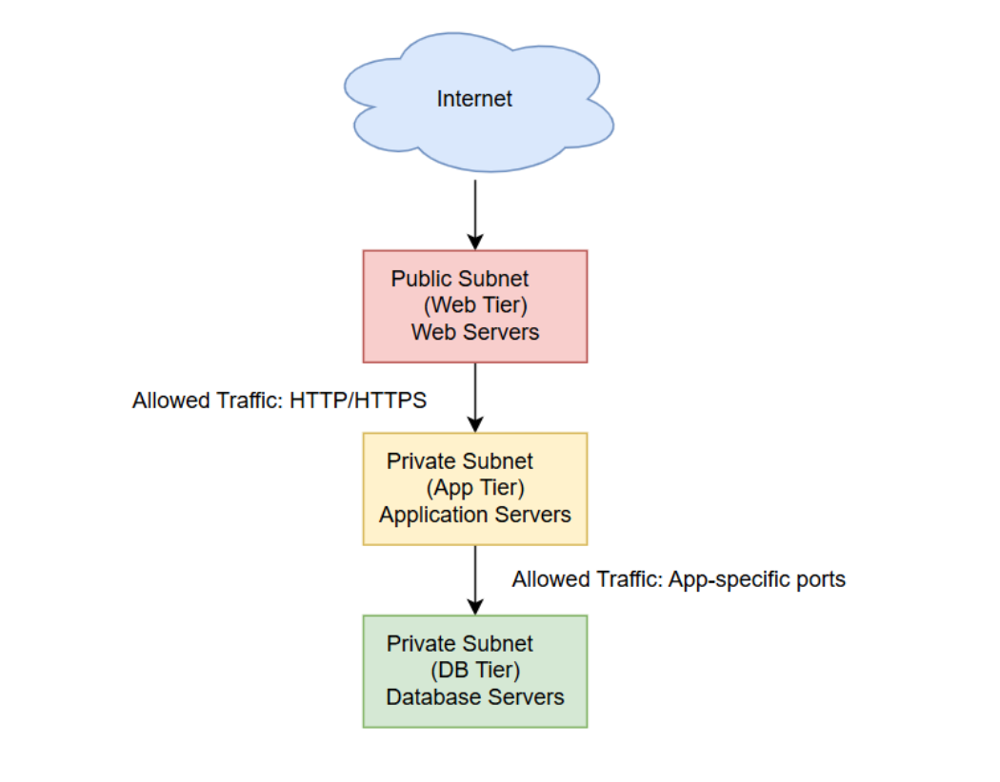
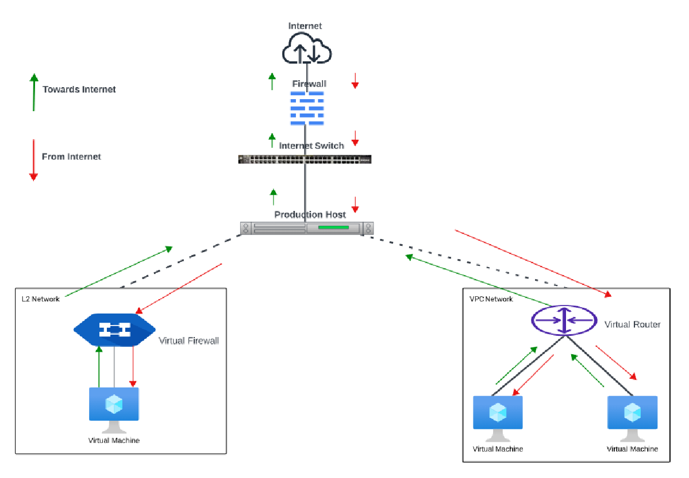

# About Virtual Private Clouds and L2 Networks

A Virtual Private Cloud (VPC) is a software-defined networking capability on Ananta that allows cloud users to simulate a traditional private cloud environment on a public cloud. Using VPC, users can control a host of features and configurations including subnet/tier management, access control using ACL, NAT-ing using IPv4, managing site-to-site or remote VPN connections, or in some advanced cases, terminating their MPLS connections directly on the VPC.

## 3-Tiered Network Architecture

VPCs follow the convention of 3-tiered network architecture, with web, app, and DB tiers forming the norm.

**Web Tier (Public Subnet)**
- This layer contains web servers and is placed in a public subnet.
- It manages user requests coming from the internet.
- It accepts incoming traffic and sends it securely to the application tier.

**App Tier (Private Subnet)**
- This layer contains the application servers that process the business logic.
- It manages requests forwarded by the web tier.
- It is placed in a private subnet with no direct internet access.

**DB Tier (Private Subnet)**
- This layer hosts the database servers.
- It resides in a private subnet and is strictly isolated from the internet.
- It is accessed only by the app tier to ensure data protection.

On Ananta, VPC is delivered using a virtual router (VR).

The sections below outline various functionality using a VPC:

- [Creating a VPC](CreateListandViewVPCs)
- [Creating subnets and tiers](CreatingVPCSubnetsTiers)
- [Managing Instances in a VPC](ManagingVPCInstances)
- [Working with IPv4 addresses](IPv4AddressesandVPC)
- [Access control on a VPC](ManagingAccessControlonVPCSubnets)
- [Working with VPN connections](WorkingwithVPNConnectionsinaVPC)
- [VPC operations](VPCManagementandBasicOperations)

## L2 Networks

L2 networks provide network isolation without any other services. This means that there will be no virtual router. It is assumed that the end user will have their **IPAM**IP Address Management helps in assigning, tracking, and managing IP addresses inside your network infrastructure.in place or that they will statically assign IP addresses.

The end-users can create L2 networks; however, network offerings that allow the network creator to specify a VLAN can only be created by the root admins. It does not assign IP addresses to instances. User data and metadata can be passed to the instance using a config drive (which must be enabled in the network service offering).

The difference in Traffic Flow is simplified in the following diagram:

