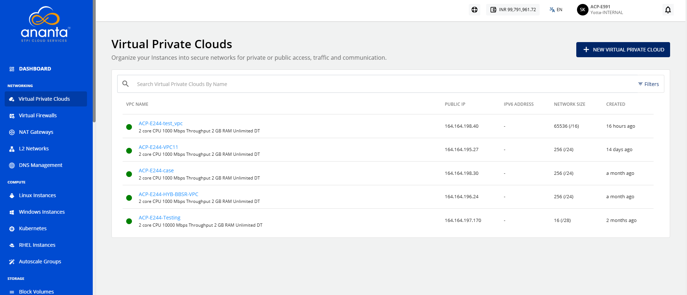
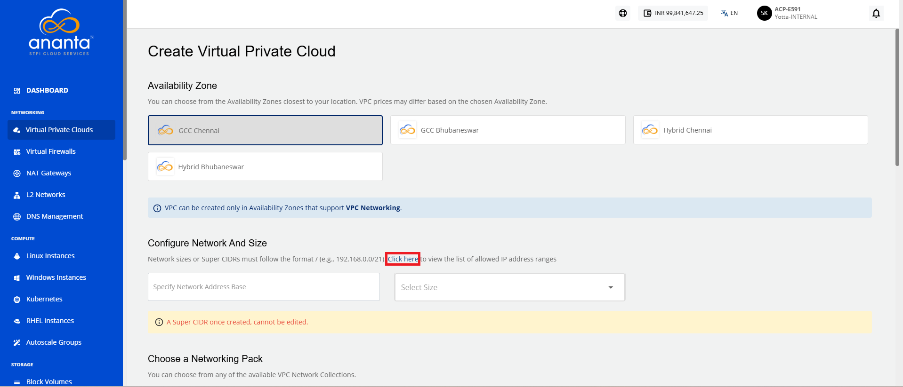
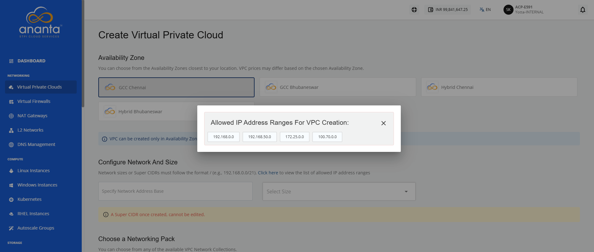
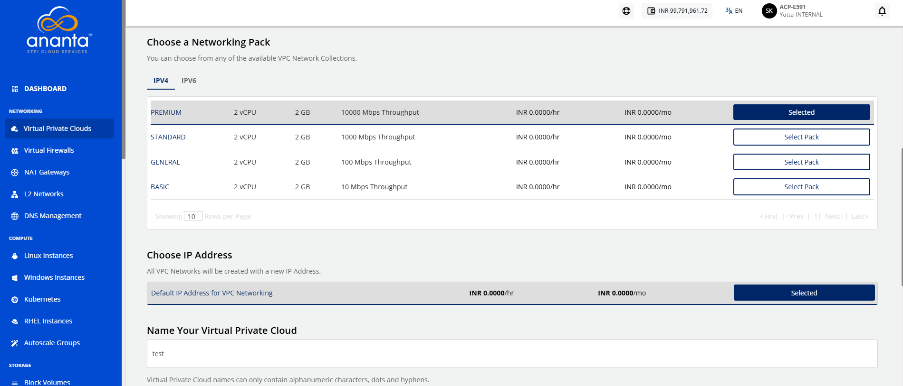
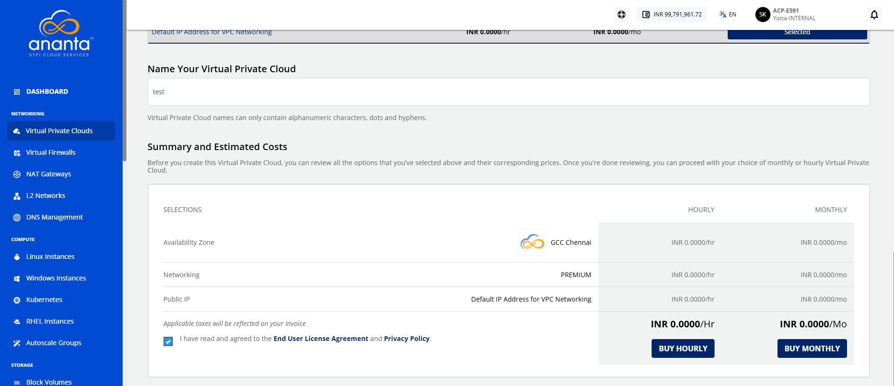
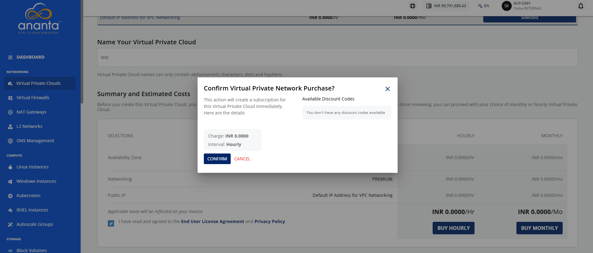
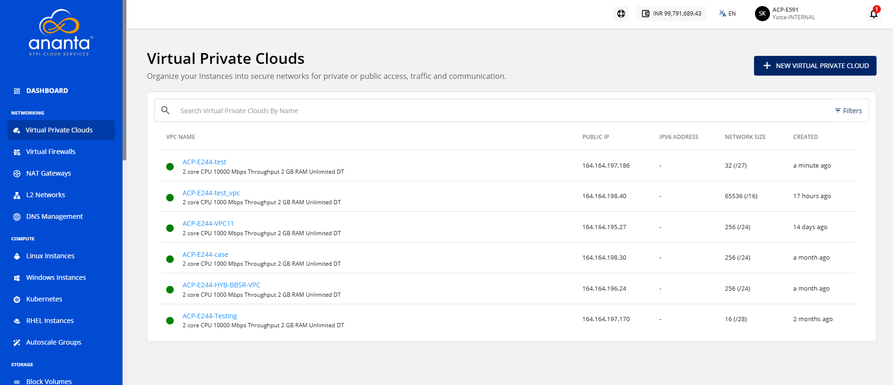
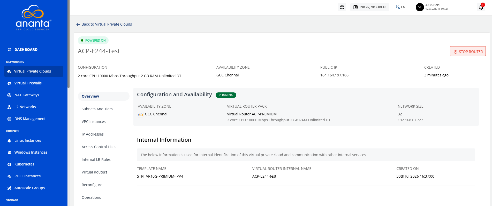

# Create, List and View VPCs

This section explains how to create and view VPCs. Creating and viewing VPCs helps you organize your resources (instances), keep track of active networks, and quickly access details for management and troubleshooting.

The following are major topics covered in this section:
- [Creating a VPC](#creating-a-vpc)
- [Viewing Available VPCs](#viewing-available-vpcs)
- [Viewing VPC Details](#viewing-vpc-details)

## Creating a VPC

To do this, follow these steps:

1. Navigate to **Networking > Virtual Private Clouds**. The following screen appears:
2. Click the **New Virtual Private Cloud** button. The following screen appears:
3. Choose the **Availability Zone** where you want to configure the VPC.
4. In the **Configure Network and Size** section, specify **Network Address Base** and select **Size** from the dropdown. (For example: The **super CIDR**It is the method of combining multiple continuous smaller CIDR blocks into a larger block to reduce the number of routes. for the internal IP allocation in an x.x.x.x/x format).
	:::note
	To know allowed IP address ranges for VPC creation, select the **click here** link (highlighted in red).
	:::
	
	
5. Choose a **IPv4** or **IPv6** networking pack.
	:::note
	To configure IPv6 under a **VPC,** you must create a ticket with our support team for assistance.
    :::
	
6. To create the VPC with a new NICNET IP address, select **Default IP Address for VPC Networking**.
7. Enter the valid name in the **Name your Virtual Private Cloud** field.
8. Verify the **Summary and Estimated Costs** section (Here, both the hourly and monthly price summaries are displayed).
9. Select the **I have read and agreed to the End User License Agreement and Privacy Policy** option.
10. To display the price summary, click the **Buy Hourly** or **Buy Monthly** button, a confirmation screen appears:
	- To apply any of the listed discount codes, click **Apply**.
	- To remove the applied discount code, click **Remove**.
	- To cancel the action, click **Cancel**.
11. Click **Confirm**.

Once ready, you get the notification of this purchase on your email address on record. 

:::note
This might take up to 5-8 minutes. You may use the Cloud Console during this time, but it is advised that you do not refresh the browser window.
:::
## Viewing Available VPCs

To view the created VPCs, navigate to **Networking** > **Virtual Private Clouds**. The created VPC is displayed with the following details:
- VPC Name
- Public IP
- IPv6 Address
- Network Size
- Created

## Viewing VPC Details
To view a list of tabs and the various operations that you can perform, click the **VPC Name**. The following screen appears with these details:
- Configuration
- Availability Zone
- NICNET IP
- Created

Along with the summary, the following information is readily available in the **Overview** tab:

- **Configuration and Availability**
    - The instance's status, **RUNNING**, is displayed in **green**, whereas **STOPPED** is displayed in greyed out.
    - Information about the Virtual Router Pack.
    - Information about the Network Size.
- **Internal Information**
	This displays the information that is used for internal identification of this VPC router and communication with other internal services.
	- Template Name
	- Virtual Router Name
	- Created On

Navigate to the respective tabs to manage VPC operations, configurations, and other available functions.

