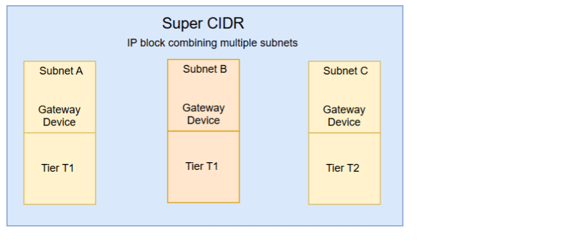
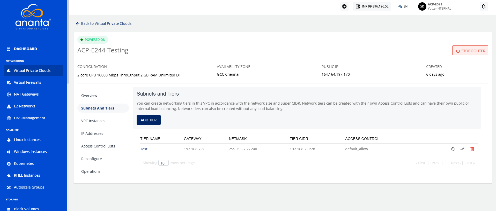
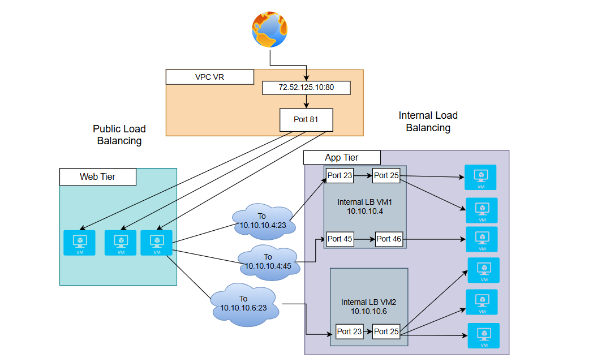

# Creating VPC Subnets/Tiers

VPCs follow the convention of 3-tiered architectures, with web, app, and DB tiers forming the norm. You can, however, configure these tiers to suit your application architecture or just follow the common convention.

## Subnet and Tiers 

In a VPC, subnets define IP-based network segments, and tiers represent logical layers of your application architecture. You can design networking tiers within this VPC based on the overall network size and the allocated Super CIDR range. 

To add a tier to your VPC, navigate to the VPC, select the **Subnets and Tiers** section. The following details are displayed:
- **Name** of the tier.
- **Gateway**A gateway for a subnet in a VPC is a device that routes traffic between the subnet and external networks, allowing internet access.for the subnet. 
- **Netmask**A netmask defines the number of IP addresses available in a subnet or tier within a VPC.for the tier/subnet.
- **Tier CIDR**It is the IP address range assigned to a particular application tier within a VPC. for this tier.
- **Access Control** of this tier.

There are three icons available on the right side for quick actions:
- Restarting the network
- Replacing the access control list
- Deleting the tier

### Adding Tier

The following are the steps to add a tier:
1. Click the **ADD NETWORK TIER** option to create the tier or subnet.
2. Enter the following details:
	- **Tier Name:** Name of the network tier you are creating.
	- **Gateway:**  IP address for the gateway of the tier.
	- **Netmask:** Subnet mask defining the IP range.
	- **Access Control:** Choose rules for network traffic control.
	- **Load Balancing Type:** Select between public or internal load balancing.
	:::note
	To set up a public load balancer, you need to select **Public LB** from this dropdown. There can only be 1 tier of type Public LB in a network.
	:::
### Public Load Balancer

A Public Load Balancer is used to manage traffic that comes from the internet. It comprises a public IP address, allowing users or external systems to access your application from outside your network.

#### Use Case
- Select this option if your application or service needs to be accessed from the public internet.
- It is ideal for websites, public APIs, or any system where users connect directly from browsers or apps.
#### Placement
- It is placed in the web tier, which is a public subnet in your VPC.
- It can forward traffic to backend instances located in either public or private subnets using routing rules.

### Internal Load Balancer

It works only inside your VPC. It has a private IP address, which means it is not accessible from the internet. It is used for managing traffic between internal services, like from your web tier to your application tier.

#### Use Case
- Select this option when your services do not need public access but need to communicate within your VPC.
- Useful in a multi-tier setup, where one layer of your application communicates to another.

#### Placement
- It is placed in the application or internal tier, which is a private subnet.
- It routes traffic to backend services or internal logic components.

:::note
Only empty tiers can be deleted, which means that to delete a tier, ensure that there are no Instances and no NAT rule(s) associated with it.
:::

