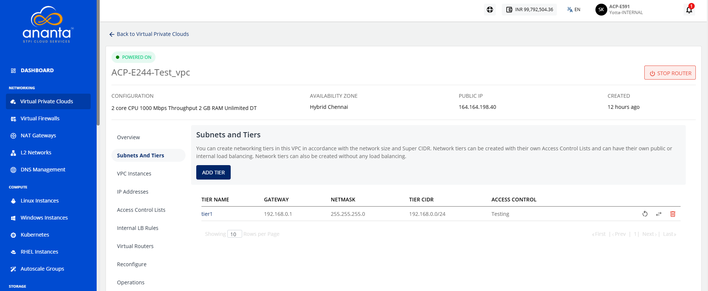
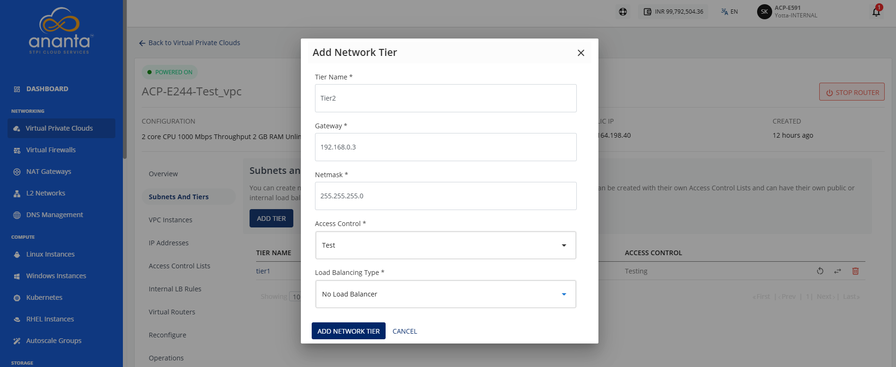
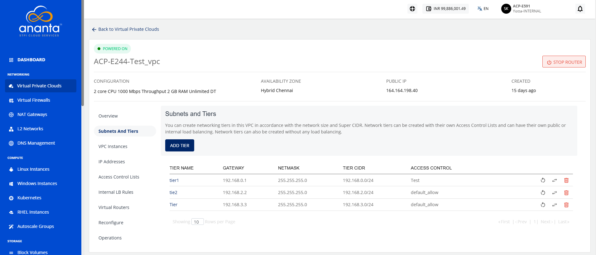
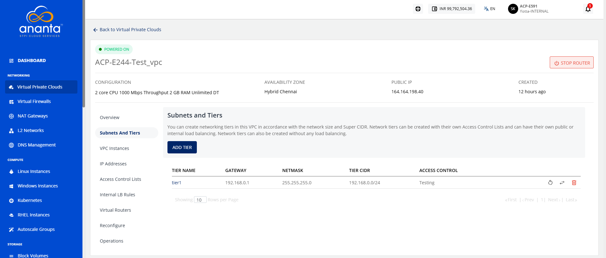
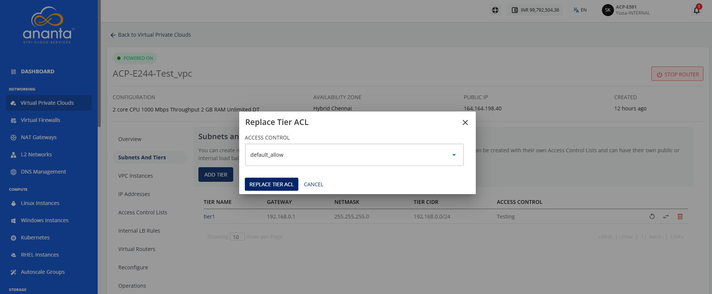
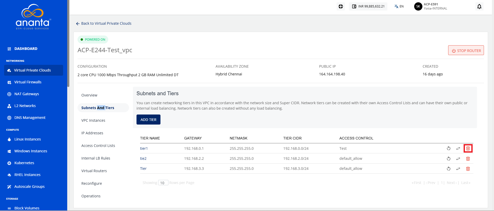
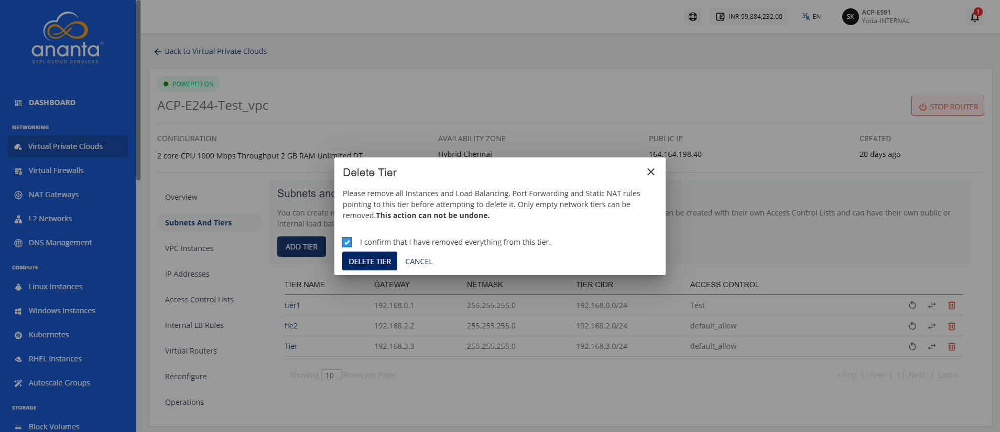

# Creating VPC Subnets and Tiers

VPCs follow the convention of 3-tiered network architecture, with web, app, and DB tiers forming the norm. You can, however, configure these tiers to suit your application architecture or just follow the common convention.

In a VPC, subnets define IP-based network segments, and tiers represent logical layers of your application architecture. You can design networking tiers within this VPC based on the overall network size and the allocated Super CIDR range. 

To add a tier to your VPC, navigate to the VPC, select the **Subnets and Tiers** section. The following details are displayed:
- **Name** of the tier.
- **Gateway**A gateway for a subnet in a VPC is a device that routes traffic between the subnet and external networks, allowing internet access.for the subnet. 
- **Netmask**A netmask defines the number of IP addresses available in a subnet or tier within a VPC.for the tier/subnet.
- **Tier CIDR**It is the IP address range assigned to a particular application tier within a VPC. for this tier.
- **Tier IPv6 Gateway** of this tier.
- **Tier IPv6 CIDR** of this tier.
- **Access Control** of this tier.

There are three icons available on the right side for quick actions:
- Restarting the network
- Replacing the access control list
- Deleting the tier
## Adding a Tier

To add a tier, follow these steps:
1. Click the **Add Tier** button.
2. Enter the following details:
	- **Tier Name:** Name of the network tier you are creating.
	- **Gateway:**  IP address for the gateway of the tier.
	- **Netmask:** Subnet mask defining the IP range.
	- **Access Control:** Choose rules for network traffic control.
	- **Load Balancing Type**: Select the load balancing type (Internal load balancer, Public load balancer, No load balancer)
3. Click the **Add Network Tier** button.

:::note
	 You can attach the network tier to the instance as a Network Interface Card (NIC).
:::

## Restarting a Network Tier

Restarting a network tier refreshes the selected tier by reapplying its network configuration. Use this option to restore normal network operations, apply recent configuration changes, or resolve temporary connectivity issues within the tier.

To restart a network tier, follow these steps:

1. Click the **Restart Network** icon (highlighted in red). The follow screen appears:
   
2. Click the **Restart Tier** button.
## Replacing an ACL

To  replace an ACL, follow these steps:

1. Click the **Replace Access Control List** (highlighted in red) icon.
   The following screen appears:
2. Select a different **ACL** from the dropdown list.
3. Click the **Replace Tier ACL** button.

The tier is attached with selected ACL.

## Deleting a Network Tier

Deleting a network tier permanently removes the selected tier from the VPC. Use this option to remove tiers that are no longer required, simplify network management, and maintain a clean and organized network configuration.

:::note
	You can delete only the empty network tiers, which means that in order to delete a network tier, ensure that there are no instances and no NAT rule(s) associated with it.
:::

To delete a network tier, follow these steps:

1. Navigate to **Virtual Private Clouds > Subnet and Tiers.** The following screen appears:
	
2. Click the **Delete Network** icon. The following screen appears: 
	
3. Select the **I confirm that I have removed everything from this tier** option, and click the **Delete Tier** button.