# IPv4 Addresses and VPC

IPv4 Addresses are an integral part of using VPC networking and are required to access various components of the VPC. By default, the Public IP address is assigned to the VR, allowing it to communicate over the Public network to transmit traffic to/from the VR. This address can also be used for configuring remote access (L2TP) and site-to-site (IPSec) VPN connections.

## Configuring Additional Public IP

  
Primarily, you can use a Public IP address to configure access and NAT through:
- [Configuring Load balancing Rule](#configuring-load-balancing-rule)
- [Configuring Port forwarding Rule](#configuring-port-forwarding-rule)
- [Configuring Static NAT](#configuring-static-nat)  

As a first step, add the new Public IP Address to the VPC. To do this, follow these steps:

1. Navigate to **Networking > Virtual Private Clouds**. 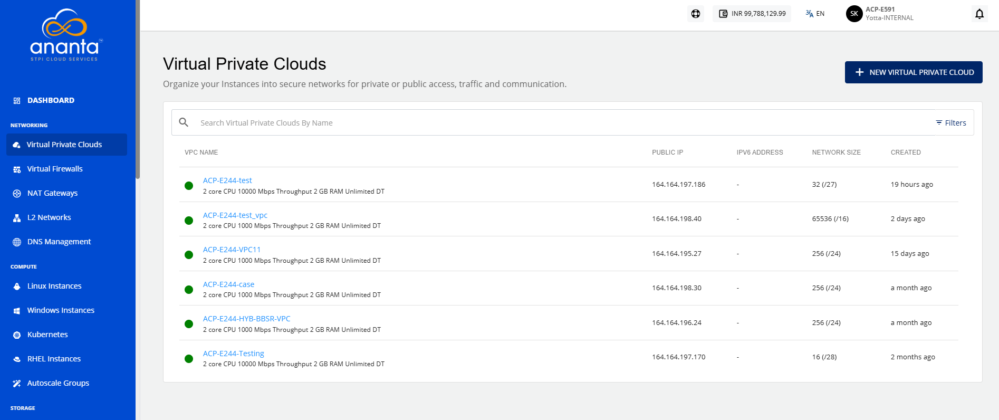
2. Click the **VPC Name**.
3. Navigate to the **IP Addresses** menu. The following screen appears: 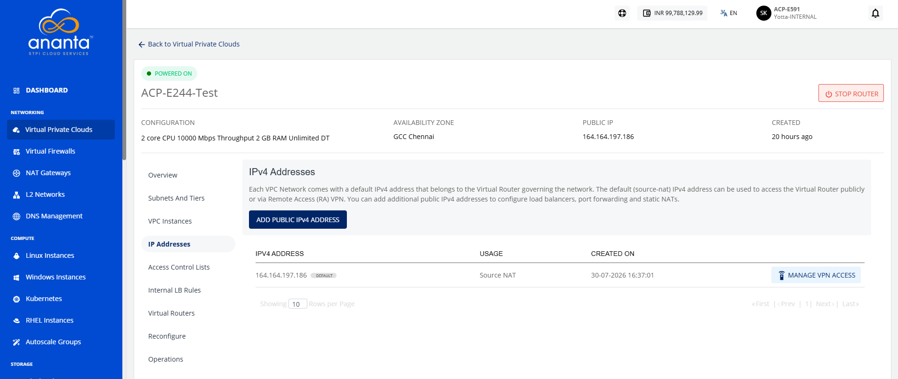
4. Click the **Add Public IPv4 Address** button. The following screen appears: 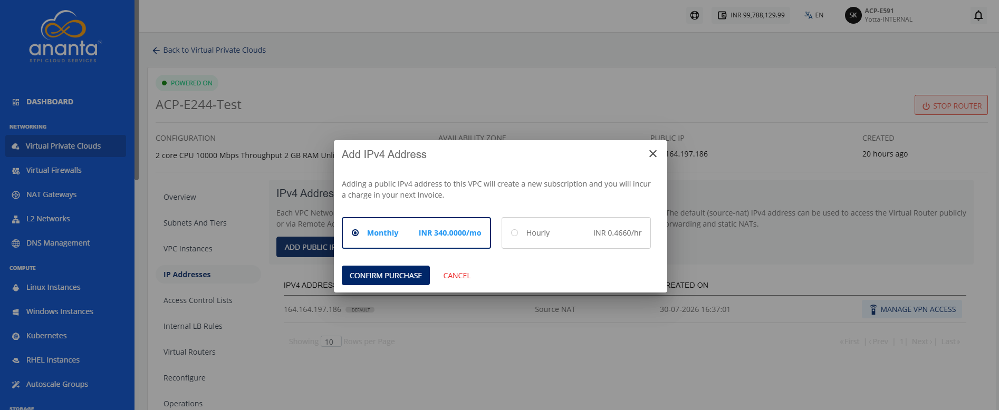
5. Click the **Confirm Purchase** button. The following screen appears: 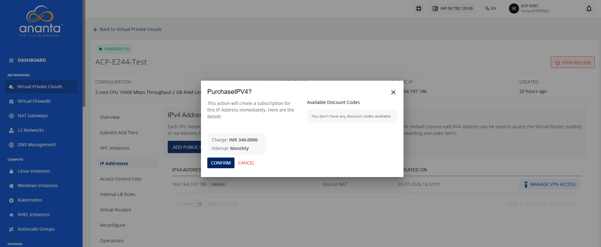
6. Click **Confirm**.

:::note  
Public IP Address may carry a price which may vary depending on availability of Public IP address in the country of operation, and/or how the service provider has priced them.  
:::

:::note  
You need at least one subnet tier with public LB to create a Load Balancer and Port Forwarding rule.
:::

## Configuring Load Balancing Rule

To enable the IP address for load balancing, you need to configure the load balancing rule. To do this, follow these steps:

1. Click the **Load Balancing** icon (highlighted in red).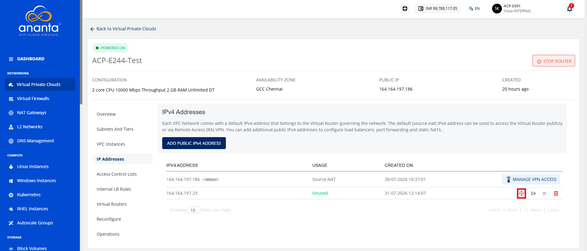
	The following screen appears: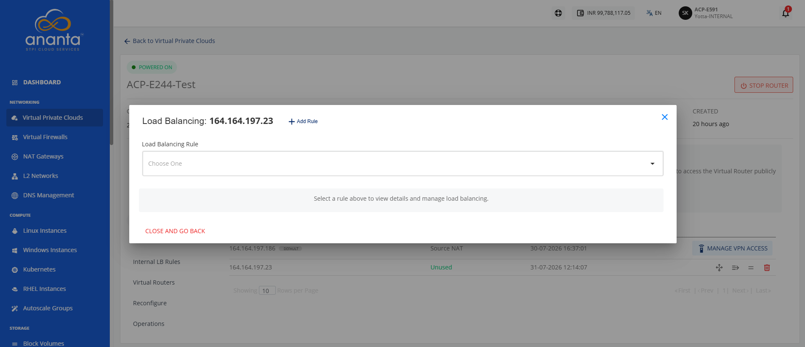
2. Click **Add Rule**. The following screen appears: 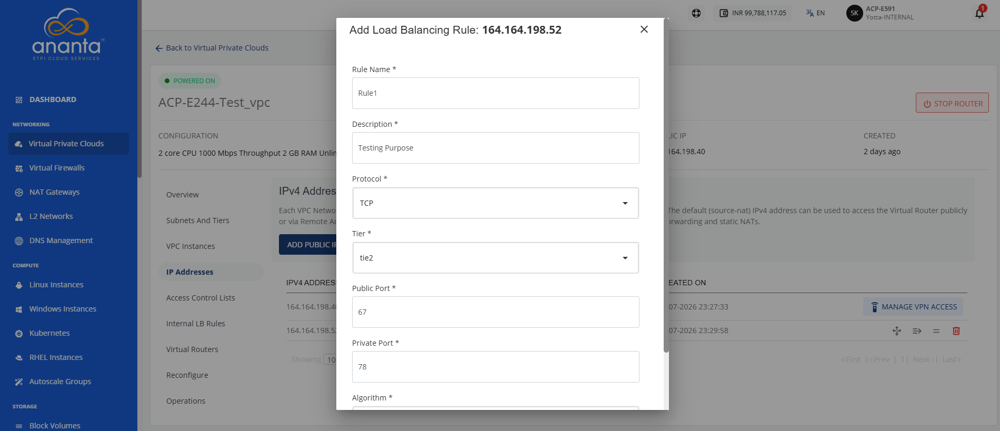
3. Provide the following details to set the load-balancing IP:
	  - A **name** and **description** for the load balancer rule.
	  - **Protocol** to use for the load balancer.
	  - Select a **Tier** to be associated with load balancing rule.
	  - **Public** and **private** port mapping.
	  -  The **load balancing algorithm** to use.
	Once the load balancer rule has been created, you can add (or remove) instances to this rule.  
4. Click the **Load Balancer Rule** button.  
	The Rule is created.
5. Click the **Load Balancing** icon. The following screen appears:  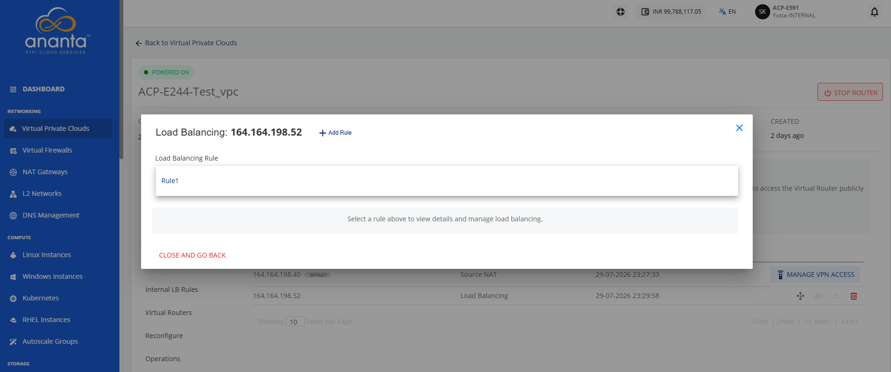
6. Select the **load balancing rule** from the dropdown. The following screen appears:  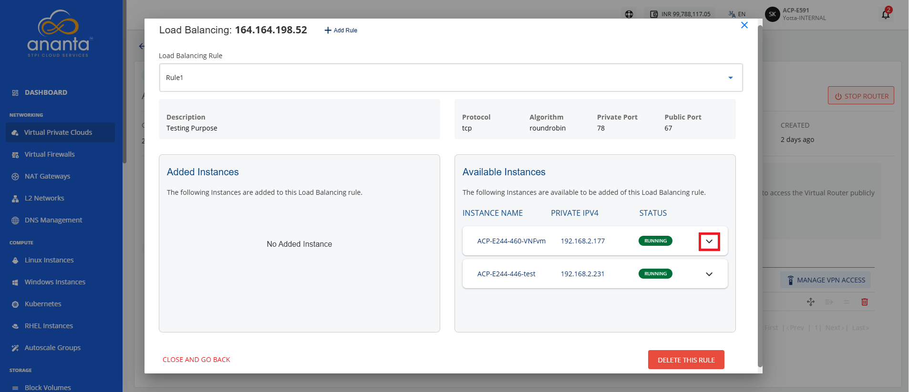
	You can view the instances that are part of this load balancer and are available to be added to this load balancer.  
7. Click the highlighted icon. The following screen appears: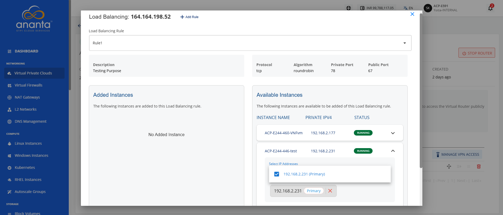
8. Select IP addresses (Primary IP, Secondary IP, or both). 
9. Click the **Add Instance to LB Rule** button.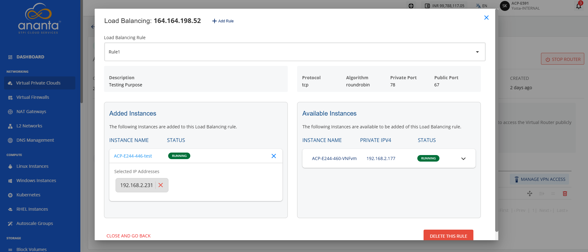  
:::note  
To delete this Load Balancing Rule, click **Delete This Rule**.
:::

:::note  
You need at least one subnet tier to create a Load Balancer IP rule.
:::

## Configuring Port Forwarding Rule

A port forwarding rule is required for accessing the instances contained in a VPC. Instances in a VPC only have a private IP address, therefore, a Public IP address is required for each instance that you want to access from your terminal.

To configure a port forwarding rule, follow these steps:

1. Click the **Port Forwarding Rule** icon (highlighted in red).
	The following screen appears: 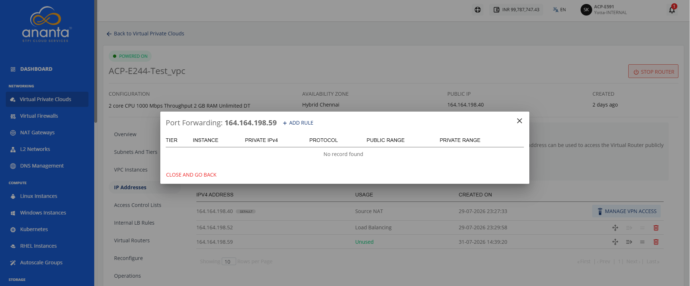
2. Click **Add Rule**. The following screen appears: 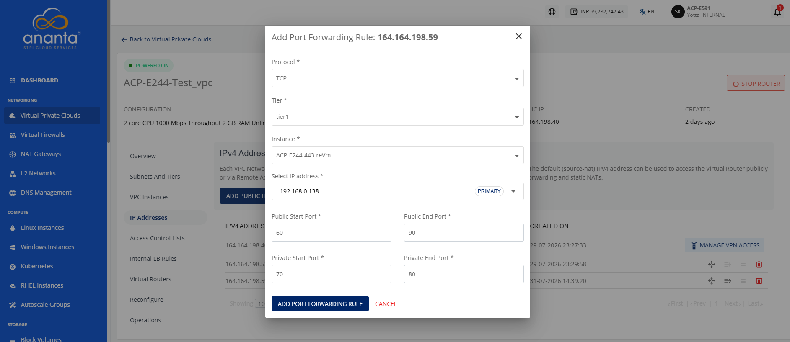
3. Provide the following details:
	  - **Protocol** for port forwarding.
	  - The **tier** and the **instance** to port-forward to.
	  - **Public** and **private port** ranges.  
	:::note  
	The end ports must be equal to or greater than the start ports.  
	:::
4. Click the **Add Port Forwarding Rule** button.  
	Once the port-forwarding rule has been created, you can view details of this rule.
5. Click the **Port Forwarding Rule** option. The following screen appears: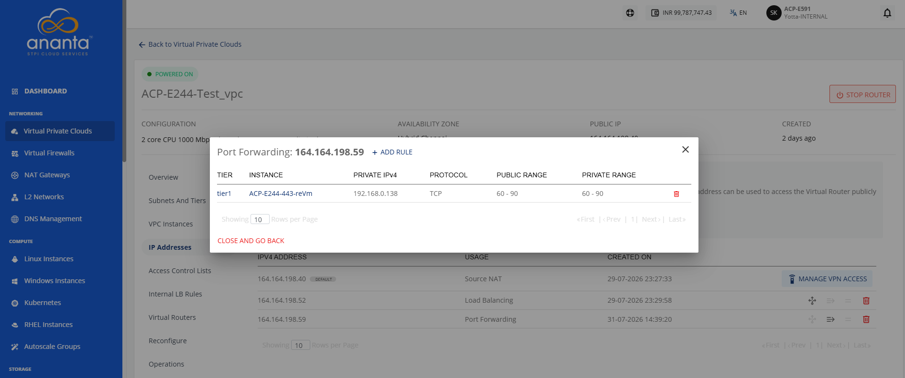  
In the dialog box, view the instance configured with this rule along with the private and public port range mappings.

To test whether port-forwarding has been configured correctly, you can use the Public IP to SSH into the instance that the IP port-forwards to.

:::note  
You can use a port-forwarding IP address to configure multiple port-forwarding access rules for a single instance. To port-forward into a different instance, you’ll need to purchase an additional Public IP address.  
:::

## Configuring Static NAT

Static NAT is required when you want a private instance inside a VPC to be accessible from the internet or external networks using a fixed Public IP.

To configure Static NAT, follow these steps:

1. Click the **Static NAT** icon (highlighted in red). 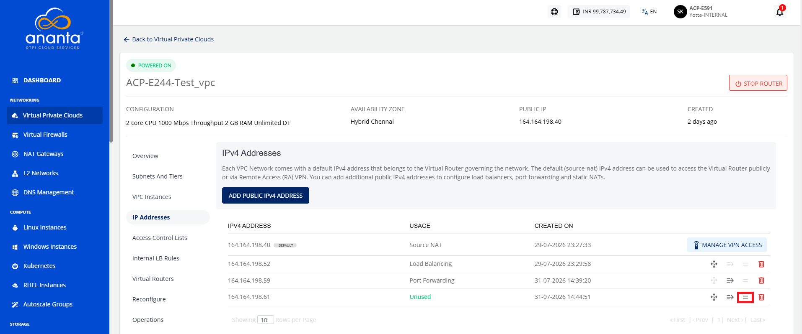
	The following screen appears: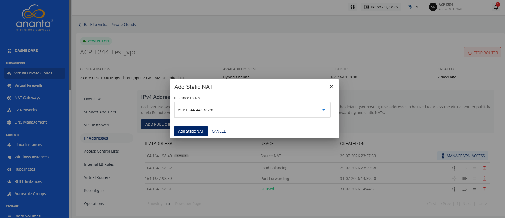
2. Select the instance you want to map this Public IP to.
3. Click the **Add Static NAT** button.

To test whether static NAT has been configured correctly, you can use the Public IP to SSH into the instance that the IP is NAT-ing to.