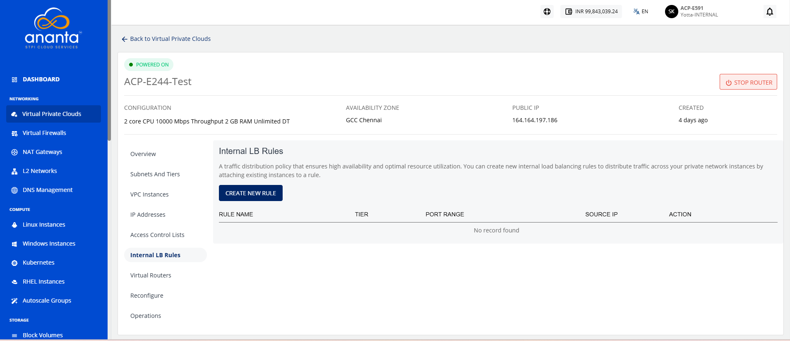
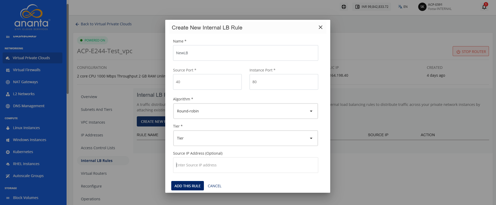
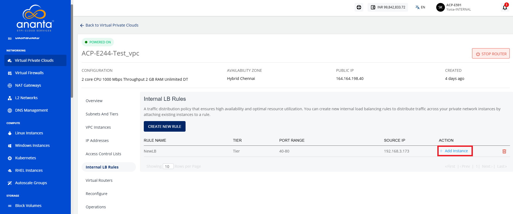
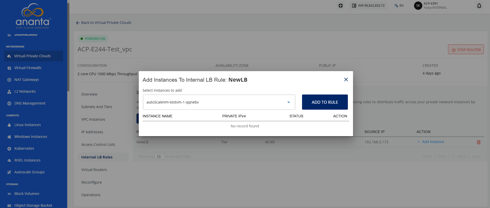
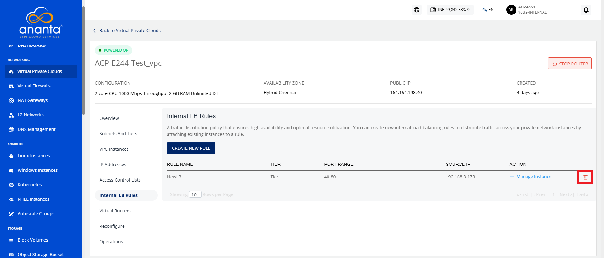
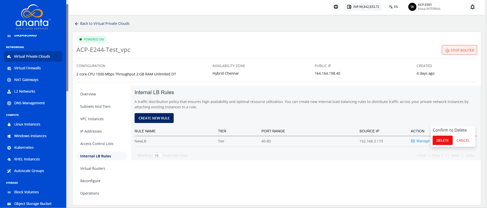

# Internal LB Rule 
An internal Load Balancer (LB) is a type of load balancer that routes traffic to workloads within a 
virtual private network.
## Creating a New Internal LB Rule 
To create a new Internal LB Rule, follow these steps:
1. Navigate to **Networking > Virtual Private Clouds**. The following screen appears: 
2. Click the **VPC name** and navigate to the **Internal LB Rules** tab. The following screen appears: 
3. Click the **Create New Rule** button. The following screen appears:
 4. Provide the following details:
	 - **Name**: Enter a unique name to identify the load balancer rule.
	 - **Source and Instance Port**: Specify the source port and the destination instance port for traffic forwarding.
	 - **Algorithm**: Select the load balancing algorithm used to distribute incoming traffic across instances.
	 - **Tier**: Select the tier you want to associate with this LB rule.
	 - **Source IP Address (optional)**: Specify a source IP address to restrict traffic to a particular IP.
5. Click the **Add This Rule** button.
## Adding an Instance

To add an instance, follow these steps:
1. Navigate to **Networking > Virtual Private Clouds**. The following screen appears: 
2. Click the **VPC name** and navigate to the **Internal LB Rules** tab. The following screen appears: 
3. Click the **Add Instance** icon (highlighted in red). The following screen appears: 
4. Select the instance to add in Internal LB Rule.	
5. Click the **Add to Rule** button.
## Deleting an Internal LB Rule 
To delete an instance, follow these steps:
1. Navigate to **Networking > Virtual Private Clouds**. The following screen appears: 
2. Click the **VPC name** and navigate to the **Internal LB Rules** tab. The following screen appears: 
3. Click the **Delete** icon (highlighted in red). The following screen appears: 
4. Click the **Delete** button.

