# Managing Access Control on VPC Subnets

This section describes how to manage Access Control List (ACL) on VPC. An ACL is a set of rules for controlling and filtering incoming and outgoing network traffic and reducing network attacks.

  
  The following topics are covered in this section:
- [Use Cases](#use-cases)
- [Managing Individual Custom ACL and Adding Rules](#managing-individual-custom-acl-and-adding-rules)
-  [Creating Bulk Custom ACL and Adding Rules](#creating-bulk-custom-acl-and-adding-rules)
- [Exporting Selected ACL Rules](#exporting-selected-acl-rules)

## Use Cases
The following are the use cases of ACL:
- **Allow web traffic**: Permit HTTP (80) and HTTPS (443) traffic to web servers.
-  **Restrict SSH access**: Allow SSH only from specific IP addresses.
- **Block unwanted traffic**: Deny access from suspicious or unauthorized IP ranges.
- **Control subnet communication**: Allow or restrict traffic between public and private subnets.
-  **Enhance network security**: Add an extra layer of protection beyond instance-level security controls.

You can create Access Control Policies by defining traffic rules that specify which inbound and outbound network traffic is allowed or denied. After that, you can apply the policies to any tier within the VPC to control network access.

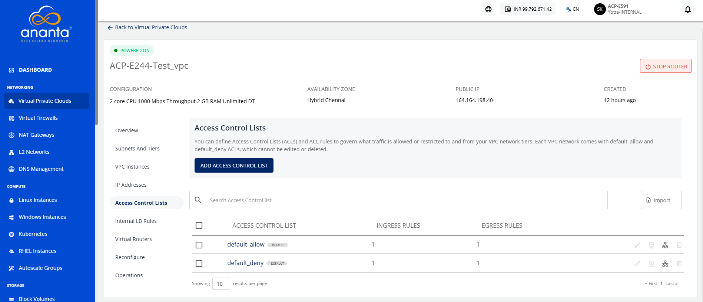

:::note
Each VPC comes with **default_allow** and **default_deny** ACL. You can edit these ACLs, but you cannot delete them.
:::  
## Managing Individual Custom ACL and Adding Rules
You can access ACLs from the Access Control Lists menu item under the VPC details. The following actions are available:

- [Creating an ACL Rule](#creating-an-acl-rule)
- [Editing ACL name](#editing-acl-name)
- [Deleting an ACL](#deleting-an-acl)
### Creating an ACL Rule
To create a custom ACL and add rules, follow these steps:
1. Navigate to **Networking > Virtual Private Clouds**. The following screen appears: 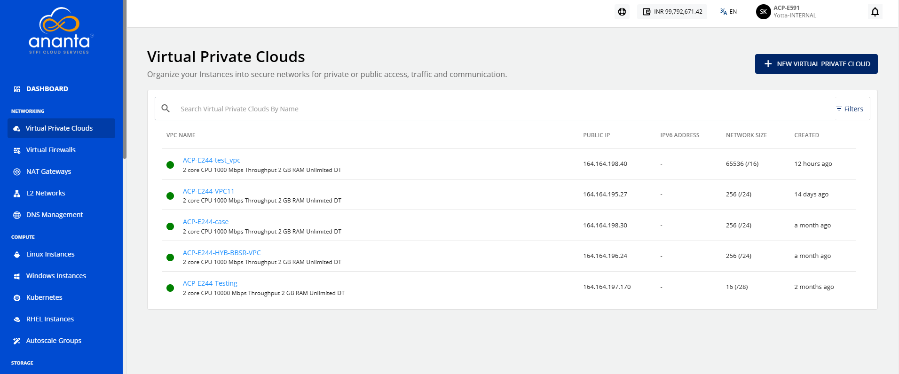
2. Click the **VPC name** and navigate to the **Access Control Lists** menu. The following screen appears:
3. Click the **Add Access Control List** button. The following screen appears: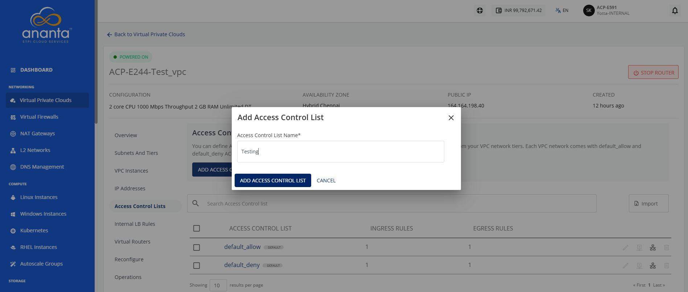
4. Provide the desired name in the **Access Control List Name** field. Then, click the **Add Access Control List** button. The Access Control List gets added as shown in the following screen: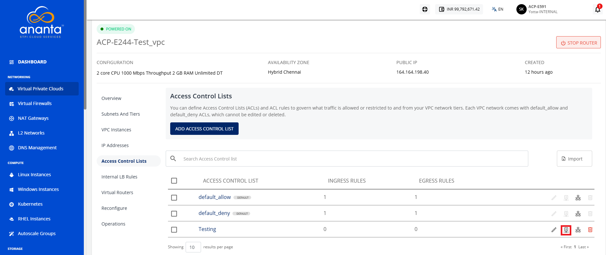
5. Click the **Add Rule** icon (highlighted in red). The following screen appears: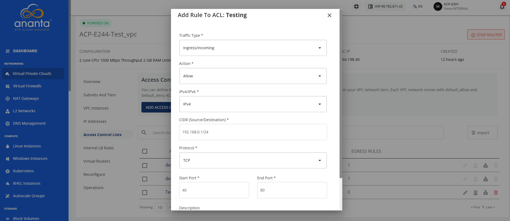
6. Provide the following details:
	- **Traffic Type:** Select the traffic direction: Ingress or Egress.
	- **Action:** Choose whether to allow or deny the traffic.
	- **IPv4/IPv6:** Select the IP version: IPv4 or IPv6.
	- **Protocol:** Select the required protocol, such as TCP, UDP, ICMP, or ALL.
		- **Start Port**: Enter the starting port.
		- **End Port**: Enter the ending port.
	- **Description:** Enter a description for the rule.
7. Click the **Add ACL Rule** button.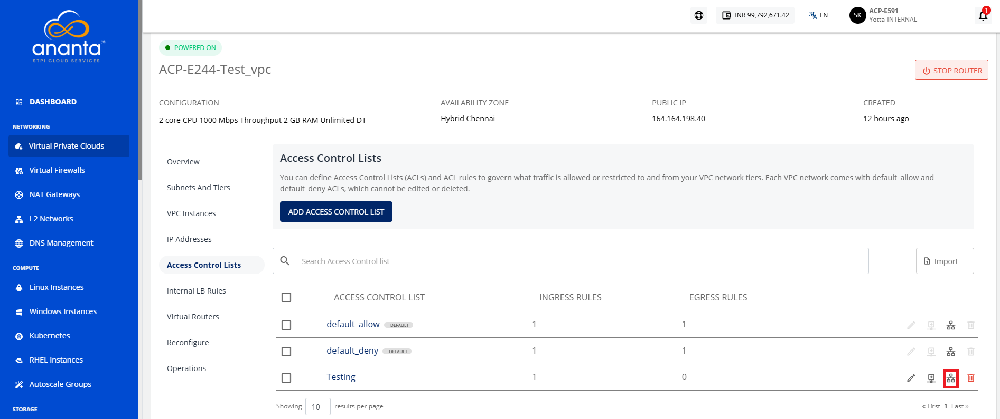
8. Click the **Appy ACL to Tier** icon (highlighted in red). The following screen appears: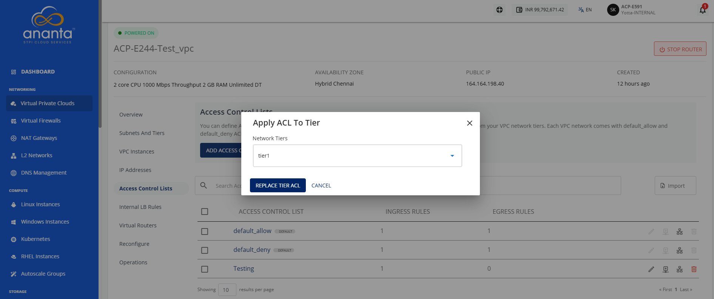
9. Select the desired tier from the dropdown.
10. Click the **Replace Tier ACL** button.

Any available (existing or new) ACL can be viewed in detail by clicking on its name in the list view. This shows a list of rules defined to govern ingress/incoming and egress/outgoing traffic for the subnet. 

### Editing ACL Name

To edit the ACL name, follow these steps:
1. Click the **edit** icon (highlighted in red) as shown in the following image: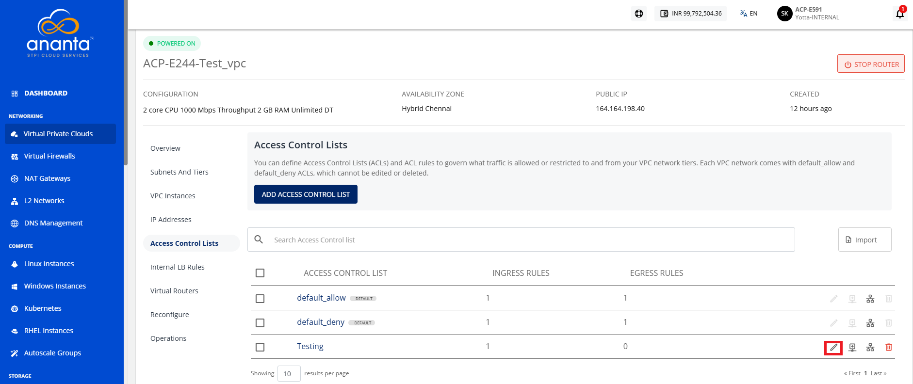
	The following screen appears: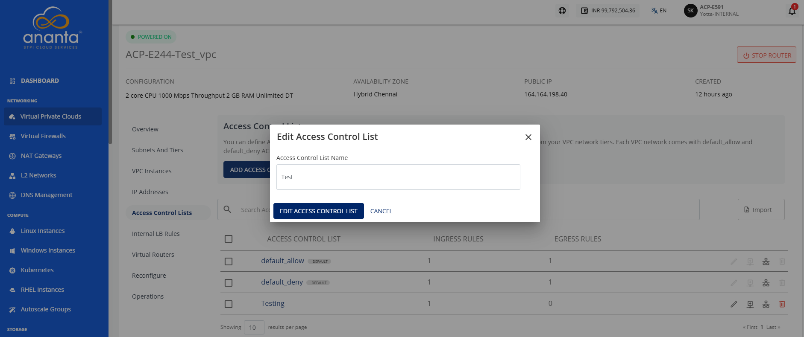
2. Enter the name of your ACL.
3. Click the **Edit Access Control List** button.

### Deleting an ACL

To delete an ACL, follow these steps:
1. Click the **Delete** icon (highlighted in red).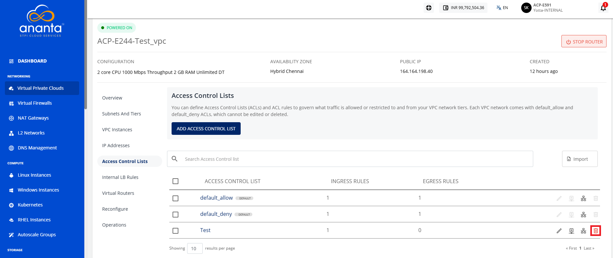
	The following screen appears: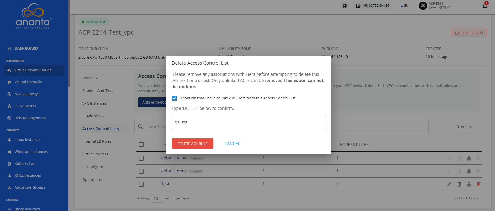
2. Click the **I confirm that i have deleted all Tiers from this Access Control List** option.
3. Type **DELETE** in the textbox.
4. Click the **Delete ACL Rule** button.

:::note
  To delete an ACL, you must first disassociated it with the attached tier. For more information, refer [Replacing an ACL](/docs/Guide/Networking/VirtualPrivateClouds/CreatingVPCSubnetsTiers#replacing-an-acl).
:::
## Creating Bulk Custom ACL and Adding Rules 

If you want to create custom ACL rule in bulk, then use the import option.

To create rules in bulk, follow these steps:
1. Navigate to **Networking > Virtual Private Clouds**. The following screen appears: 
2. Click the **VPC name** and navigate to **Access Control Lists** menu. The following screen appears: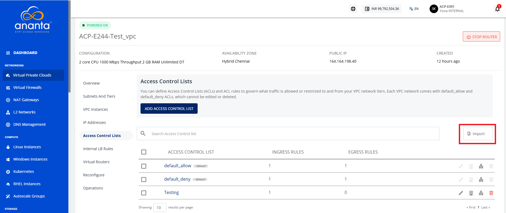
3. Click the **Import** option (highlighted in red). The following screen appears: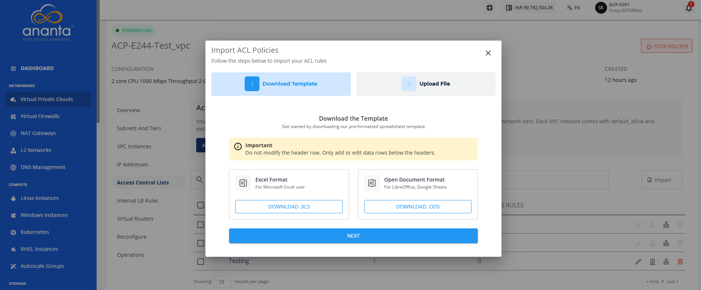
4. Under the Download Template tab, click the **Download .XLS** or **Download .ODS** button. 
5. Click **Next**.
6. Create rules in the downloaded file by following the instructions provided for each column within the file.
7. Under the **Upload File** tab, click or drag and drop your file.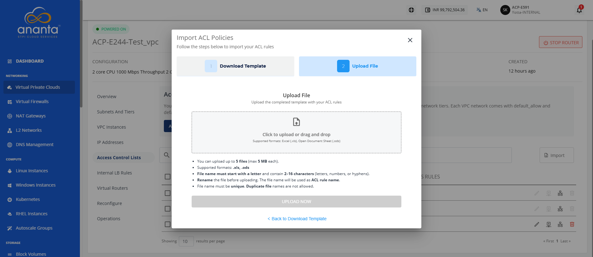
8. Click **Upload Now**.

The ACL rule is successfully uploaded.

## Exporting Selected ACL Rules

To export the ACL rules, follow these steps:

1. Navigate to **Networking > Virtual Private Clouds**. The following screen appears: 
2. Click the **VPC name** and navigate to **Access Control Lists** menu. 
3. Select the created ACL rules, the following screen appears: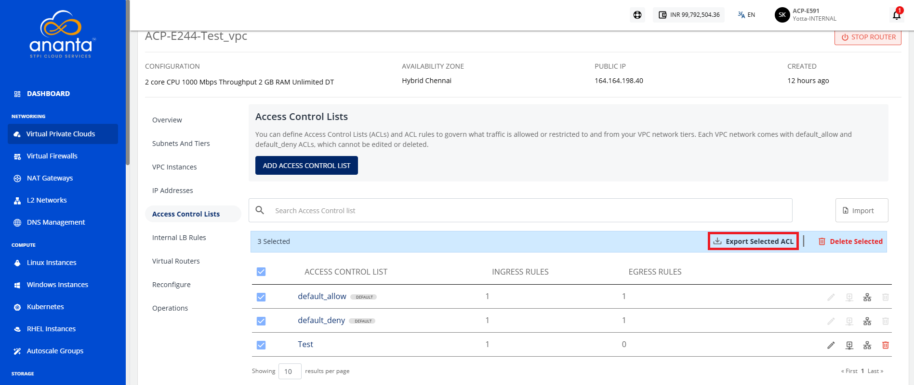
4. Click the **Export Select ACL** icon (highlighted in red).

The ACL rules are exported successfully in excel (.xlsx) file.
