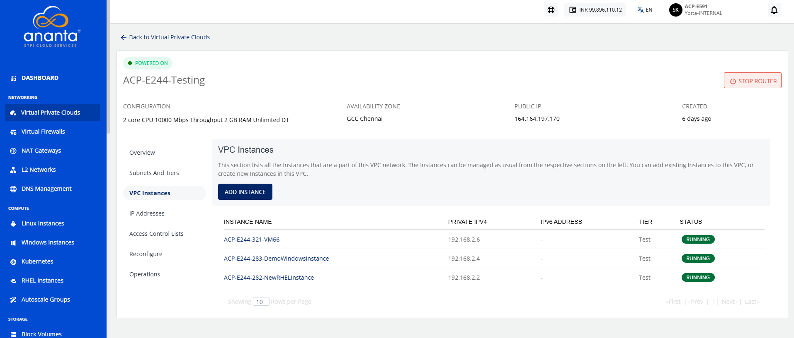

# Managing VPC Instances

VPC instances represent the instances running within your Virtual Private Cloud. This section helps you monitor their status and perform basic operations to keep your cloud resources running efficiently and reliably.

This section comprises of the following sub-sections:
- [Adding an Instance to VPC](#adding-an-instance-to-VPC)
- [Viewing VPC Instances](#viewing-vpc-instances)

## Adding Instance to VPC

Adding instances to a VPC to deploy compute resources within your private network. This allows you to connect workloads to a secure and controlled environment and ensure they operate within your defined cloud infrastructure.

:::note
An Instance created in any VPC/advanced Availability Zone must be attached to at least one subnet.
:::

To add instances to a VPC, follow these steps:
1. Navigate to **Network > Virtual Private Clouds**. The following screen appears:
2. Click on your created VPC name from the list. The following screen appears:
3. Click **VPC Instances**. The following screen appears:
4. Click the **Add Instance** button. The following screen appears:
5. Select the **Network Tier** from the dropdown, and click the **+** icon (highlighted in red). The following screen appears:

## Viewing VPC Instances

Viewing instances associated with a VPC enables you to monitor the compute resources deployed within the selected network. The Ananta Cloud provides a centralized view of all instances connected to a VPC, making it easier to review their deployment, verify network association, and efficiently manage resources within the VPC environment.

To view the instances that are a part of the VPC network, follow these steps:

1. Navigate to **Network > Virtual Private Clouds**. The following screen appears:

2. Click on your created VPC name from the list. The following screen appears:

