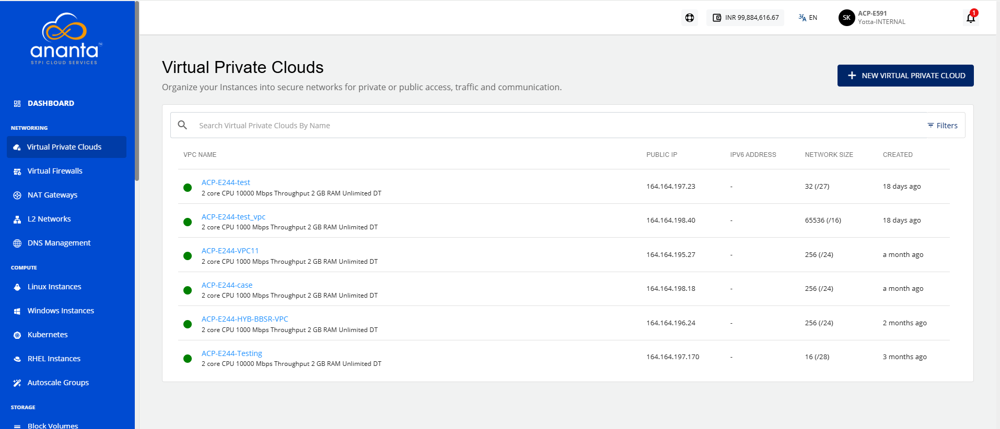
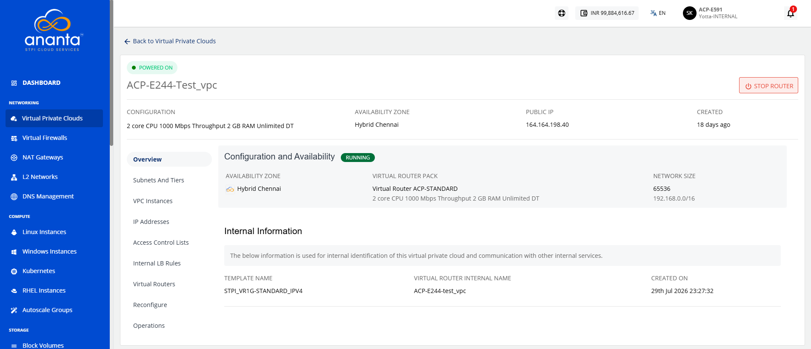
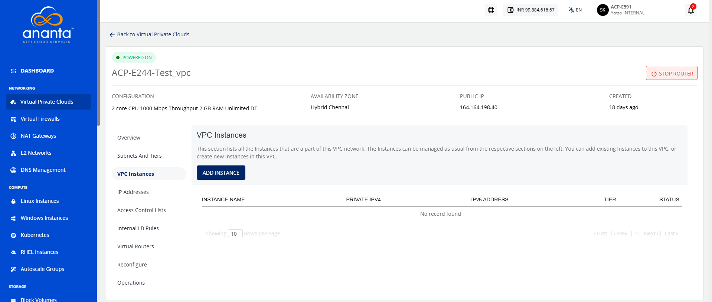
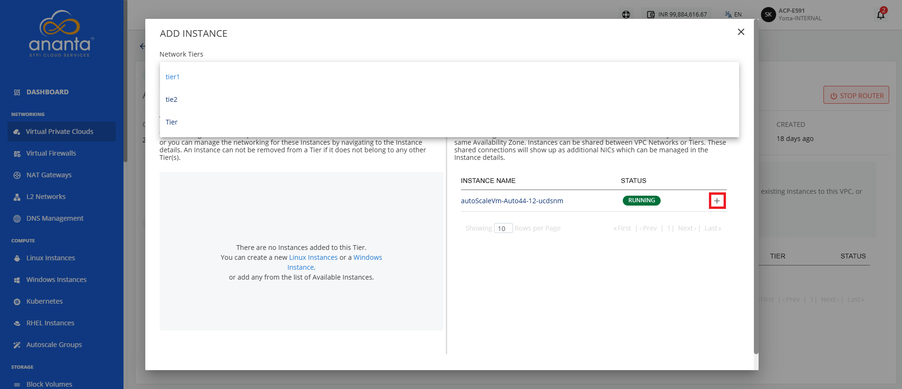
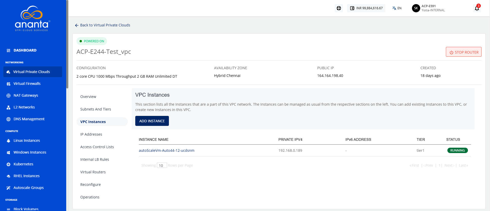

# Adding Instance to VPC

Adding instances to a VPC to deploy compute resources within your private network. This allows you to connect workloads to a secure and controlled environment and ensure they operate within your defined cloud infrastructure.

:::note
An Instance created in any VPC/advanced Availability Zone must be attached to at least one subnet.
:::

To add instances to a VPC, follow these steps:
1. Navigate to **Network > Virtual Private Clouds**. The following screen appears:
2. Click on your created VPC name from the list. The following screen appears:
3. Click **VPC Instances**. The following screen appears:
4. Click the **Add Instance** button. The following screen appears:
   
5. Select the **Network Tier** from the dropdown, and click the **+** icon (highlighted in red). The following screen appears:
   
