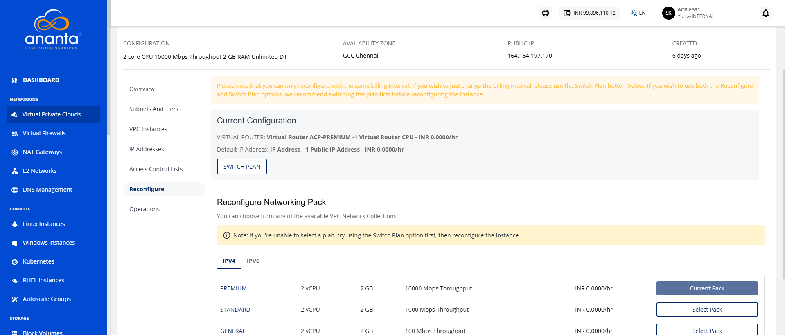

# Reconfiguring a VPC

The **Reconfigure** section/tab will list your current subscription details and allow you to reconfigure the networking pack, or switch between **hourly** and **monthly** pricing.

:::note
You can only reconfigure with the same billing interval. If you wish to change the billing interval, please use the **Switch Plan** button. It is recommended to switch the plan first before reconfiguring the instance if you wish to use both the **Reconfigure** and **Switch Plan** options. In either case, you will be charged based on the reconfiguration, not the existing plan.
:::

