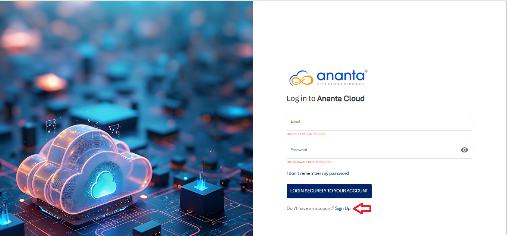
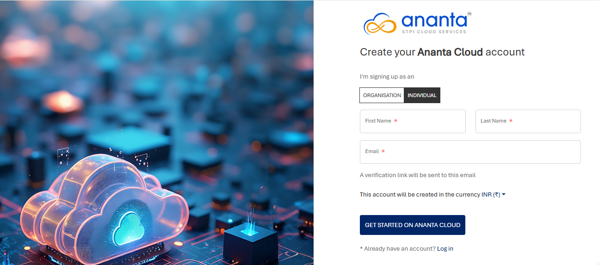
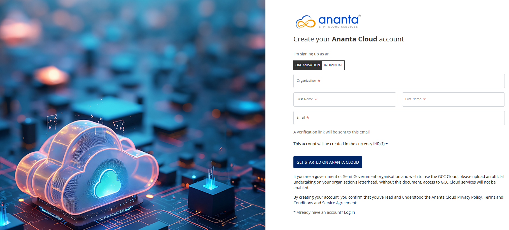

# Signing Up

The cloud portal provides a secure web-based interface for managing your cloud resources. Sign up to create an account and gain access to the portal's features and services.

## Self-service Signup

To create an account on the Ananta portal, follow these steps:

1. Navigate to [Ananta Cloud URL](https://portal.ananta.stpi.in). The following screen appears:
2. Click the **Sign Up** link (highlighted in red). The following screen appears where you provide the required details for Individual or Organisation account:
	
	
3. Select the **Currency** for the account.
4. Click the **Get Started on Ananta Cloud** button.
## Admin-assisted Signup

Admin-assisted signups are semi-automated and require basic intervention from admins. These are governed by configurations and rules defined under platform configurations, and take up default values from there. Additionally, admins can manually add or edit information before publishing the account.

To do this, follow these steps:

1. Click the **Sign Up** button on Access Central and fill out the signup form.
2. A signup request is registered on the system, and a notification email is sent to the admin; at this stage, the admin console will show this account as 'draft'.
3. Admin users can log in to the admin console and verify the information (and add/edit, if needed) and proceed to publishing the account.
4. A verification email is sent to you; at this stage, the admin console will show this account as awaiting confirmation.
5. Follow the instructions sent to your email and verify your email.
6. Additionally, if mobile verification is enabled (SMS gateway required), verify your details.
7. Upon successful verification, you can set your account password and log in with your email and password.

## Admin-initiated Signup

Admin-initiated signups are manual and require the maximum intervention from admins. These are governed by configurations and rules defined under platform configurations, and take up default values from there. However, admins need to initiate the entire signup process from filling the form on behalf of the subscribers. 

To create an account via this process, follow these steps:
1. If the admin-initiated mode is enabled, the **Sign Up** link will not be shown on Access Central.
	1. Admin users can log in to the admin console and proceed to create a new subscriber account.
2. Once published, a verification email is sent to you; at this stage, the admin console will show this account as awaiting confirmation.
3. A verification email is sent to you; at this stage, the admin console will show this account as awaiting confirmation.
4. Follow the instructions sent to your email and verify your email.
5. Additionally, if mobile verification is enabled (SMS gateway required), verify your details.
6. Upon successful verification, you can set your account password and log in with your email and password.

:::note
Only new subscriber accounts can be created using this process. Child admins and child subscribers can not be created this way and need to be invited from within their respective parent accounts.
:::

