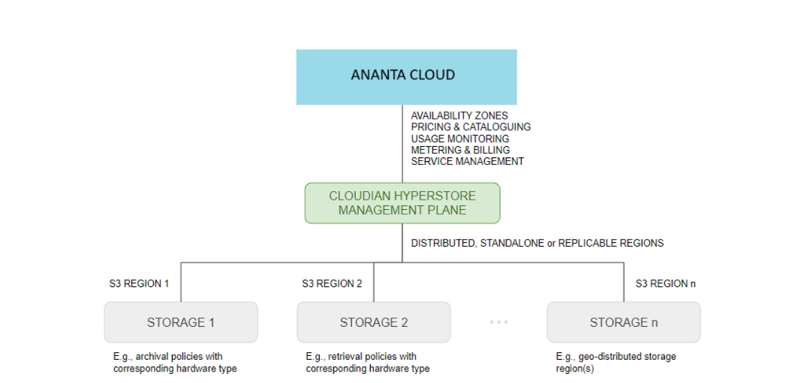

# About Ananta Object Storage

Ananta Object Storage (AS3) provides scalable and flexible storage for unstructured data in the form of objects. In object storage, data is stored as discrete objects containing data, metadata, and a unique identifier. Ananta delivers the service as an integration with Cloudian HyperStore.

## Use Cases

- **Backup and Archival**  
	  - Store critical system and user data safely in the cloud.  
	  - Ideal for long-term retention and compliance needs.
- **Logs and Analytics**  
    - Centralize application logs in one secure location.  
    - Simplifies monitoring, reporting, and troubleshooting.
- **Data Lakes**  
    - Keep massive datasets in a scalable storage pool.  
    - Supports advanced analytics, AI, and ML workloads.
- **Media Storage**  
    - Host and deliver images, audio, and video efficiently.  
    - Ensures durability and easy access from anywhere.
- **Disaster Recovery**  
    - Maintain secondary copies of important data offsite.

:::note
The following are not yet supported on AS3:
- **Glacier support** - Archival storage using Glacier is not yet available.
:::

