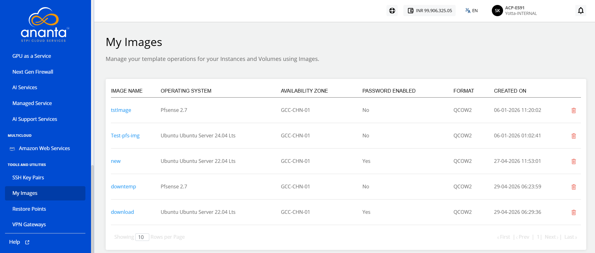
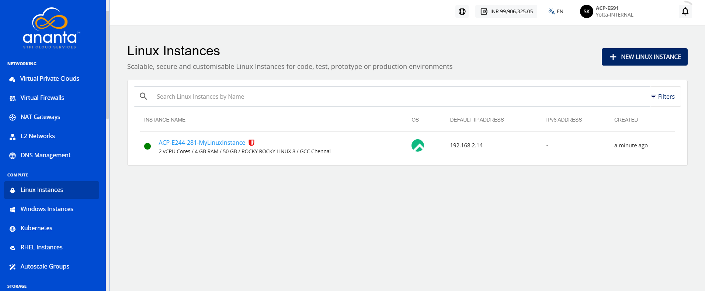
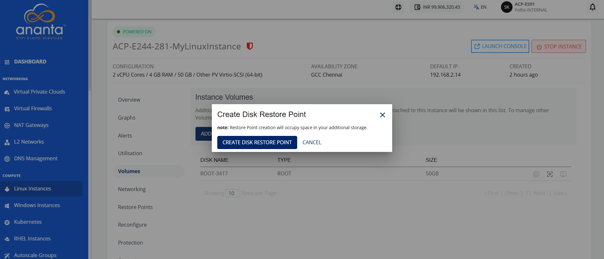
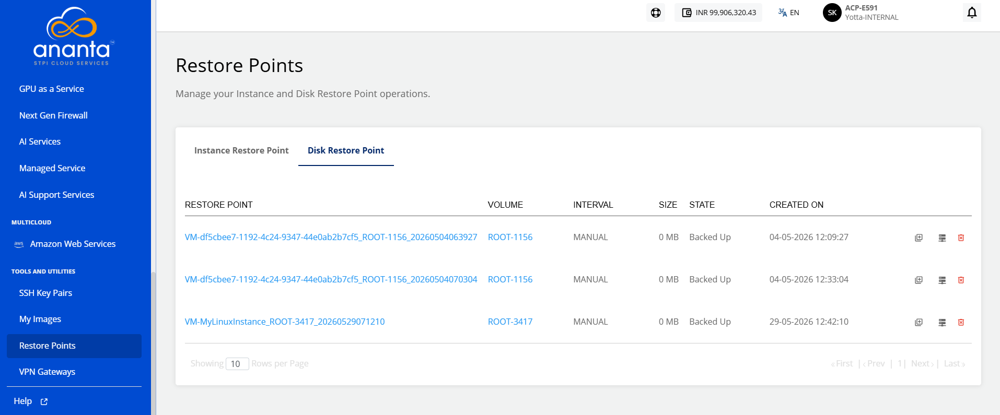
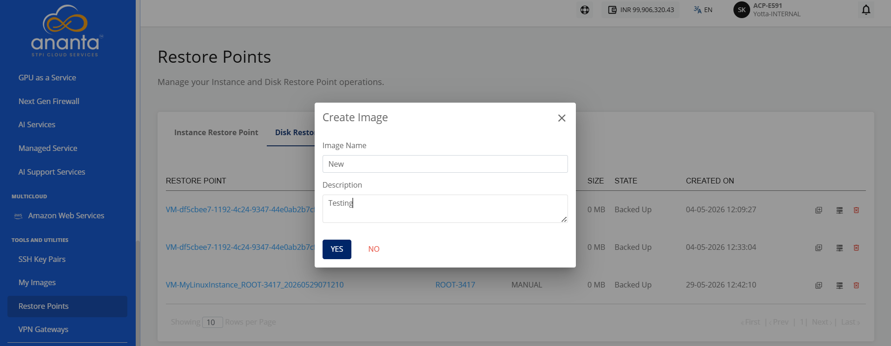
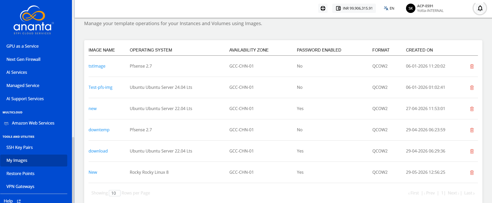
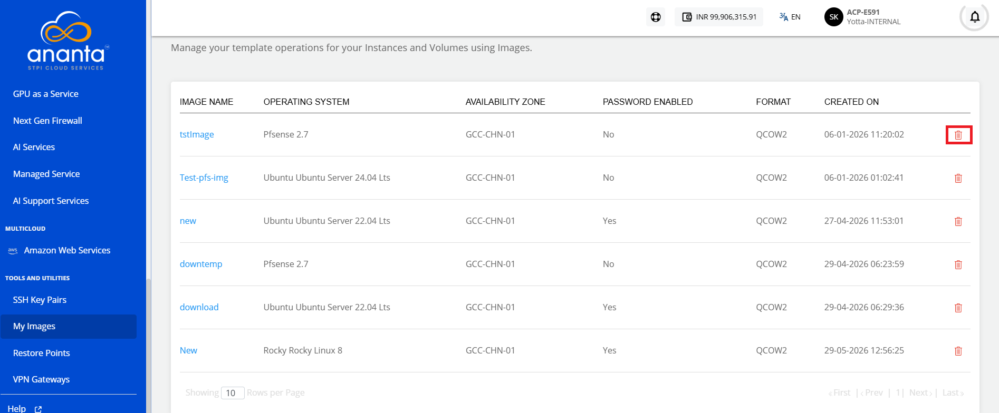
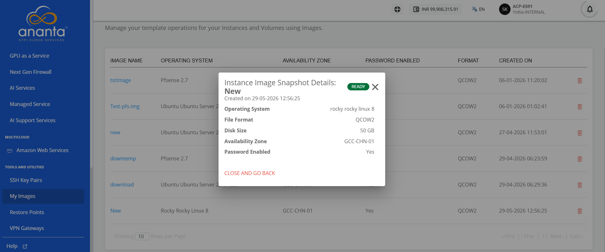
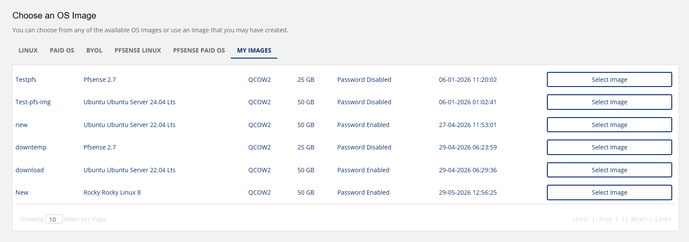

# Managing Custom Templates and Images

You can create custom OS templates from a Restore Point. To locate these custom templates, navigate to **Tools and Utilities > My Images** with the following details:

- Image Name
- Operating System
- Availability Zone
- Password Enabled
- Format
- Created On

## Creating Custom Images

To create custom images, follow these steps:

1. Navigate to **Compute** > **Linux Instances**. The following screen appears:
2. Click the **Instance Name**. 
3. Click **Volumes** to view the attached volumes or data disks.
4. Click the **CREATE RESTORE POINT** icon to create a restore point for the selected volume.
	 
5. Navigate to **TOOLS AND UTILITIES** > **Restore Points**.
6. Navigate to **Disk Restore Point** to view the newly created restore point. The following screen appears: 
7. Click the **Create Image** icon for the newly created **Disk Restore Point**. The following screen appears: 
8. Provide the following details:
	- **Image Name**
    - **Description**  
9. Click **Yes** to confirm and create the image.
10. Navigate to **TOOLS AND UTILITIES** > **My Images** to view the newly created custom image.
## Deleting a Custom Image

You can delete an image by clicking the **delete** icon. 
	
You can also check the status by clicking the image name.
	
You can use these Images while creating new Linux or Windows Instances.

## Uploading Custom Image
You can upload your own instance image to the Ananta Cloud by submitting a request to the support team. Prepare the instance image in the QCOW/QCOW2 format and make it accessible through a downloadable URL.

You can raise a support request by any of the following methods:
- Email: [support@ananta.stpi.in](mailto:support@ananta.stpi.in)
- Toll-Free Support Number
- Raise a ticket to the support team ([Account Centre > Support & Tickets](/docs/Guide/AccountCentre/SupportandTickets))

Include the instance image URL and the required details in the request. 

After the support team validates and uploads the image, the system adds it as a template and makes it available under the **My Images** tab in the Ananta Cloud portal for the instance creation.

