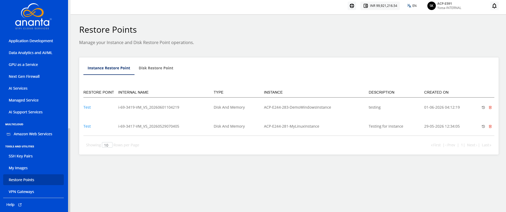
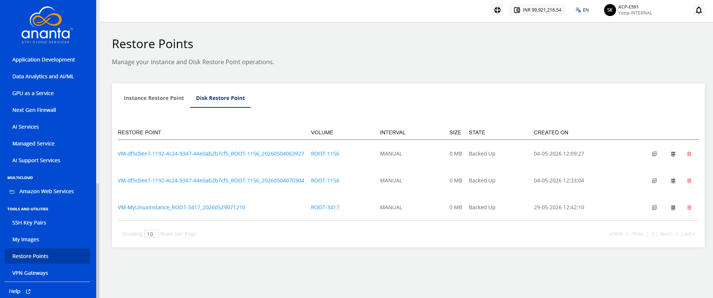

# Managing Instance and Disk Restore Points 
Restore points use the Ananta Block Volume service and occupy billable storage space.

You can view and manage all your instance and disk restores points, and perform various associated operations.

## Instance Restore Point

The Instance Restore Point lists the following details:

- Restore Point
- Internal Name
- Type
- Instance
- Description
- Created On

To revert the Instance to the restore point, click the icon present in the right corner before the delete icon, or also you can click on the restore point name and then click the **Revert Instance** button.

To delete the Instance Restore Point, click the **Delete** icon from the right corner.

## Disk Restore Point

The Disk Restore Point section shows the following details:
- Restore Point
- Volume
- Interval
- Size
- State
- Created On

