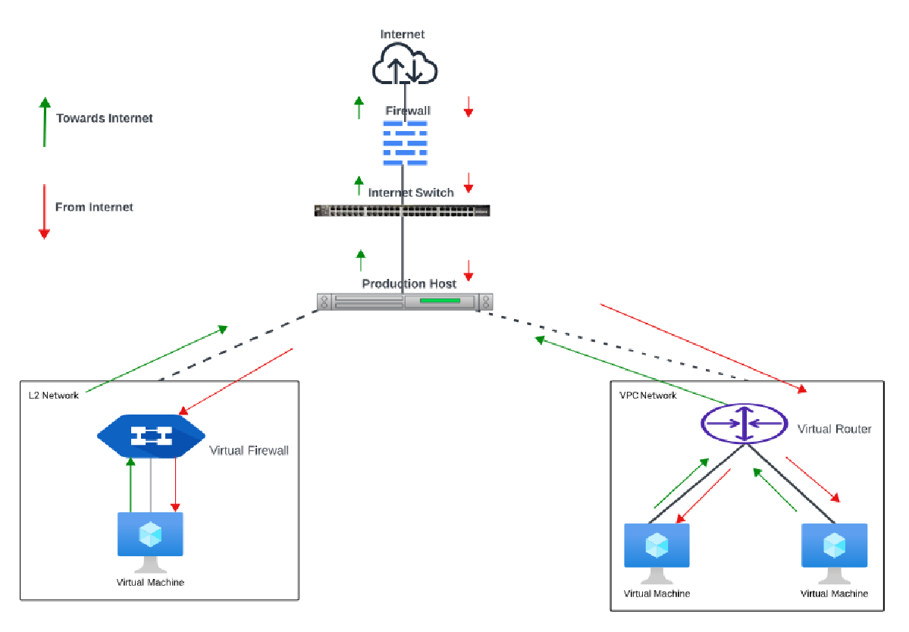

# Difference Between L2 Networks and VPC

An L2 network provides connectivity at the data link layer, allowing devices within the same network segment to communicate directly, while a Virtual Private Cloud (VPC) creates an isolated virtual network environment in the cloud. These components work together to support secure and flexible network design.

L2 networks and VPCs help manage traffic efficiently, improve isolation, and provide better control over how cloud resources communicate.

  
This section covers the following topics:
- [L2 Networks](#l2-networks)
- [VPC](#vpc)

## L2 Networks

L2 networks provide network isolation without any other services. This means that there will be no virtual router. It is assumed that the end user will have their own IPAM in place or that they will statically assign IP addresses.

End users can create L2 networks; however, network offerings that allow the network creator to specify a VLAN can only be created by root admins.

CloudStack does not assign IP addresses to instances.

User data and metadata can be passed to the instance using a config drive (which must be enabled in the network service offering).

## VPC

VPC is a higher-level abstraction that allows you to create isolated network environments with more advanced features. A VPC can include multiple tiers, such as public and private subnets, and supports advanced networking features like VPNs (Virtual Private Networks) and ACLs.

The difference in Traffic Flow is simplified in the following diagram:

