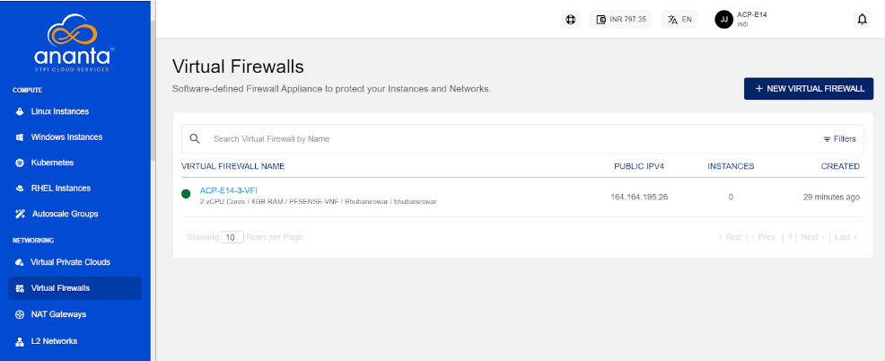

# About Firewall Instances

Ananta supports the delivery and management of Virtual Firewall Instances (VFI) in an as-a-service model. VFI is essentially a Linux Instance pre-loaded with a firewall software which makes it work as a a virtual appliance. The Service falls under the **Virtual Firewall** and is built using our integration framework using [pfSense](https://pfsense.org/) or [FortiGate VM](https://www.fortinet.com/products/private-cloud-security/fortigate-virtual-appliances) for powering the appliance.

Cloud Console users can use VFI as an alternative to VR-based VPC, enabling stronger security and enhanced firewall capabilities. The VFI service utilizes L2 networks, which help conserve IPv4 addresses.

Currently, VFI is an experimental Service on Ananta and there are a few limitations to it:

1. A user can have only one VFI per Availability Zone.
2. VFI-based networks only support a single VLAN.
3. Only Instances with a special Linux OS can be added to VFI-based networks.
4. VFI needn't inherit Ananta-level RBAC for users.

Ananta offers the following features in its current scope:

- [Creating a Virtual Firewall Instance](docs/Networking/FirewallandSecurity/CreatingaVirtualFirewall.md)
- [Creating a VFI-based network](AddingInstancestoaVFI-basedNetwork)
- [Activating and accessing the VFI control panel](AccessingtheVFIControlPanel)
- [Viewing VFI network details](ViewingVFINetworkDetails)
- [Deleting a VFI network](DeletingaVFINetwork)
- [Application Load Balancer](ApplicationLoadBalancer)

All VFI created in an account can be accessed from navigating to the **Networking > Virtual Firewalls** tab.

