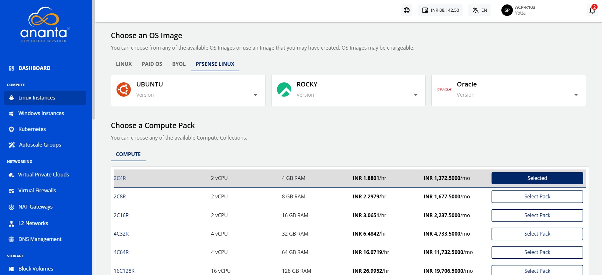
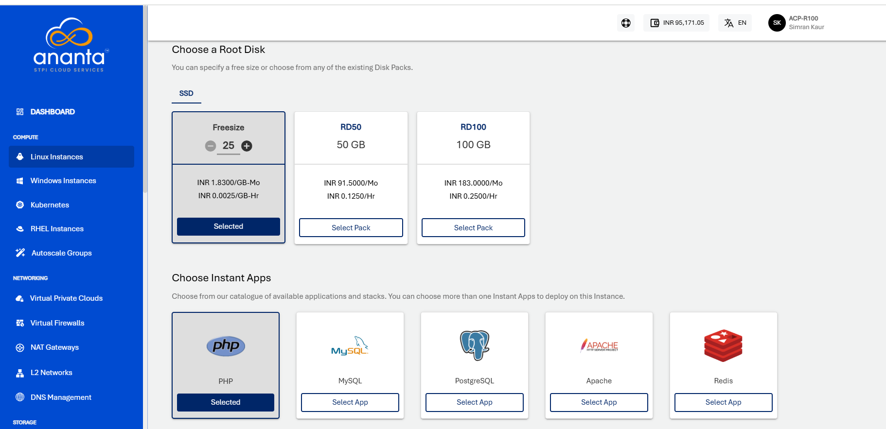

# Adding Linux Instance

To create a Linux instance, follow these steps:

1. Navigate to **Compute > Linux Instances**.
2.  Click the **+ NEW LINUX INSTANCE** button.
    
3. Choose an **Availability Zone**, which is the geographical region where your Instance will be deployed. 
4. Select the **Destination** (VPC/VNF) and then the **Network** from the respective drop-down lists.   
5. **Choose an OS Image** to run on your Instance.
6. **Choose a Compute Pack** from the available compute collections.  
	 
7. **Choose a Root Disk** from the available options.
8. In **Choose Instant Apps**, select the available applications. To Verify/Login into your selected database, refer to [App Overlays](/docs/Compute/LinuxInstances/AppOverlays). 
    
9. **Choose an Authentication Method**:
    - **Use SSH key pair**: Click on the Use SSH key pair option; all the SSH key pairs present in your account will be listed. If your account does not have any SSH key pair, then you can click the **Generate a new key pair** option or upload the key pair by clicking the **Upload a key pair** option. 
    - **Use root user password**: On selecting Use root user password, the **Also email me the password** option is displayed. If you select this option, the password, along with the details, for instance, will be emailed to your registered email ID.
10. In the **Name Your Linux Instance** field, enter the desired name for your Linux Instance. The Instance name must only contain alphanumeric characters, underscore, dots and hyphens. 
    
11. Under the **Summary and Estimated Costs** section, verify the estimated cost of your Linux Instance based on the chosen specifications.
	
12.  After reviewing the policies mentioned by your cloud service provider, click **The above information is correct**. 
13. To view the price summary and any discount codes in your account, click the **BUY HOURLY** or **BUY MONTHLY** button.
    - You can apply any of the discount codes listed by clicking on the **APPLY** button. 
    - You can also remove the applied discount code by clicking the **REMOVE** button. 
    - Clicking on the **CANCEL** button, this action will be canceled.
14. Click the **CONFIRM**  button to create the Linux Instance.

:::note
It might take up to 5-8 minutes for the Linux instance to get created. You may use the Cloud Console during this time, but it is advised that you do not refresh the browser window.
:::

Once ready, you receive a notification of this purchase at your email address. To access the newly created Linux instance, navigate to **Compute > Linux Instances** on the main navigation panel.