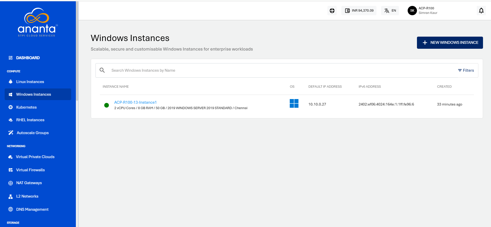
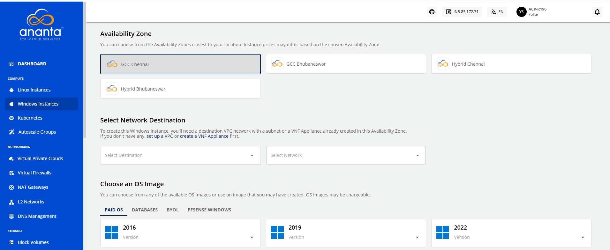
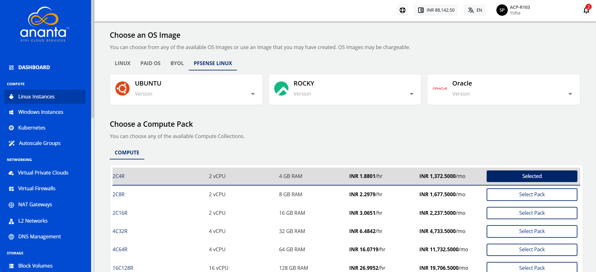
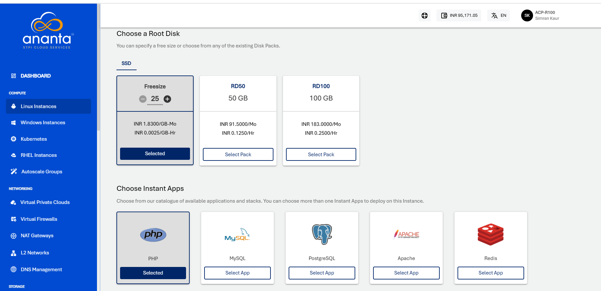
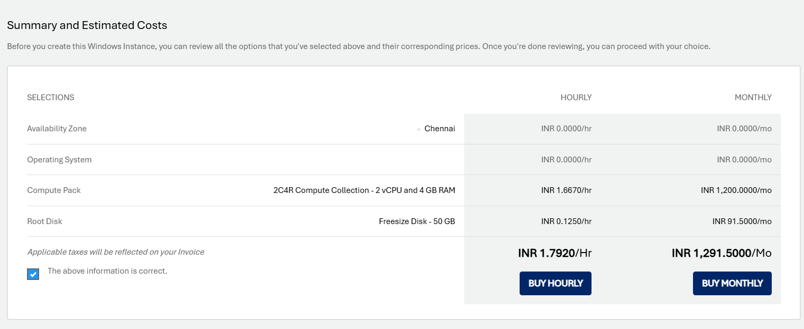

# Adding Windows Instance
To create a Windows instance, follow these steps:

1. Navigate to **Compute > Windows** Instances.
2. Click on the **+ NEW WINDOWS INSTANCE** from the top right.
	
3. Enter the name for your Windows instance by following the naming convention mentioned below in the helper text.
4.  Choose an Availability Zone, which is the geographical region where your Instance will be deployed. The chosen option should be the **advanced VPC** from all available AZs.
5.  Select a VPC network from the **Select Network** Dropdown and select the appropriate tier listed in **Select a Network Tier**.
	:::note
	To add a Windows Instance to a VPC, you need to have a VPC configured with at least one tier.
	:::
	
6. Choose an Image to run on your Instance. This can be an operating system or a custom image that is available under **MY IMAGES.**
7. Choose a compute pack from the available compute collections.
   
8. Choose a Root disk from the available Disk packs, or you can use the free size option to specify the Root Disk.
   
9. Verify the Estimated Cost of your Windows Instance based on the specifications you have   chosen from the Summary and Estimated Costs Section (Here, both Hourly and Monthly Prices summary will be displayed)
10. After reviewing the policies provided by your cloud service provider, click the checkbox.
11. To view the price summary and any discount codes in your account, click the **BUY HOURLY** or **BUY MONTHLY** button.
    - You can apply any of the discount codes listed by clicking on the **APPLY** button. 
    - You can also remove the applied discount code by clicking the **REMOVE** button. 
    - Clicking on the **CANCEL** button, this action will be canceled.
12. Click the **CONFIRM**  button to create the Windows Instance.
    

:::note 
This might take up to 5-8 minutes. You may use the Cloud Console during this time, but it is advised that you do not refresh the browser window.
:::

Once ready, you’ll be notified of this purchase on your email address on record. The newly created Windows Instances can be accessed from **Compute >** **Windows Instances** on the main navigation panel.