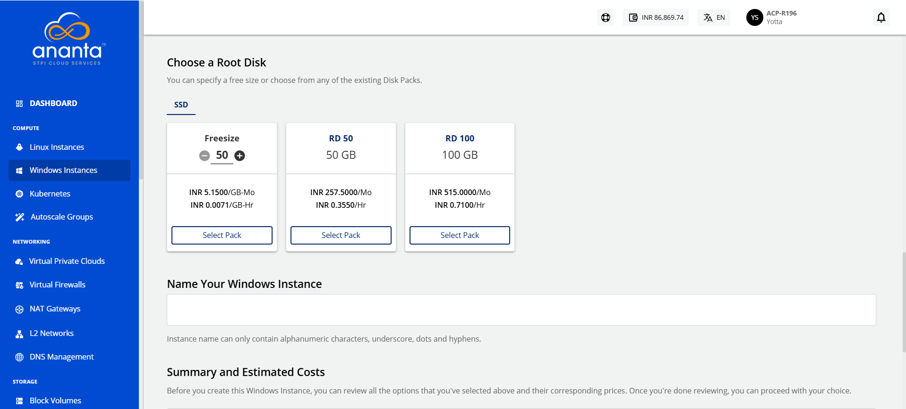

# Adding Windows Instance

To create a Windows instance, follow these steps:

1. Navigate to **Compute > Windows** Instances.
2. Click the **+ NEW WINDOWS INSTANCE** button.
	
3.  Choose an **Availability Zone**, which is the geographical region where your Instance will be deployed. The chosen option should be the **advanced VPC** from all available AZs.
	
4.  Select a VPC network from the **Select Network** Dropdown and select the appropriate tier listed in **Select a Network Tier**.
	:::note
	To add a Windows Instance to a VPC, you need to have a VPC configured with at least one tier.
	:::
5. **Choose an OS Image** to run on your Instance. 
6. **Choose a compute pack** from the available compute collections.
7. **Choose a Root disk** from the available Disk packs, or you can use the free size option to specify the Root Disk.
8.  In the **Name Your Windows Instance** field, enter the desired name for your Windows Instance. The Instance name must only contain alphanumeric characters, underscore, dots and hyphens. 
	
9.  Under the **Summary and Estimated Costs** section, verify the estimated cost of your Windows Instance based on the chosen specifications.
	
10. After reviewing the policies mentioned by your cloud service provider, click **The above information is correct**. 
11. To view the price summary and any discount codes in your account, click the **BUY HOURLY** or **BUY MONTHLY** button.
    - You can apply any of the discount codes listed by clicking on the **APPLY** button. 
    - You can also remove the applied discount code by clicking the **REMOVE** button. 
    - Clicking on the **CANCEL** button, this action will be canceled.
12. Click the **CONFIRM**  button to create the Windows Instance.
    

:::note 
This might take up to 5-8 minutes. You may use the Cloud Console during this time, but it is advised that you do not refresh the browser window.
:::

Once ready, you receive a notification of this purchase at your email address. To access the newly created Windows instance, navigate to **Compute > Windows Instances** on the main navigation panel.