# Application Load Balancer

The Application Load Balancer feature prevents the overloading of a single server. It efficiently distributes incoming requests to multiple available backend servers. This process involves real-time mediation of client requests, where the load balancer directs the traffic to the most suitable backend servers for optimal processing.

To configure **pfSense Firewall** and **Application Load Balancer**, follow these steps:

To set up the Virtual Firewall on Ananta Cloud, refer to the [Creating a Virtual Firewall](/docs/Networking/FirewallandSecurity/CreatingaVirtualFirewall) page.

1. To view the details of the pfSense Firewall, click the **Virtual Firewall Name** highlighted in blue.
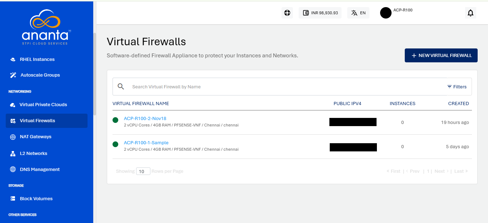
2. To launch your pfSense account, click on **LAUNCH CONSOLE**.
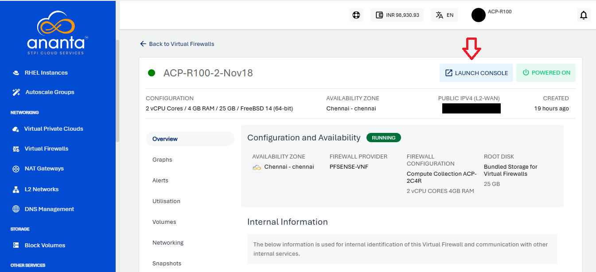
3. You will get the mail on your registered mail id with login credentials..
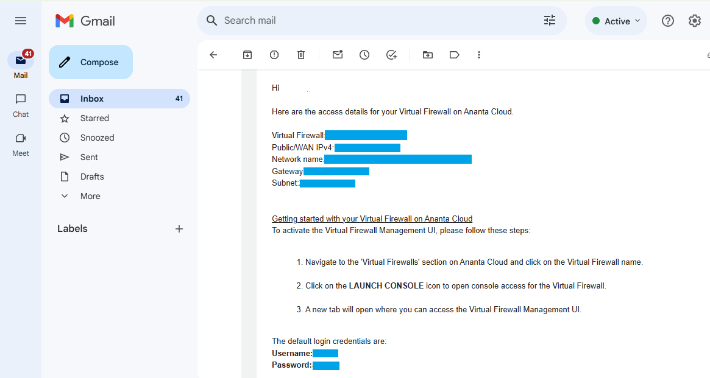
4. Enter the Username and Password to log in to the pfSense firewall GUI.

5. You will see the pfSense dashboard on the screen.
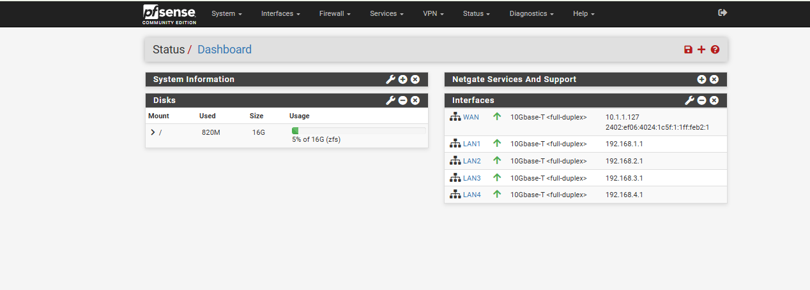
6. **Deploy Application VM**
	- Navigate to the **Create Linux Instance** tab.
	- Deploy the application VM in the desired tier.
	- Perform the required application installation on the application VMs.
7. Navigate to **System** > **Certificates** > **Certificates**, Click on **Add/Sign**. 
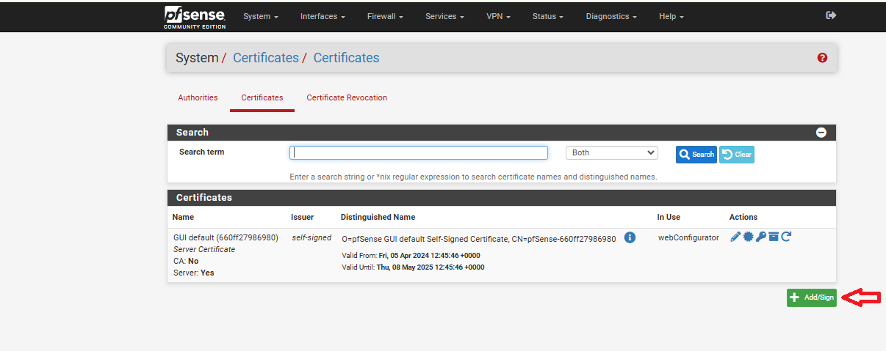
8. Specify the following:
    - **Method** - Select Import an existing certificate option from the dropdown.
    - **Descriptive Name** - Enter a valid name without using any special characters (mentioned in the screenshot below)
    - **Certificate Type** - Select **X.509 PEM** as your certificate type.
    - **Certificate Data** -  Paste your certificate data.
    - **Private Key Data** - Paste your private key data.
    - Leave other options at their default values.
9. Click **Save** and **Apply Changes**.
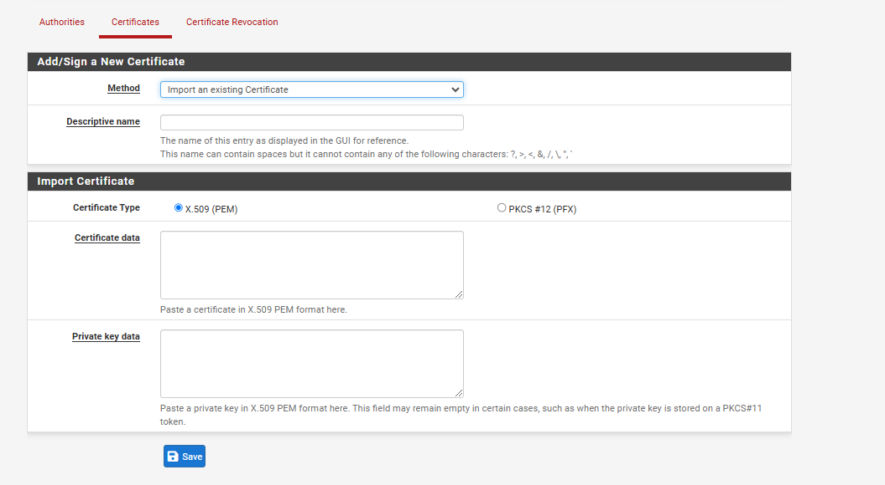
Now your certificates are ready and your can start configuring **HAProxy**.
	:::note
		If you wish to use an unsecured connection (e.g. port 80), you can skip this step.
	:::

To configure the backend and frontend in HAProxy, follow these steps:

1. Navigate to the **Backend** tab in HAProxy, click **Add** to create a new backend.
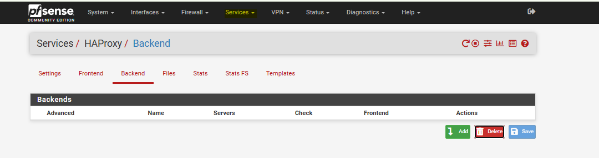
2. Specify the following:
    - **Name** - Provide a name for the backend.
    - **Server List** - Add the IP addresses of backend servers.
    - Leave other options at their default values.
3. Click **Save** and **Apply Changes**.
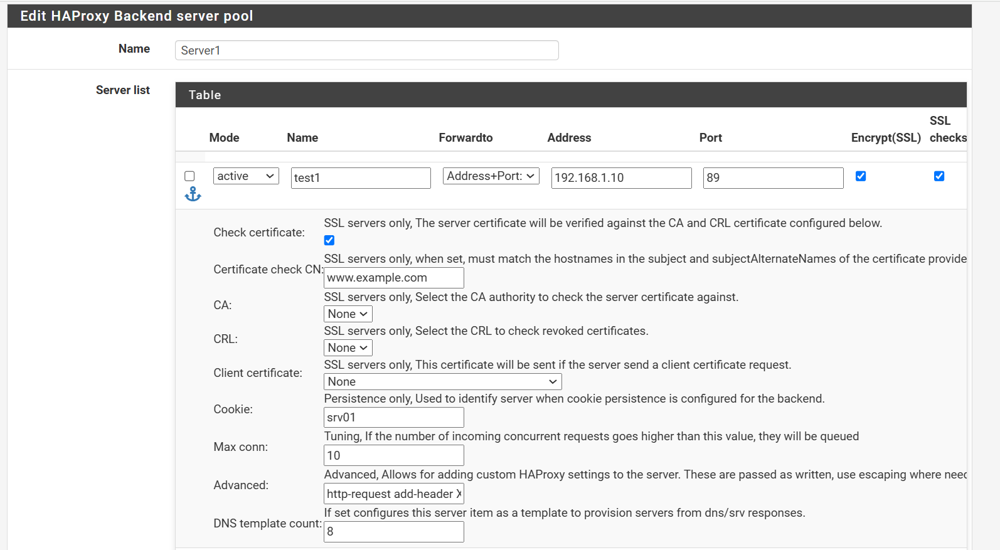
4. Navigate to the **Frontend** tab in HAProxy, click **Add** to create a new frontend.
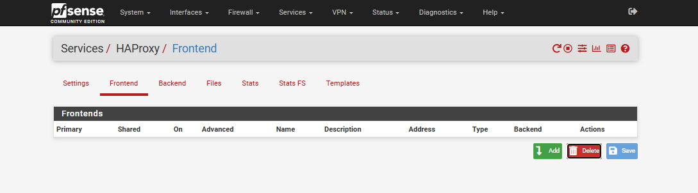
5. Specify the following:
    - **Name** - Provide a name for the frontend.
    - **Description** - Add a brief description.
    - **External Address** - Define the external address.
    - **Type** - Choose the appropriate type.
    - **Access Control Lists** - Specify any ACL rules.
    - **Actions** - Define the required actions.
    - **Default Backend** - Link to the corresponding backend.
    - **Use "forwardfor" Option** - Select this option to generate an HTTP **"X-Forwarded-For"** header that includes the client's IP address.
    - **Certificate** - Link the imported SSL certificate.
    - Leave other options at their default values.
6. Click **Save** and **Apply Changes**.
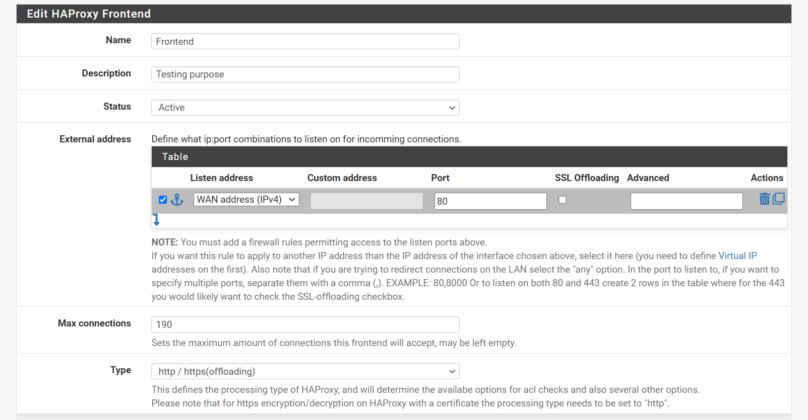

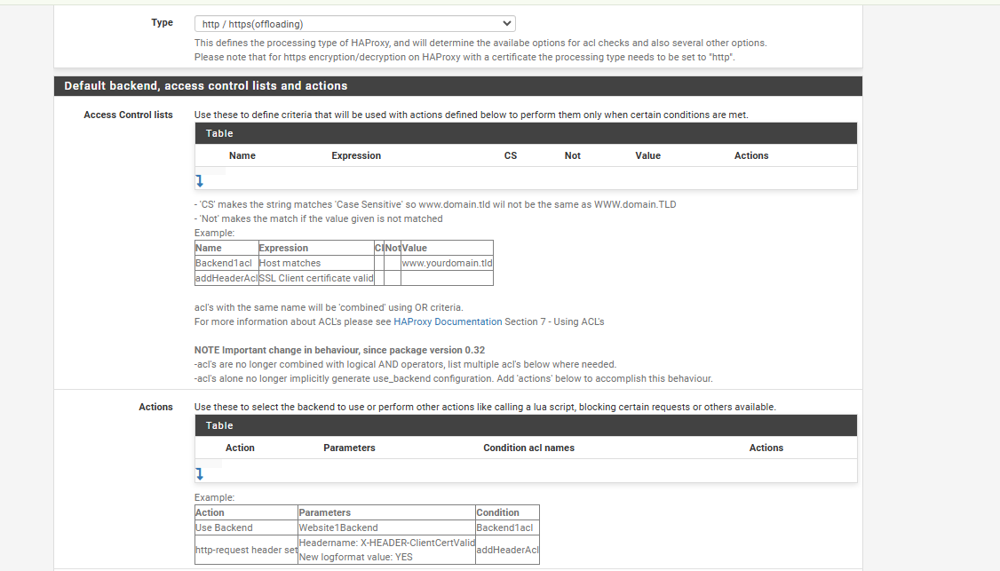

After completing the above steps, test your application by entering its domain name in the browser's address bar.
