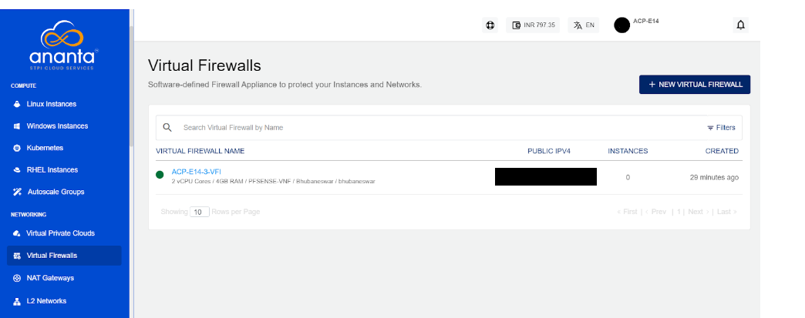
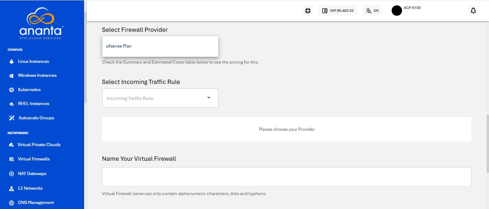

# Creating a Virtual Firewall

 To create a Virtual Firewall, follow these steps:
 
 1. Navigate to the **Networking > Virtual Firewalls**.
 2. Click on **+ NEW VIRTUAL FIREWALL** button.
	  :::note
	    Ananta currently only supports one Virtual Firewall per Availability Zone.
	  :::
	
3. Select your Availability Zone.
	
4. Choose the compute pack from the list.
	
5. Select the Firewall provider from the dropdown menu. 
	 
6. Select the Incoming Traffic Rule (Allow All , Deny All, Allow Custom) and give name to your Virtual Firewall.
	:::note
		**Allow All-** Grants access to all protocols and services without restriction when selected.
		**Deny All-**  Restrict access to all protocols and services when selected
		**Allow Custom-** Enable the user to specify the Source from which traffic should be allowed.
	:::
	
7. Review the summary and estimated costs for both **Hourly** and **Monthly** options.
	
8. Choose **Buy Hourly** or **Buy Monthly** based on your requirement, and then click **Confirm** on the confirmation popover.
	 

The Virtual Firewall service can be configured for provisioning in a self-service or an approval-based manner.

## Managing Virtual Firewall Provisioning Requests

If **approval-based provisioning** is enabled for the VFI Service, the following process will be followed:
1. **Request Submission**
	-  A provisioning request is automatically raised to the cloud administrator.
	- The requester will be notified via email once the request is approved or rejected.
2. **Request Status**
	-  Upon approval or activation, the Virtual Firewall appliance becomes visible in the **Virtual Firewalls list**.
3. **Accessing the Request**
	- The request is available under the **Requests** section in the **Support & Operations** menu on the Ananta admin console.
4. **Admin Actions**
	- The administrator can:
	    - Review the request
	    - Approve or reject the request
	    - Enter any custom price overrides
	    - Click **OK** to finalize the action
	- The **end user** and the **admin** will receive an email notification regarding the request status.
5. **End User Notification**
	- If the request is approved, the end user will receive an additional email with- **Subscription details, Service access information.**

