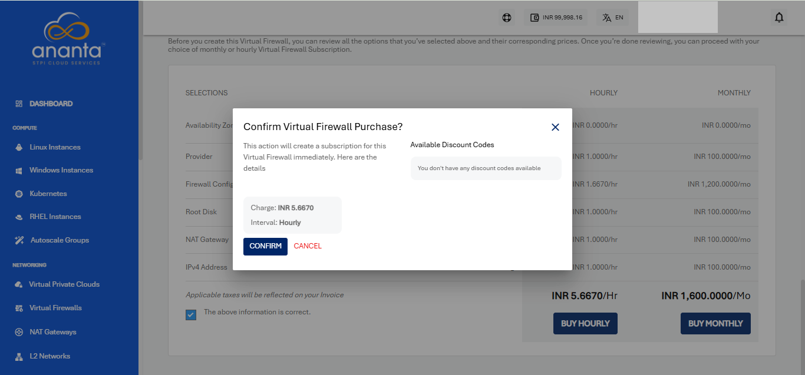

# Creating a Virtual Firewall

 To create a Virtual Firewall, follow these steps:
 
 1. In the main menu, navigate to the **Networking > Virtual Firewalls** tab. 
 2. To activate the service, click on **+ NEW VIRTUAL FIREWALL** button.
  :::note
    Ananta currently only supports one Virtual Firewall per Availability Zone.
  :::

3. Select your Availability Zone.

4. Choose the compute pack from the list.

5. Select the Firewall provider from the dropdown menu. 

7. Select the Incoming Traffic Rule (Allow All , Deny All, Allow Custom) and give name to your Virtual Firewall.

9. Review the summary and estimated costs for both **Hourly** and **Monthly** options.

7. Choose **Buy Hourly** or **Buy Monthly** based on your requirement, and then click **Confirm** on the confirmation popover.

The Virtual Firewall service can be configured for provisioning in a self-service or an approval-based manner.

## Managing Virtual Firewall Provisioning Requests

Needed only if approval-based provisioning is enabled for the VFI Service

For approval-based provisioning, a request will be raised to the cloud administrator for provisioning approval, and, once approved or rejected, the requester user will be notified of the same. Upon approval/activation, the Virtual Firewall appliance will be visible in the list of Virtual Firewalls.

The request can be found in the **Requests** section under **Support & Operations** on the Ananta admin console.

Admin can approve (or reject) the request by clicking on approve and entering any custom price overrides, as shown in the screenshot below and then clicking on **OK**. An email will be sent to both the end user and admin about the approval of the request.

The end user will receive an additional email mentioning subscription and service access details.

